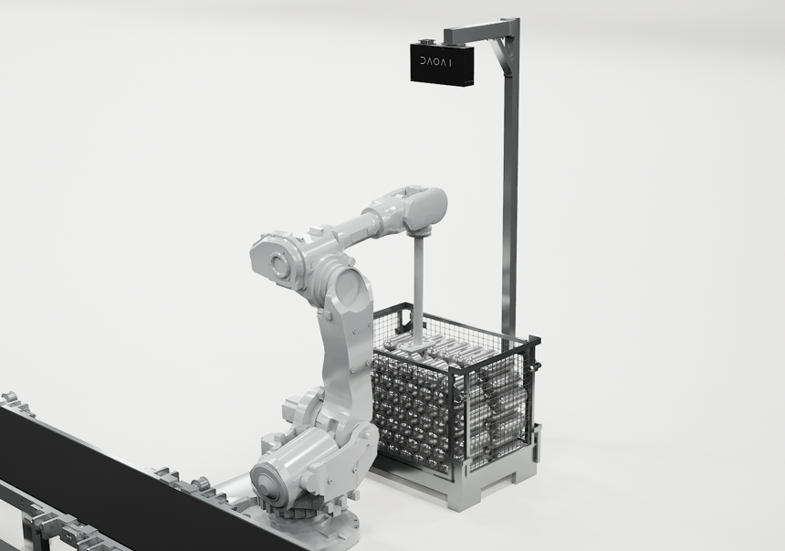
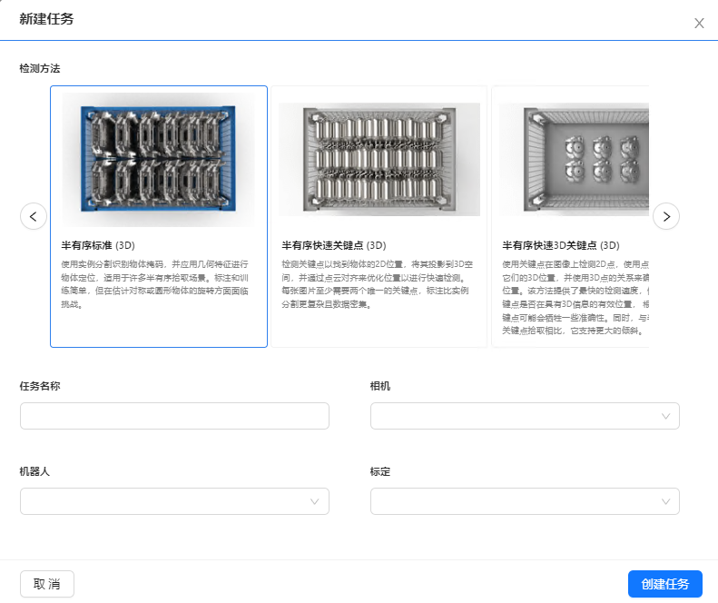

软件应用
============

软件的应用总共分为3大类。

.. contents::
    :local:

所有应用都需要先将机器人和DaoAI 3D相机连接到DaoAI机器人视觉认知系统，并完成手眼标定。

抓取应用
----------

抓取应用主要针对抓取场景中的物体。如果您想让机器人抓取某样物体，那么抓取流程可以帮您完成这个任务。

1. 您需要先在机器人视觉认知系统中选择抓取任务，并再选择一个检测流程，设置针对该物体的检测流程和抓取策略。了解更多的检测流程请查阅 :ref:`视觉项目`

3. 在设置好抓取任务后，运行项目。

4. 机器人端发送检测请求, 然后再发送抓取点位请求。更多机器人可用的函数请查阅 :ref:`接口/Interface`

5. 视觉回复请求，返回抓取点位，机器人移动至抓取点位进行抓取。

.. 放置应用
.. ----------

.. 放置应用主要针对放置物体于放置区域。如果您的机器人抓取了物体后，需要放置在指定的区域（固定位置，堆叠，排列，以及检测放置区域放置），那么放置流程可以帮助您完成这个任务。

.. .. image:: images/placing.png

.. 1. 在机器人视觉认知系统中选择选择放置任务，设置放置方式，或者放置检测流程，然后运行项目。了解更多的检测流程请查阅 :ref:`视觉项目`

.. .. image:: images/placing2.png

.. 2. 机器人发送检测请求, 然后发送放置点位请求。更多机器人可用的函数请查阅 :ref:`接口/Interface`

.. .. image:: images/placing3.png

.. 3. 视觉回复请求，返回放置点位，机器人移动至放置点位点位放置物体。

.. 物体姿态纠正应用 
.. -----------------

.. 物体姿态纠正应用主要针对抓取物体后，纠正抓取物体的姿态。姿态纠正任务通常会和放置任务一起使用。在机器人抓取物体后，物体可能会以倾斜的姿势被抓起，这时就需要对物体姿态进行纠正，才可以执行安全的放置。

.. .. image:: images/adjust.png

.. 1. 首先在机器人视觉认知系统中选择姿态纠正任务，以及相应的放置任务，设置好检测流程，然后运行项目。了解更多的检测流程请查阅 :ref:`视觉项目`

.. .. image:: images/adjust1.png

.. 2. 机器人端发送检测请求, 请求发送纠正点位，以及放置点位。更多机器人可用的函数请查阅 :ref:`接口/Interface`

.. .. image:: images/adjust2.png

.. 3. 视觉回复请求，机器人移动并纠正物体姿态并放置物体。
