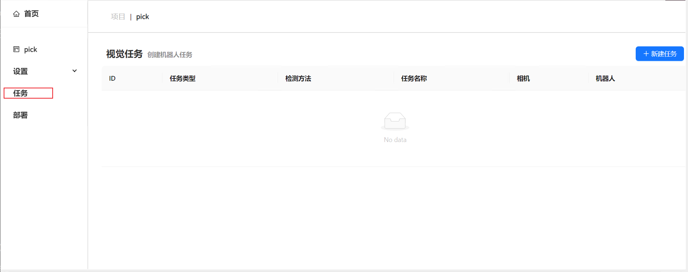
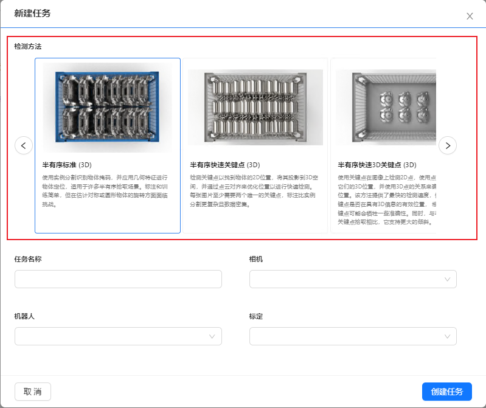
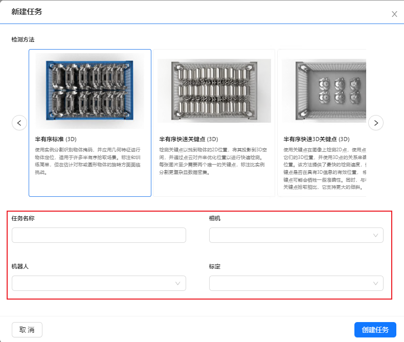

视觉任务
============

本章将会详细介绍DaoAI Vision Pilot的视觉项目，从创建一个任务开始。 

创建一个新任务
-------------------

配置任务
-----------

这一步之前需要首先添加、连接相机，机器人，并且完成手眼标定。

1. 在左边项目栏中点击 ``任务`` 打开任务管理页面。

2. 在这里点击 ``+ 新建任务``

3. 选择任务类型，检测方法。

4. 填入任务详情。
 - 填入您所创建的任务名称
 - 选择该项目中连接的相机
 - 选择该项目中连接的机器人
 - 选择该项目中上传或标定好的标定文件

5. 点击“创建任务”。

.. image:: images/task_added.png
    :scale: 100%

这样任务就添加完成了。

下一步请参考检测流程的详细配置：

    .. toctree::
        :maxdepth: 1
        
        detection
        pick
        deploy
        empty_box_check

删除任务
-------------------
     - 您可以直接点击“删除任务”来删除该任务

