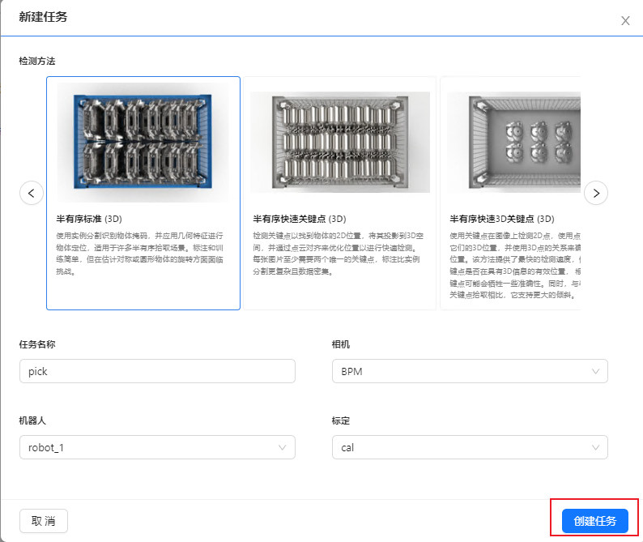

视觉任务
============

本章将会详细介绍DaoAI机器人视觉认知系统的视觉项目，从创建一个任务开始。 

创建一个新任务
-------------------

这一步之前需要首先添加、连接相机，机器人，并且完成手眼标定。

1. 在左边项目栏中点击 ``任务`` 打开任务管理页面。

.. image:: images/vision_project.png
    :scale: 60%

2. 在这里点击 ``+ 新建任务``

3. 依次选择任务，检测方法，

.. image:: images/task.png
    :scale: 80%

4. 填入任务详情。

.. image:: images/info.png
    :scale: 80%

5. 点击OK添加任务。

这样任务就添加完成了，下一步请参考检测流程的详细配置：

.. toctree::
    :maxdepth: 1

    dl_modfinder
    dl_kp
    pick
    deploy