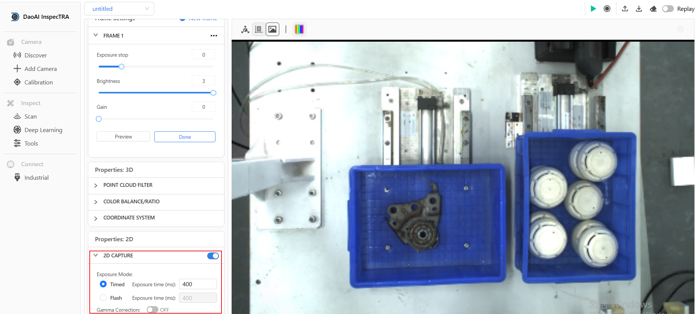

案例分析
===========

.. content::
    :local:

拍摄金属件时，为了保持点云质量，RBG图片亮度低怎么办？
-------------------------------------------------------

    .. image:: images/case_pcc.png
        :scale: 70%

如上图，设置了相机参数为暗一点的时候，点云质量会更好，可是图片过暗，边缘匹配时无法正确的匹配到边缘。这种情况该怎么办呢？

可以在相机参数中，启用“2D CAPTURE”功能，并调试曝光参数并采集验证。该功能会在采图时额外采集一张图片作为点云和RGB图片的颜色。该亮度可以独立设置，不会影响点云的质量。

这样就可以在保持点云质量不变的同时，增加RGB图像的亮度，以更好的进行2D边缘匹配。

如何分层抓取物体？
-------------------------------------------------------

    - 您可在抓取顺序中打开“使用层过滤”功能，并输入所需要的层高数值。视觉就会将识别到的物体按您所设置的层高及过滤数值重新将识别到的物体分层。
    - 如下图所示：视觉可以识别到4个物体、两层、由于打开了层过滤功能、并选择了只保留1层的识别物。则视觉重新排序后就只保留了最上层的识别物。

    .. image:: images/层1.png
        :scale: 70%
 

    - 如下图所示：没有打开层过滤功能、并保留0层的识别物。则视觉就会将所有识别到的物体按您所设置的“Z值最高”排序。

    .. image:: images/层2.png
        :scale: 70%

如何顺序抓取物体？
-------------------------------------------------------

    .. note::
        抓取顺序中设置的坐标系参考的是相机坐标系、不是物体（Object）坐标系。

    - 您可在抓取顺序中设置“按以下顺序抓取物体”中选择：X值最高。这样视觉就会将识别到的物体按照X轴由高到底的顺序来排序，如下图所示，物体由右到左有序排列。
     
    .. image:: images/X最高.png
        :scale: 70%

    - 您可在抓取顺序中设置“按以下顺序抓取物体”中选择：X值最低。这样视觉就会将识别到的物体按照X轴由低到高的顺序来排序，如下图所示，物体由左到右有序排列。

    .. image:: images/X值最低.png
        :scale: 70%

    - 同理，您也可以选择“Y值最低”“Y轴最高”等参数，将视觉识别到的物体按照您想要的方向进行排序、从而让机器人有序抓取。

    .. image:: images/排序选择坐标轴.png
        :scale: 70%
    

如何从最上方抓取物体？
-------------------------------------------------------

    - 您可在抓取顺序中设置“按以下顺序抓取物体”中选择：Z值最高。这样视觉就会将识别到的物体按照Z轴由高到底的顺序来排序、如下图所示"4"比"1"Z值低、视觉排序之后优先抓取“1”
    .. image:: images/分层抓取排序.png
        :scale: 70%

    

防碰撞功能如何使用？
-------------------------------------------------------

    - 您可在防碰撞中打开倾斜和虚拟框体碰撞功能、当机器人tool坐标Z轴与物体Z轴夹角超过设定的度数或机器人末端夹爪模型与您所设置的虚拟框体发生碰撞时、防碰撞模块判定该物体抓取时会有碰撞风险、视觉判定不抓取。

    .. image:: images/防碰撞.png
        :scale: 70%

物体旋转180°后抓不准该怎么办？
----------------------------------

您首先可以考虑多加几个示教点位使用 **多示教抓取** ：

    .. image:: images/multi_pose_pick.png
        :scale: 70%

比如说您可以对于1个物体创建4个示教点位，每次示教 物体旋转90°

这样您就有了4个物体的旋转区间对应的抓取点位，系统自带的cluster picking 功能，会智能采用对应旋转区间的示教关系来执行抓取。

如果多示教抓取还不够，您可以考虑以下几点。

对抓取精度影响的主要因素有：
    1. 手眼标定精度
    2. 检测精度
    3. TCP精度
    4. 示教关系精度

那么改善的方面也应该从这几点下手

1. **检查手眼标定**

    手眼标定时，校准版的 **位置** 应该涵盖物体可能出现的位置。
    手眼标定时，校准版的 **旋转角度** 应该涵盖物体可能出现的旋转角度。

    如果手眼标定没有满足以上的两个条件，请重新做手眼标定。
    
2. **检测精度**

    查看物体的匹配情况，可以在快速检测步骤观察物体的坐标，以及点云的对齐情况，如果有误差的话，

        a. 优化相机配置 
        b. 优化深度学习模型
        c. 优化点云模型
        d. 优化高级检测参数

3. **TCP精度**

    通常长夹爪在遇到物体检测的角度误差时，平移误差会根据夹爪的长度成比增加。那么为了减少这个问题，就需要缩短示教关系的距离 （tool in object）。

    如果机器人是用法兰位置交互的，那么请尝试创建一个TCP(tool center point)并使用TCP来进行示教、抓取。

    .. image:: images/tcp.png
        :scale: 60%

4. **示教关系精度**

    与3.同理，尽可能地缩短示教点与物体坐标原点的距离，这样可以减少误差。
    
    如果您示教完成后，发现TCP的点位 在虚拟现实中和 想要的抓取点位有些许误差，那么可以尝试在显示窗口里，将TCP调整至理想抓取点位。这样可以减少示教时的误差。
    
    .. image:: images/pick_pose.png
        :scale: 60%

正确的制作机器人夹爪模型
-------------------------------

    .. image:: images/gripper-mesh.png
        :scale: 60%

1. 夹爪模型应该避免使用过于复杂的的细节，或者包含过多的网格面数，因为这样会极大程度的增加运算负担

2. 夹爪的起始端应该做一个大球的网格，来代表机器人的法兰以及小臂部分，这样可以在避碰处理时也把机器人的小臂部分也包含到，运算时最大程度的避免了碰撞发生的可能性。

3. 夹爪模型的z轴需正确的朝向下方（垂直抓取的方向）, 这是由于避碰时计算的倾斜角度限制是以z轴为参考轴计算的，这样才可以正确的计算夹爪抓取时倾斜角度的限制。
