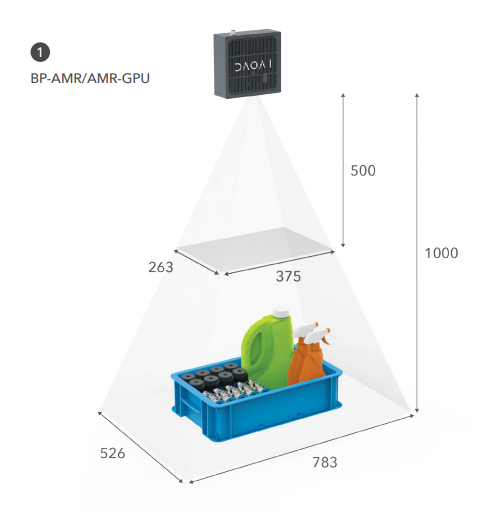
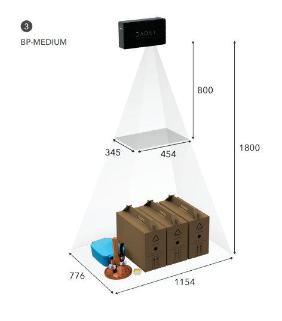

=========================
机械安装
=========================

.. contents:: 
   :local:

机械接口
======================================

尺寸
---------------------------------

.. tabs::

   .. group-tab:: BP SAMLL

      .. image:: images/mechanical-interface/amr_1.png
         :align: center
   
      .. image:: images/mechanical-interface/amr_2.png
         :align: center

   .. group-tab:: BP MEDIUM

        .. image:: images/mechanical-interface/medium_1.png
         :align: center
   
      .. image:: images/mechanical-interface/medium_2.png
         :align: center

   .. group-tab:: BP LARGE

       .. image:: images/mechanical-interface/large.png
         :align: center
   
       .. image:: images/mechanical-interface/bp-l.png
         :align: center
         :scale: 42%
   
   .. group-tab:: BP AMR

      .. image:: images/mechanical-interface/amr_1.png
         :align: center
   
      .. image:: images/mechanical-interface/amr_2.png
         :align: center

   .. group-tab:: BP AMR-GPU

      .. image:: images/mechanical-interface/amr_gpu_1.png
         :align: center
   
      .. image:: images/mechanical-interface/amr_gpu_2.png
         :align: center

   .. group-tab:: BP LASER

      .. image:: images/mechanical-interface/large.png
         :align: center
   
      .. image:: images/mechanical-interface/bp-l.png
         :align: center
         :scale: 42%

安装规格
--------------------------------------

.. tabs::

   .. group-tab:: BP SAMLL

        DaoAI BP SAMLL摄像机有四个M5安装孔，一个Ø5定位锥孔和一个定位锥孔。为确保不损坏螺纹，我们建议在紧固螺丝时不要超过规定的最大扭矩值。

       .. image:: images/mechanical-interface/amr_3.png
         :align: center

   .. group-tab:: BP MEDIUM

      DaoAI BP MEDIUM 摄像机有四个M5安装孔，一个Ø5定位锥孔和一个定位锥孔。为确保不损坏螺纹，我们建议在紧固螺丝时不要超过规定的最大扭矩值。

       .. image:: images/mechanical-interface/medium.png
         :align: center

   .. group-tab:: BP LARGE

      DaoAI BP LARGE 摄像机有四个M5安装孔，一个Ø5定位锥孔和一个定位锥孔。为确保不损坏螺纹，我们建议在紧固螺丝时不要超过规定的最大扭矩值。

       .. image:: images/mechanical-interface/bp-l_mounting.png
         :align: center
   
   .. group-tab:: BP AMR

      DaoAI BP AMR摄像机有四个M5安装孔，一个Ø5定位锥孔和一个定位锥孔。为确保不损坏螺纹，我们建议在紧固螺丝时不要超过规定的最大扭矩值。

       .. image:: images/mechanical-interface/amr_3.png
         :align: center   

   .. group-tab:: BP AMR-GPU

      DaoAI BP AMR-GPU 摄像机有四个M5安装孔，一个Ø5定位锥孔和一个定位锥孔。为确保不损坏螺纹，我们建议在紧固螺丝时不要超过规定的最大扭矩值。

       .. image:: images/mechanical-interface/amr_gpu.png
         :align: center

   .. group-tab:: BP LASER

      DaoAI BP LASER 摄像机有四个M5安装孔，一个Ø5定位锥孔和一个定位锥孔。为确保不损坏螺纹，我们建议在紧固螺丝时不要超过规定的最大扭矩值。

       .. image:: images/mechanical-interface/bp-l_mounting.png
         :align: center

|

正确的安装位置
=================================

摄像机和投影仪相对于中心轴有一个角度。如果希望摄像机垂直于场景，就应该考虑这一点。

.. .. tabs::

..    .. group-tab:: BP SAMLL

..     .. image:: images/small.png
..         :align: center

..    .. group-tab:: BP MEDIUM

..     .. image:: images/medium.png
..         :align: center

..    .. group-tab:: BP LARGE

..     .. image:: images/large.png
..         :align: center

   
..    .. group-tab:: BP AMR

..     .. image:: images/amr.png
..         :align: center
   

..    .. group-tab:: BP AMR-GPU

..     .. image:: images/amr.png
..         :align: center
   

如果可能的话，将摄像机安装在一个轻微的倾斜角度，以避免背景的反射和干扰。这也为场景上方腾出了空间，方便工具和机器人的使用。请查看可用的DaoAI支架。

周围的光线可能会降低性能，考虑阻挡影响场景的直接光线。

.. image:: images/positioning-correctly/fov.png
      :scale: 35%
      :align: center

.. note::
    如果场景包含高反光的物体，相机的倾斜就更加重要。

请查看 :ref:`工作距离和视场` 来了解工作距离和相机定位的更多信息，以及如何正确定位你的相机。

在分拣的应用中
----------------------------------

对于分拣的应用中，将DaoAI BP相机投影仪置于箱体后缘或后角上方（见以下图片）。平移和倾斜它，使二维相机看向箱体的中心。
投影仪的光线不应落在离投影仪最近的两面箱壁上的内表面；它们应几乎与这两面箱壁平行。这样安装摄像机可以最大限度地减少箱壁的相互反射。

.. image:: images/positioning-correctly/position.png
   :scale: 35%
   :align: center

冷却间隙
----------------------------------
DaoAI BP LARGE相机使用主动和被动冷却，其他BP相机使用被动冷却，它们都在设备周围留出一些空间供空气流动，并且不堵塞其前后两侧的空气开口。关于你的相机的工作温度范围，请参见数据手册。

信号保护
---------------------------------
请勿将DaoAI BP摄像机和电缆安装在可产生高等级电磁干扰的高压设备旁。不要将摄像机布线与交流电源线和发出高电平干扰的电缆通过同一干线/管道。

继续阅读 :ref:`连接和电源`.

|

工作距离和视场
======================================

该系列有五种型号的拣选相机，适用于不同的工作空间和应用，例如：拣选箱、码垛和零件装载。

**BP ARM/AMR-GPU**

**BP SMALL**

.. image:: images/working-distance-and-fov/small.png
   :align: center

**BP MEDIUM**

**BP LARGE**

.. image:: images/working-distance-and-fov/large.png
   :align: center

**BP LASER**

