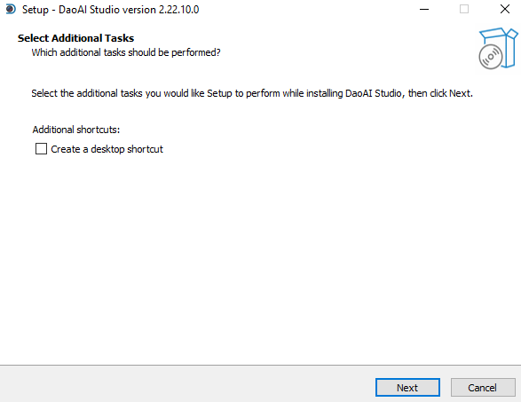
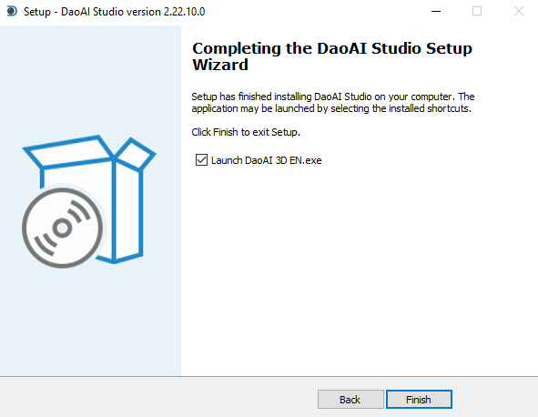
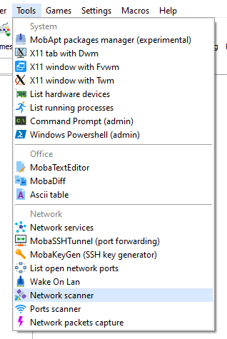
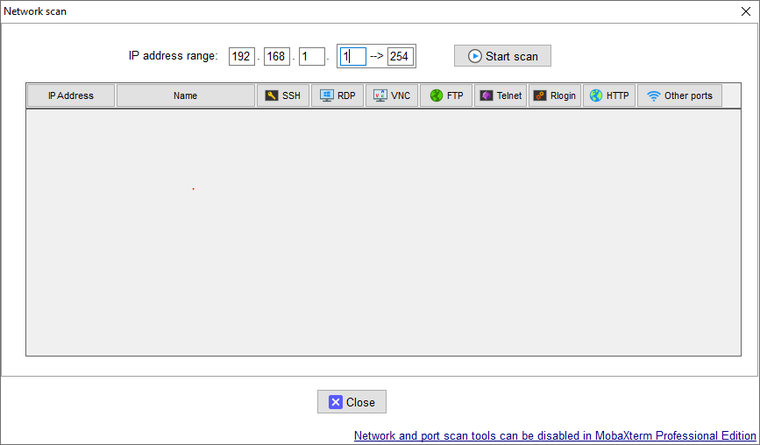

======================
软件安装
======================

在安装DaoAI Vision Congnition System软件之前。

- 检查GPU要求 (GTX 1050 Ti)
- 检查GPU驱动是否为最新版本

安装步骤。

1. 下载最新的DaoAI Camera Studio软件安装程序。

2. 运行以DaoAI_Studio开头的完整安装程序。(e.g. DaoAI_Studio_2.22.10.0_103_full.exe)

.. .. image:: images/software_installation_1.png

3. 按照步骤进行。你可以根据自己的需要定制设置。

4. 点击 "安装"，安装将开始。请注意，安装可能需要几分钟的时间才能完成。

.. image:: images/software_installation_3.png

5. 点击 "完成"，软件安装过程就完成了。

6. 如果您选择了 "启动DaoAI 3D EN.exe "复选框（默认），您将看到DaoAI Camera Studio的启动窗口。

.. image:: images/software_installation_5.png

|

网络配置
========================

默认配置
~~~~~~~~~~~~~~~~~~~~~~~~~~~~~~~

.. list-table::
   :widths: 25 25 25
   :header-rows: 1

   * -  
     - IP
     - 子网掩码
   * - BP-AMR
     - 192.168.1.12
     - 255.255.255.0
   * - 其他BP系列
     - 192.168.1.2
     - 255.255.255.0

| 子网范围内的任何IP地址都是有效的（例如，对于BP系列摄像机：192.168.1.0 - 192.168.1.255）。
| 如果您以前没有配置过摄像机的IP地址，摄像机的IP地址将是上表中的默认IP地址。

静态IP网络配置 - PC
~~~~~~~~~~~~~~~~~~~~~~~~~~~~~~~~~~~~~~

此步骤对于使用 :ref:`多个摄像机<使用多个DaoAI摄像机>` 

导航至: 

控制面板→网络和互联网→网络和共享中心→更改适配器设置。

.. image:: images/control_panel_change_adapter_settings.png

右键单击→属性。

.. image:: images/control_panel_change_adapter_settings_properties.png

双击互联网协议版本4（TCP/IPv4）。

.. image:: images/control_panel_change_adapter_settings_ipv4.png

| 选择 **使用以下IP地址** →设置IP地址为192.168.1.x。
| 如果这是第一次设置摄像机，IP地址应该是2以外的任何数字（例如，输入192.168.1.9）。
| 输入子网掩码。255.255.255.0

.. image:: images/control_panel_change_adapter_settings_ipv4_OK.png

点击 **确定**，完成配置。

.. note:: 
  请确保所有连接的摄像机的IP地址彼此不同，否则在尝试连接时可能会遇到问题 :ref:`多个相机<使用多个 DaoAI 相机>`.

|

检查摄像机的IP地址
~~~~~~~~~~~~~~~~~~~~~~~~~~~~~~~~~~~~~~
如果你不知道摄像机的IP地址，你可以使用 `MobaXterm <https://mobaxterm.mobatek.net/download-home-edition.html>`_ 来检查。

打开MobaXterm。

.. image:: images/x_open.png

从 **工具** 下拉列表中，选择 **网络扫描器**。

在**IP地址范围内输入 **192.168.1.1 → 254**，然后点击 **开始扫描**。

扫描后，它将列出本地网络中所有可发现的IP地址。

.. image:: images/x_results.png

|
