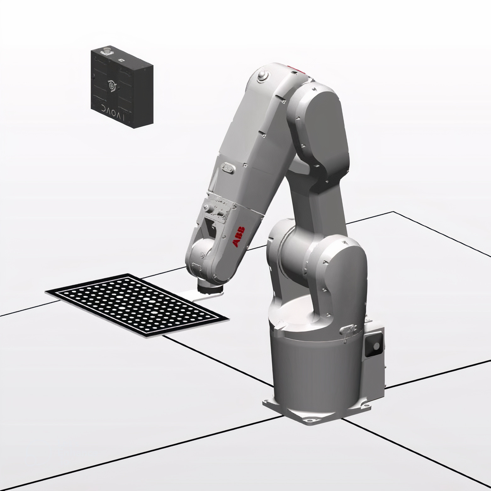
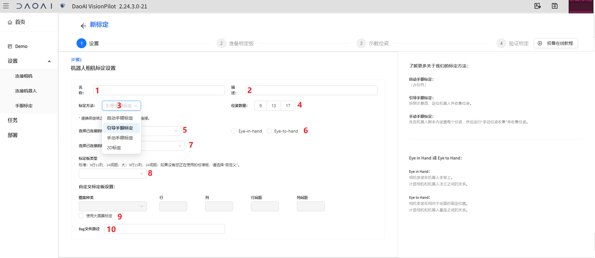
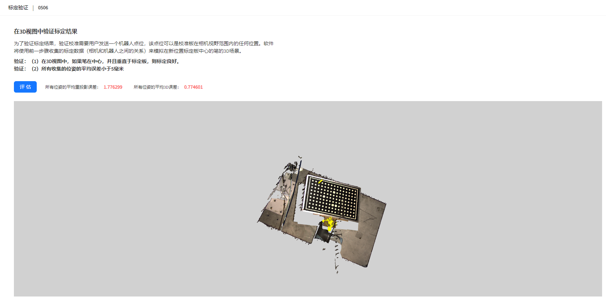

机器人手眼标定
===============

本章会详细介绍进行机器人手眼标定的流程。

机器人手眼标定是为了确立机器人和相机的相对位置关系，这样就使得相机可以精准引导机器人执行抓取任务。

进行手眼标定需要首先连接相机和机器人。

    - 参考 :ref:`连接相机`
    - 参考 :ref:`连接机器人`

使用标定文件
-------------

当你已有一个标定文件，那么您可以选择上传一个手眼标定文件。

1. 来到设置栏，选择手眼标定。
2. 点击上传标定文件。
3. 点击上传浏览选择您的标定文件
4. 输入标定名称
5. （可选）输入标定描述
6. 选择标定文件应用的相机
7. 选择标定文件应用的机器人
8. 点击添加文件。

然后手眼标定就配置好了，您可以继续下一步，创建 :ref:`抓取应用` 了。

进行手眼标定流程
------------------

如果您没有手眼标定文件。 那么您可以执行手眼标定流程以配置手眼标定。同时该流程会生成一个手眼标定文件，保存至项目文件夹内。

机器人和相机的安装分为两种方式： ``Eye-to-Hand`` 安装 和 ``Eye-in-Hnad`` 安装

Eye to Hand 安装，相机固定安装与场景上方，标定版安装在机械臂上，由机器人移动标定版完成手眼标定。

Eye in Hand 安装，相机固定在机械臂上，标定版固定于抓取平面，由机器人移动相机拍摄标定板完成手眼标定。

.. note::
    相机的安装必须严密且固定。不严密且固定的安装会使得相机位置产生变化，使得机器人和相机的相对位置关系偏离手眼标定得出的结果，从而影响引导抓取的精度。

点击开始新的标定以进入标定设置页面。

1. 输入标定名。
2. （可选）输入描述。
3. 选择标定方法，后面会详细介绍每种方法的流程。
4. 选择标定位姿数量。
5. 选择标定的相机，并选择安装方式。
6. 选择标定的机器人。
7. 选择标定板的类型, 选择自定义可以自己输入标定版的参数。
8. 使用大圆标定，大圆标定利用了标定版上的4个大圆对标定版做旋转定位，在机器人需要执行大角度抓取时，建议勾选大圆标定。
9. 设置完毕，进行下一步，进入标定流程。

.. note::
     我们有自动标定、引导标定、手动标定3种标定方式。

     - 自动标定：不用提前示教机器人的各个标定点位、视觉会给机器人发送下一个标定的移动点位（当机器人周围比较宽阔时比较适用）

     - 引导标定：不用提前示教机器人的各个标定点位、视觉会显示下一个标定点位的姿态、需要您手动将机器人摇到该姿态（比较适用初学的工程师）

     - 手动标定：需要提前示教好机器人的各个标定点位（比较适用于经验丰富的工程师）

自动标定
~~~~~~~~~

自动标定流程需要用户设置第一个点位。移动机器人使校准版处于图片中心。然后运行机器人自动校准脚本。DaoAI机器人视觉认知系统会自动发送余下的点位给机器人，执行标定。

以UR机器人为例

1. 打开自动校准的流程图。
    .. image:: images/ur_auto_cali.png
        :scale: 80%

2. 用机器人面板，移动并设置center点位，直至标定板处于图片中心。
    .. image:: images/auto_cali_start.png
        :scale: 80%

3. 然后在视觉认知系统中点击开始校准，先开始DaoAI认知系统，然后开始运行机器人脚本。
    .. image:: images/auto_start.png
        :scale: 80%

4. 稍作等待，手眼标定就完成了。
    .. image:: images/auto_done.png
        :scale: 80%

.. warning::
    在做自动标定的时候，请将机器人的速度调至可以反应过来的速度，并随时准备紧急停止，以防止过大的机器人移动距离造成碰撞。

引导标定
~~~~~~~~~~

引导标定流程需要用户根据DaoAI认知系统界面的引导。移动机器人使校准版匹配引导图中的姿态。然后运行机器人引导校准脚本。再如此重复，直到校准完成。

以UR机器人为例

1. 打开自动校准的流程图。
    .. image:: images/ur_guided.png
        :scale: 80%

2. 用机器人面板，移动并设置当前点位，直至显示里的标定板和引导图片中的姿态匹配。
    .. image:: images/guided_cali_start.png
        :scale: 80%

3. 在DaoAI界面中点击开始校准。

4. 运行一次UR程序，发送一次位姿。

5. 重复 '3','4' 直到所有位姿都收集完成，手眼标定就完成了。
    .. image:: images/guided_done.png
        :scale: 80%

手动标定
~~~~~~~~~~

手动标定由熟练的用户自己定义所有校准的点位。移动机器人脚本一次移动并发送设置好的点位到视觉认知系统完成手眼标定。

以UR机器人为例

1. 打开手动校准的流程图。
    .. image:: images/ur_manual.png
        :scale: 80%

2. 手动设置9，13，或者17个点位，数量对应再标定配置里选择的数量。

3. 在DaoAI界面中点击开始校准。

4. 运行UR程序，等待机器人移动并发送全部点位， 然后手眼标定就完成了。
    .. image:: images/manual_done.png
        :scale: 80%

视觉验证手眼标定
-----------------

在完成手眼标定后，点击下一步, 会来到可视化验证界面。

这一步是为了视觉的验证校准的精度，这一步也可以跳过。

1. 点击评估，相机会拍照。

2. 移动机器人，使标定板在视野范围内的任意想要验证的位置。

3. 切换到发送位姿脚本，然后发送当前位姿，以UR为例：
    .. image:: images/ur_send_pose.png
        :scale: 80%

4. 然后点击 ``显示`` 按钮， 验证结果就显示在窗口了。
    .. image:: images/verify_result.png
        :scale: 80%

.. note::
    验证的方式是这样的: 
        您会看到您拍的校准版的点云，校准版的起始坐标（没有勾选大圆定位：起始坐标处在标定板边角的圆心。如果勾选了大圆定位，起始坐标会在标定板中心），会垂直的投射出一个笔。并且在机器人法兰处，投射一个夹爪模型。

        如果校准结果准确，那么笔应该插在起始坐标的圆心位置。而夹爪模型应当处于机器人的法兰处。
        如果校准结果不准确，那么这个笔，和夹爪模型的投射，就会有偏移和误差，偏移越大，校准也就越不准确。

5. 您可以重复 **1 - 5** 来验证更多点位。

