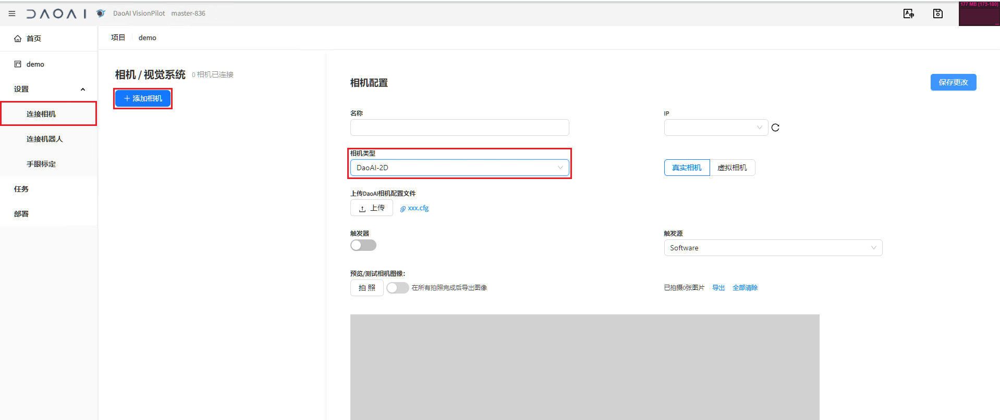
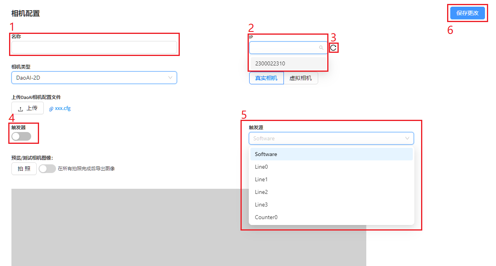
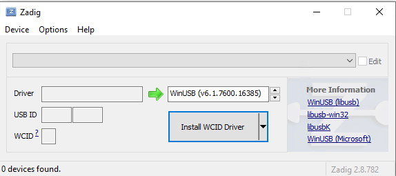
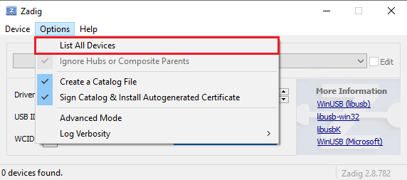
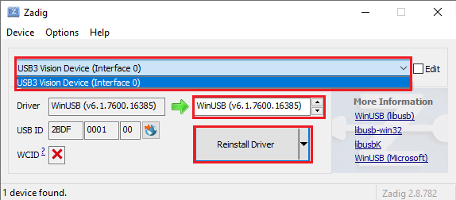
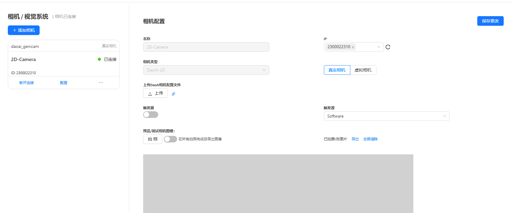
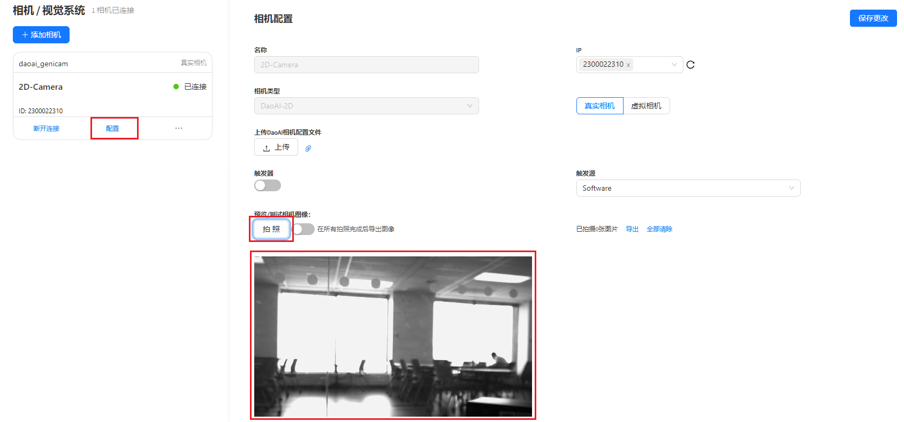
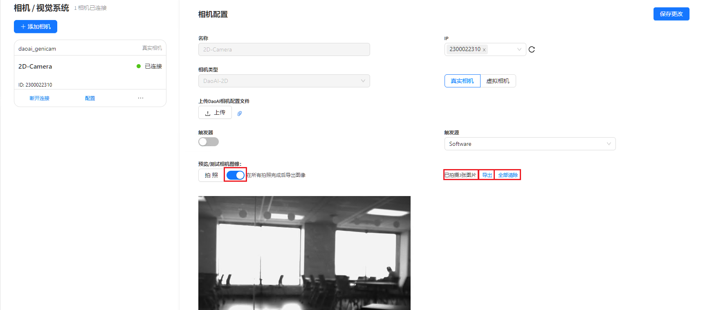
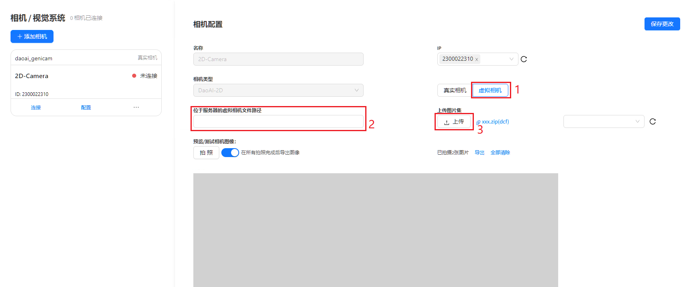

连接2D相机
===================

本章将详细介绍如何连接2D相机到DaoAI Vision Pilot

创建新2D相机
--------------

创建项目后，点击连接相机，然后点击创建新相机，选择相机类型为 DaoAI-2D

真实相机设置界面

1. 相机名称
2. 相机序列号选择框
3. 刷新相机列表
4. 启用相机触发器
5. 选择相机触发器源
6. 保存更改并创建相机

用Zadig安装相机驱动
--------------------------

2D相机需要使用 `Zadig工具 <https://daoairoboticsinc-my.sharepoint.com/:u:/g/personal/nrd_daoai_com/EbXrdMiY201Mk85qQMu1BVwBsTrhk_pLKckLtQgvFeO7kg?e=dzineD>`_ 安装相机驱动，才能连接到DaoAI Vision Pilot。

连接相机到电脑后，打开Zadig工具，

打开Options菜单, 点击List All Devices

选择您的2D相机, 选择 (v6.1.7600.16385) 驱动， 然后点击 Install Driver 或者 Reinstall Driver

然后回到DaoAI Vision Pilot 连接相机页面，点击刷新，便可发现您的2D相机。

连接2D相机
---------------

填写名称，选择相机序列号，点击保存更改，即可创建相机。

然后在新创建的相机卡片里，点击连接相机，即可连接到相机

拍照并采集数据
-------------------

连接相机后，在2D相机卡片上，点击配置。然后点击拍照即可拍照并查看图片。

启用 ``在所有拍照完成后导出图像`` ，然后再拍照，就可以保存拍摄的数据。随后点击导出，即可下载数据到电脑。点击全部清除，可以清除已保存的所有数据。

虚拟相机
------------------

1. 选择虚拟相机
2. 选择服务器中想要读取的png图片的文件夹路径。
3. （或）点击上传，选择png图片上传到服务器。

