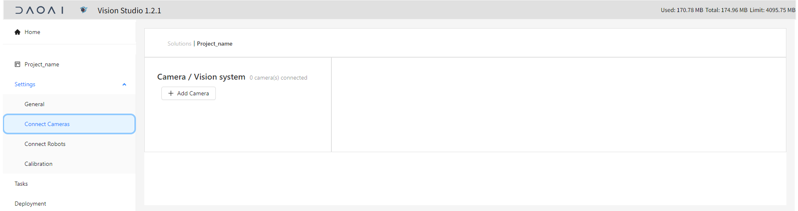

连接相机
===========

更改网口ipv4
---------------

DaoAI相机使用CAT-6网线连接到您的工控机。

|

之后需要在网络配置处，更改您连接相机的网口的ipv4，以避开相机的ip。

.. image:: images/change_ip.png

|

连接相机到DaoAI机器人视觉认知系统
--------------------------------

打开一个项目后， 在设置一栏下面，点击连接相机选项栏。

.. image:: images/connect_cameras.png
    :scale: 60%

|

点击添加相机。在右边的页面输入相机的名字，ip， 以及并保存。
.. image:: images/add_cameras.png
    :scale: 60%

|

.. note::
    用虚拟数据模拟相机，需要输入包含数据(.dcf)文件的文件夹路径。并保存。
    
    .. image:: images/virtual_camera.png
        :scale: 60%

点击保存，点击连接即可连接到相机。可以点击capture image 来拍摄一张图片。

.. tips::
    如果无法连接，或者Capture image 失败，请检查相机ip, 或者虚拟相机路径是否正确。