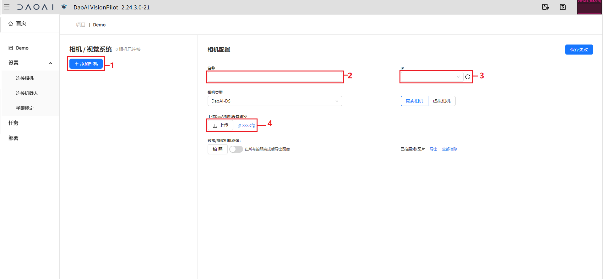

连接相机
===========

更改网口ipv4
---------------

DaoAI相机使用CAT-6网线连接到您的工控机。需要在连接网线后，在对应的网口中更改您连接相机的网口的ipv4，以避开相机的ip。

.. note::
    DaoAI相机的默认ip通常为:
        - 192.168.1.2
        - 192.168.1.3

    更改时需要将后三位改成和相机ip不同的值就可以。

.. image:: images/change_ip.png

|

连接相机到DaoAI机器人视觉认知系统
----------------------------------

|

1. 点击添加相机。
2. 输入相机的名称。
3. 输入相机的ip。
4. （可选）上传一个相机的配置(.cfg)文件。
5. 保存更改以添加相机。

|

这样相机就添加好了，点击连接相机，稍作等待，就可以连接到您的相机了。

.. tip::
    如果无法连接，请参考 :ref:`无法连接相机怎么办?`

使用相机数据连接虚拟相机
------------------------------

用虚拟数据模拟相机，需要选中虚拟相机，然后输入包含数据(.dcf)文件的文件夹路径并保存。之后点击连接即可连接到相机。

可以点击capture image 来确认可以读取并显示您指定的虚拟的数据。

