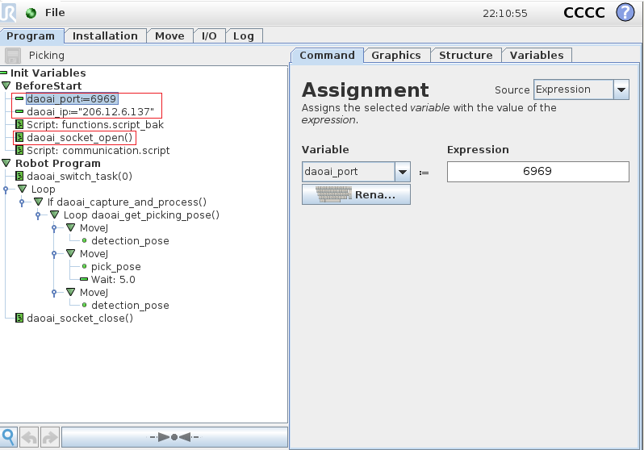
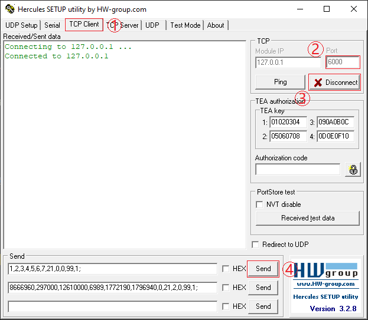

连接机器人
===========

打开一个项目后， 在设置一栏下面，点击连接机器人选项栏。

.. image:: images/connect_robot.png
    :scale: 60%

|

点击添加相机。在右边的页面选择机器人类型，端口号，然后点击保存, 然后点击connect。

.. image:: images/add_robot.png
    :scale: 60%
    
|

连接真实机器人
---------------

以UR机器人为例， 导入DaoAI机器人脚本。

然后调用.......

|

运行UR机器人脚本后，就可以连接机器人到DaoAI机器人视觉认知系统了。

|

.. tips::
    如果无法连接，请检查电脑的ip, 和端口是否正确。

连接虚拟机器人
-----------------------------

使用Hercules为例，连接虚拟机器人到DaoAI机器人视觉认知系统。

切换到Tcp_Client一栏， ip 输入 127.0.0.1, 输入设置好的端口。 
    

|

点击connect，就可以连接到DaoAI机器人视觉认知系统了。

.. image:: images/hercules_connected.png
    :scale: 100%

|

当机器人和DaoAI机器人视觉认知系统交互时，就可以编辑下面的信息串并点击发送。

机器人通讯详情请阅读 :ref:`机器人通讯`
