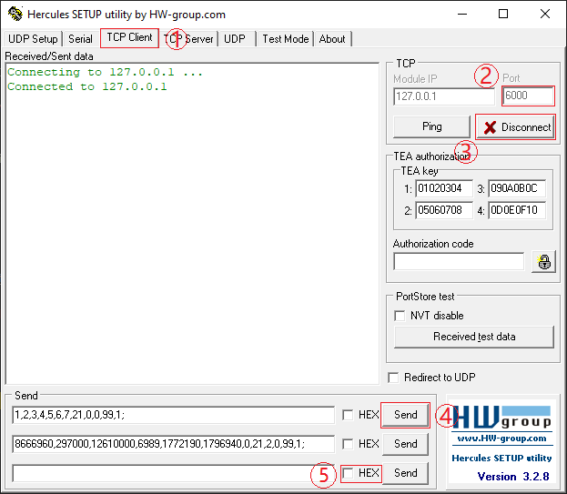

连接机器人
===========

打开一个项目后， 在设置一栏下面，点击连接机器人选项栏。

连接真实机器人
---------------

|

1. 点击添加机器人
2. 点击配置，调出配置页面
3. 选择机器人类型
4. 输入端口号
5. (机器人类型为其它时) 选择位姿顺序
6. (机器人类型为其它时) 选择收发格式，勾选后使用字符串收发，不勾选使用字节串收发。
7. 保存更改
8. 连接机器人
9. 删除机器人

机器人通讯协议详情请查阅 :ref:`机器人通讯`

|

机器人端以UR机器人为例， 导入DaoAI机器人脚本。

.. image:: images/ur_connect.png
    :scale: 80%

|

设置变量daoai_ip 为服务器ip。
设置变量daoai_port 为设置的端口。

然后调用daoai_socket_open()函数。

在运行UR机器人脚本后，可以连接机器人到DaoAI机器人视觉认知系统了。

.. tips::
    如果无法连接，请检查电脑的ip, 和端口是否正和机器人脚本中一致。

连接虚拟机器人
-----------------------------

使用Hercules为例，连接虚拟机器人到DaoAI机器人视觉认知系统。

在连接机器人一栏，选择机器人类型为 ``其他机器人``， ``端口`` 以6000为例。

|

选择使用的旋转顺序。

选择收发格式，勾选使用字符串，不勾选时会使用字节串。更多请查阅 :ref:`机器人通讯`

|

在Hercules界面

1. 切换到Tcp_Client一栏， 
2. ip 输入 127.0.0.1, 并输入设置好的端口 6000。 
3. 点击连接，就可以连接到DaoAI机器人视觉认知系统了。
4. 可以在左边的输入栏编辑消息，然后点击发送到视觉认知系统。不勾选HEX发送时是以字符串的格式发送。更多请查阅 :ref:`字符串`
5. 如果使用字节串收发，请勾选HEX再发送，发送的信息需要是十六进制格式。更多请查阅 :ref:`字节串`

