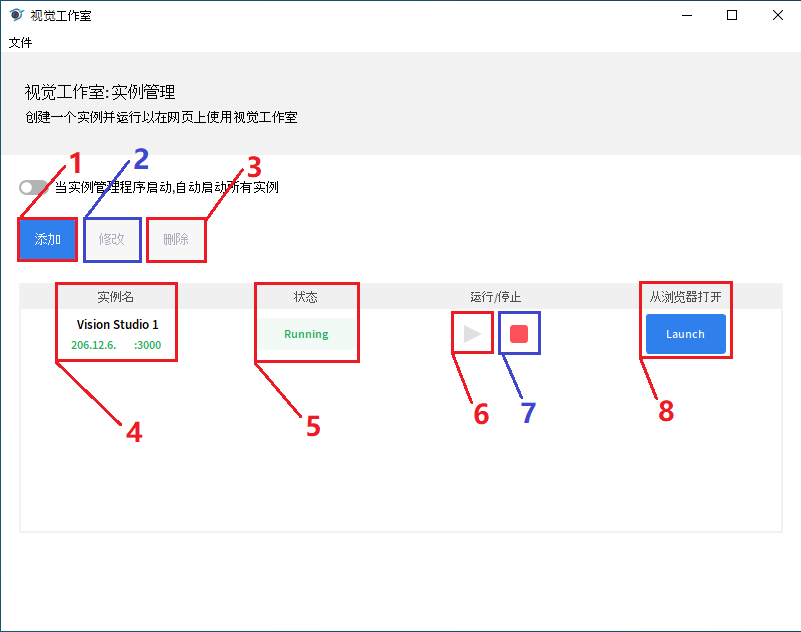
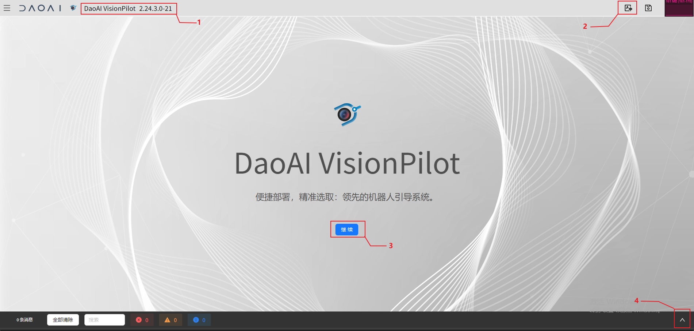
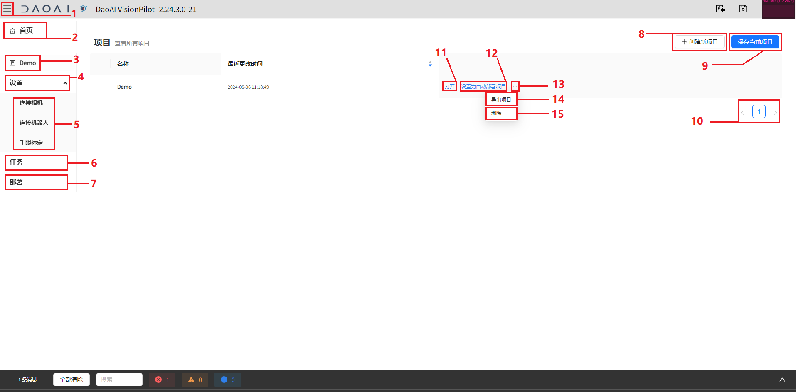
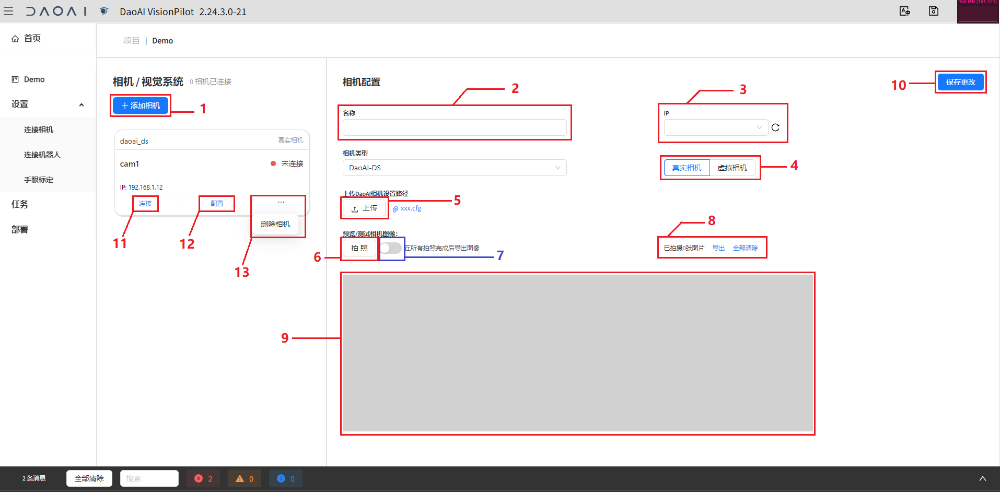

图形界面
=========

本章会向您介绍DaoAI机器人引导系统的图形界面。

打开软件后，进入网页访问 <本地默认网址> `http://127.0.0.1:3000/ <http://127.0.0.1:3000/>`_ 。

如果您自定义了服务器端口，那么您可以从浏览器访问 <服务器ip>:<端口号>。

.. note::
    例: 
        如果您的服务器 ip 是 198.162.1.123
        然后启动器的端口设置为: 8888

        那么您可以从网络内的任何电脑访问 198.162.1.123:8888 进入DaoAI机器人引导系统。

WeRobotics Cognition System页面
------------

双击图标进入后，您会看到以下页面

1. 添加一个服务器实例
2. 修改您所添加的服务器实例
3. 删除您所添加的服务器实例
4. 以创建的服务器实例
5. 服务器实例当前状态
6. 控制该服务器实例运行
7. 控制该服务器实例停止
8. 是否需要在浏览器中启动该服务器实例

欢迎页面
------------

进入后，您会看到软件的欢迎页面，点击继续进入主页面。

1. 软件版本号
2. 语言切换按钮，中英文一键切换
3. 继续，进入主页面
4. 控制台显示/隐藏切换按钮

控制台
---------

1. 控制台消息数量
2. 清除控制台消息
3. 搜索控制台的一条消息
4. 过滤显示错误信息
5. 过滤显示警告信息
6. 过滤显示系统信息
7. 控制台消息显示区域

主界面
------------

在主界面，您可以看到您所有的项目，创建项目，或者管理已有项目。

1. 首页按钮，点击可以返回主界面。
2. 当前加载的项目名。
3. 设置栏，点击可以展开/隐藏 4. 子设置栏,配置相机、机器人、和手眼标定。
4. 配置相机、机器人、和手眼标定项目栏，点击进入对应的页面。
5. 任务栏，点击进入任务管理页面。
6. 部署栏，点击进入项目部署页面。
7. 创建新项目按钮，点击进入创建项目页面。
8. 保存按钮，点击保存当前的页面。
9. 当前页面和翻页按钮，翻页以浏览更多项目。
10. 展开项目选项：11，12，13
11. 导出项目，点击后，会将项目从服务器下载到本地。
12. 打开按钮，点击后加载该项目到当前项目。
13. 删除项目，弹窗确认后即可删除项目。

连接相机页面
-------------

在连接相机页面，您可以管理您的相机：添加、删除相机，连接，拍照，采集数据。

1. 添加相机按钮，点击后出现右边的相机配置页面。
2. 相机名称。
3. 相机的IP地址。
4. 设置相机为真实相机，或者虚拟相机。
5. 当选中真实相机时，可以点击上传相机配置(.cfg)文件。如果选中虚拟相机（如下图）需要输入虚拟数据的文件夹路径。
    
    .. image:: images/virtual_cam_file.png
        :scale: 80%

6. 拍照按钮，需要先点击 `10.` 创建相机再连接相机，点击后会触发相机拍照，会显示在 `9. `显示窗口
7. 切换在预览时，保存相机图片的功能，开启后，每次拍照，会在 `8.` 更新状态。
8. 预览时保存的相机数据，可以点击导出下载到本地，或者全部清除来清除当前保存的数据。
9. 相机预览拍照时的显示窗口
10. 保存相机设置 并创建相机，创建相机后相机
11. 连接相机，点击后需要稍作等待
12. 配置按钮，点击后打开对应相机的右侧相机配置页面
13. 删除相机。

显示窗口
---------------
 - 旋转点云：一直点着鼠标左键、移动鼠标
 - 缩小和放大点云：滑动鼠标滚轮
 - 拖动点云：一直点着鼠标右键、移动鼠标
 - 虚拟框如何拖动：如下图所示

   1. 虚拟框拖动功能
   2. 鼠标光标放置在坐标原点就会显示黄色拖动框、一直点着鼠标左键移动鼠标就可以实现虚拟框的拖动
   3. 鼠标左键一直点着红色区域移动鼠标、可以实现虚拟框X方向的拖动
   4. 鼠标左键一直点着绿色区域移动鼠标、可以实现虚拟框Y方向的拖动
   5. 鼠标左键一直点着蓝色区域移动鼠标、可以实现虚拟框Z方向的拖动

   .. image:: images/如何拖动虚拟框.png
       :scale: 80%

 - 虚拟框如何旋转：如下图所示

   1. 虚拟框旋转功能
   2. 鼠标左键一直点着红色区域移动鼠标、可以实现虚拟框X方向的旋转
   3. 鼠标左键一直点着绿色区域移动鼠标、可以实现虚拟框X方向的旋转
   4. 鼠标左键一直点着蓝色区域移动鼠标、可以实现虚拟框Y方向的旋转

   .. image:: images/旋转虚拟框.png
       :scale: 80%

 - 虚拟框如何放大和缩小：如下图所示

   1. 虚拟框放大缩小功能
   2. 鼠标左键一直点着红色区域移动鼠标、可以实现虚拟框X方向的放大缩小
   3. 鼠标左键一直点着绿色区域移动鼠标、可以实现虚拟框X方向的放大缩小
   4. 鼠标左键一直点着蓝色区域移动鼠标、可以实现虚拟框Y方向的放大缩小

   .. image:: images/放大缩小虚拟框.png
       :scale: 80%

连接机器人页面
---------------

在连接相机页面，您可以管理您的机器人：添加、删除机器人，选则机器人的类型，以及通讯端口。

1. 点击添加按钮来添加一个机器人。
2. 点击连接来打开服务器，接收机器人发送的信息。
3. 配置按钮，点开会打开右侧机器人配置页面。
4. 删除机器人。
5. 选择机器人的类型。
6. 指定一个连接端口。
7. 保存机器人类型与连接端口。