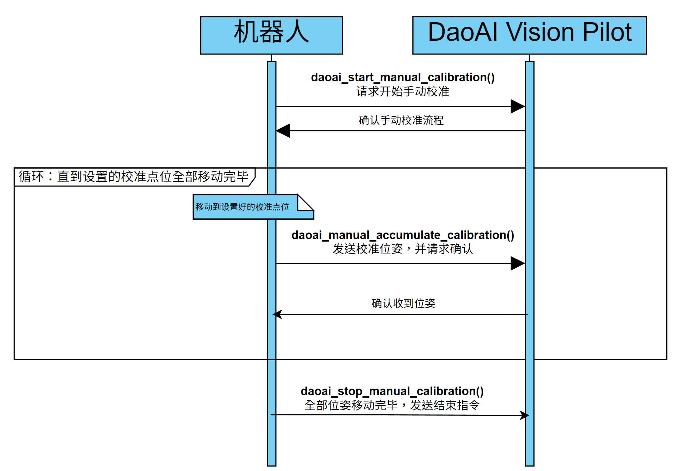
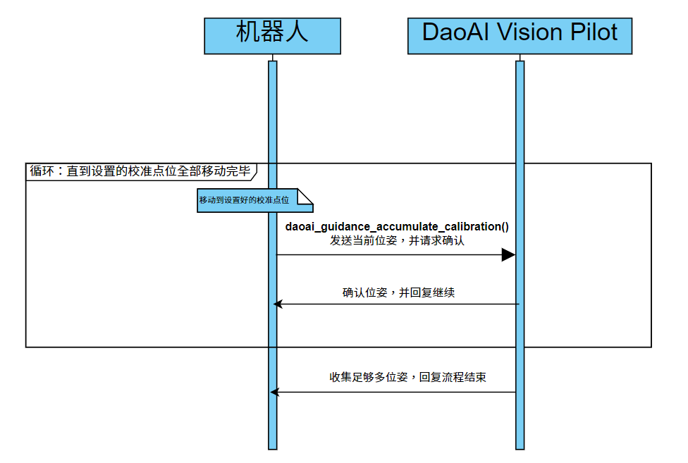
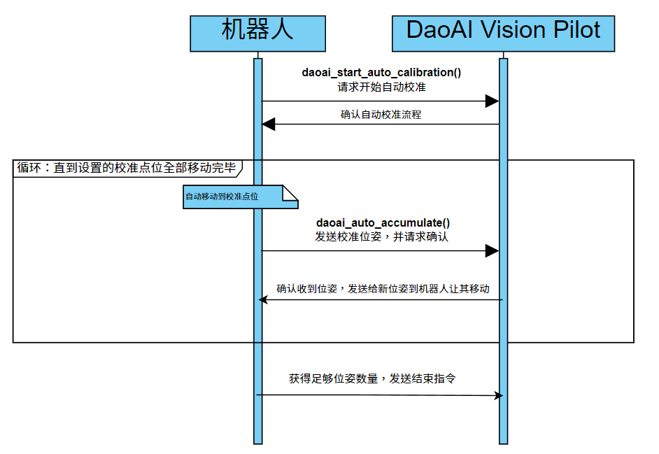
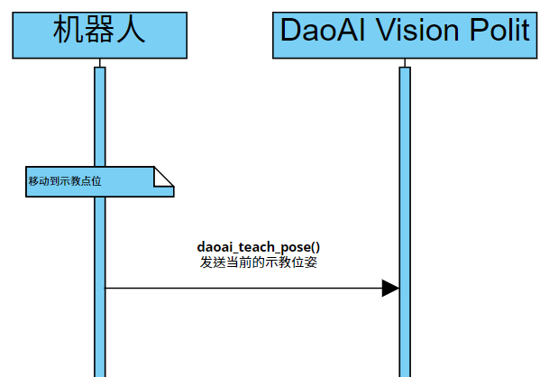
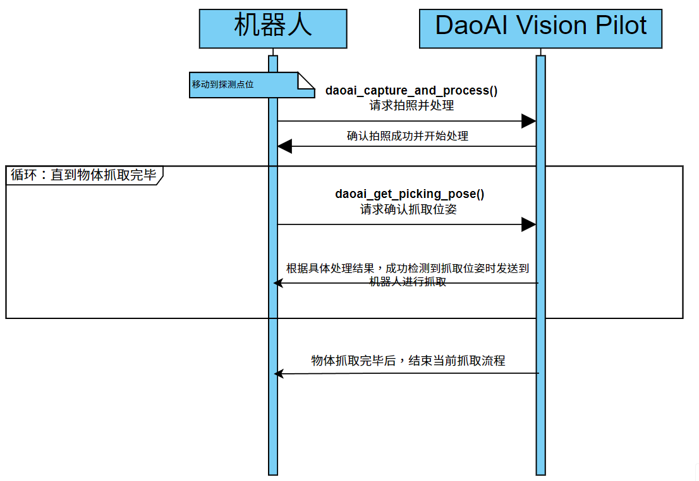
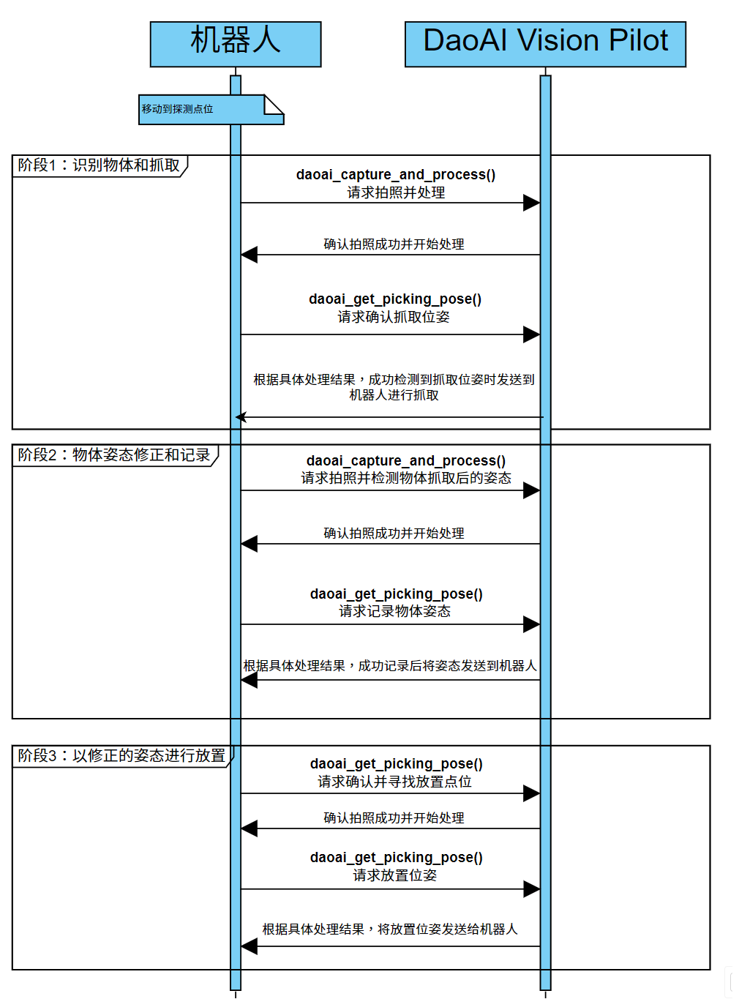

通讯应用示例
===========

校准
-----------

手动校准通信示例
~~~~~~~~~~~~~~~~~~~~~~~~

.. diagram is from https://online.visual-paradigm.com/ saved diagram file in the images location & filename is the same, extension is .vpd(visual paradim diagram)

1. 设置好机器人脚本中所有的校准位姿。
2. 机器人调用API函数 ``daoai_start_manual_calibration()`` 发送开始校准指令到 DaoAI Vision Pilot 。
3. 视觉回复并确认正处于手动校准模式，DaoAI Vision Pilot进入累计流程；否则，机器人停止程序。
4. 机器人调用API函数 ``daoai_manual_accumulate_calibration()`` 发送当前位姿， DaoAI Vision Pilot 进行储存、回复并确认，机器人继续进行下一个位姿移动；否则，机器人停止程序。
5. 在累计流程结束时(所有设置的校准位姿移动完毕)机器人调用API函数 ``daoai_stop_manual_calibration()`` 表示已结束校准流程。

引导校准通信示例
~~~~~~~~~~~~~~~~~~~~~~~~

1. 设置好第一个校准位姿。
2. 机器人使用 daoai_guidance_accumulate_calibration() 发送开始引导校准指令到DaoAI Vision Pilot。
3. 视觉会进行拍摄并计算出下一个位姿，而且会对当前位姿作出提议，用户需根据视觉的提示移动机器人到更理想的位姿：
4. 视觉判定当前校准位姿的成相是优良的，视觉会回复并显示下一个推荐的位姿，用户需移动到推荐位姿；
5. 视觉判定当前校准位姿的成相是较差的，视觉会回复并显示该如何改进当前位姿，重新移动并采集和计算；
6. 重复步骤2-3直到视觉收集到足够的校准位姿。
7. 在累计流程结束时视觉向机器人发送结束状态，使机器人结束校准流程。

自动校准通信示例
~~~~~~~~~~~~~~~~~~~~~~~~

1. 设置好第一个校准位姿。
2. 机器人使用 daoai_start_auto_calibration() 发送开始自动校准指令到DaoAI Vision Pilot，并发送当前机器人位姿。
3. 在确认DaoAI Vision Pilot处于正确的流程后，回复机器人进入采集图像和累计流程。
4. 机器人使用 daoai_auto_accumulate() 指令让 DaoAI Vision Pilot 进入累计流程。视觉进行储存计算出下一个校准位姿，并回复下一个位姿移动机器人。
5. 在累计流程结束时视觉向机器人发送结束校准流程状态。

示教
-----------

1. 设置示教位姿。
2. 机器人使用 daoai_teach_pose() 发送当前位姿到DaoAI Vision Pilot，不需要等待任何回复。

抓取和放置
-----------

抓取通信示例
~~~~~~~~~~~~~~~~~

1. 设置好探测位姿，此位姿是抓取结束后机器人移动到的位姿，该位姿不能阻挡摄像头。
2. 机器人使用 daoai_capture_and_process() 请求拍照并识别物体。
3. DaoAI Vision Pilot拍照成功并给予回复，表示视觉处于拍摄探测阶段；
4. 机器人发送 daoai_get_picking_pose() 请求视觉发送抓取位姿；
5. DaoAI Vision Pilot回复四种以下的可能性： 
    a. 相机拍摄成功并且视觉成功探测到一个或多个物体时，视觉发送成功状态和抓取位姿。payload_1数值为剩余的需抓取物体数量，此payload会根据每次抓取结束后更新；
    b. 相机拍摄成功，视觉探测不成功或者场景中没有物体时，视觉发送：无有效物体状态；
    c. 相机拍摄成功，没有安全抓取位姿时，视觉发送：无安全抓取位姿状态；
    d. 相机拍摄失败时，视觉发送：拍摄失败状态；
6. DaoAI Vision Pilot回复的payload_1 代表物体剩余数量（包括当前发送的物体）； payload_2 代表物体在深度学习中的标签码，用于区分物体种类。
7. 场景内的物体抓取完成时，视觉会在最后一个需要抓取的物体信息中，payload_1 = 1，以此告知机器人剩余一个物体抓取，结束后将需要重新拍照。这时如果再调用daoai_get_picking_pose()则返回的payload_1 就会为0，代表没有可抓取的物体。

抓取 - 物体姿态修正 - 放置
~~~~~~~~~~~~~~~~~~~~~~~~~~~~~~

此流程是完整的：抓取物体，然后检测修正物体姿态，然后放置到指定区域的流程。

**第一步抓取** ：机器人请求 daoai_capture_and_process() 拍照并识别抓取点位。

1. DaoAI Vision Pilot回复拍照成功并给予回复，表示视觉处于拍摄探测阶段；
2. 机器人发送 daoai_get_picking_pose() 请求视觉发送放置位姿；
3. DaoAI Vision Pilot回复四种以下的可能性： 
    a. 相机拍摄成功并且视觉成功探测到一个或多个物体时，视觉发送成功状态和抓取位姿。payload_1数值为剩余的需抓取物体数量，此payload会根据每次抓取结束后更新；
    b. 相机拍摄成功，视觉探测不成功或者场景中没有物体时，视觉发送：无有效物体状态；
    c. 相机拍摄成功，没有安全抓取位姿时，视觉发送：无安全抓取位姿状态；
    d. 相机拍摄失败时，视觉发送：拍摄失败状态；

**第二步物体姿态修正** ：机器人请求 daoai_capture_and_process() 拍照并识别物体。该步骤只是检测物体姿态，并不做移动。

1. DaoAI Vision Pilot回复拍照成功并给予回复，表示视觉处于拍摄探测阶段；
2. 机器人发送 daoai_get_picking_pose() 请求视觉发送结果，这里视觉发回的是：当前物体于夹爪中的姿态，并在机器人端记录;
3. DaoAI Vision Pilot回复三种以下的可能性：
    a. 相机拍摄成功并且视觉成功探测物体姿态时，视觉发送成功状态和当前物体于夹爪中的姿态。
    b. 相机拍摄成功，视觉探测不成功或者场景中无物体时，视觉发送：检测不到有效物体姿态。
    c. 相机拍摄失败时，视觉发送：拍摄失败状态；

**第三步放置** ：机器人请求 daoai_capture_and_process() 拍照并识别放置区域。

1. DaoAI Vision Pilot回复回复拍照成功并给予回复，表示视觉处于拍摄探测阶段；
2. 机器人发送 daoai_get_picking_pose() 请求视觉发送结果，这里视觉发回的是：当前放置区域相对于示教时的初始位置的偏移量，并在机器人端记录;
3. DaoAI Vision Pilot回复三种以下的可能性：
    a. 相机拍摄成功并且视觉成功探测放置区域时，视觉发送成功状态和放置位姿。和当前放置区域相对于示教时的初始位置的偏移量。
    b. 相机拍摄成功，视觉探测不成功或者场景中无目标时，视觉发送：检测不到有效放置点位。
    c. 相机拍摄失败时，视觉发送：拍摄失败状态。
4. 机器人端计算出放置位置，然后移动至放置区域。