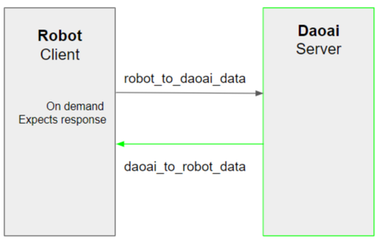
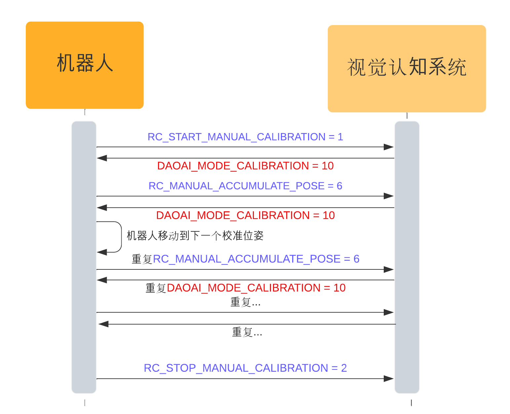
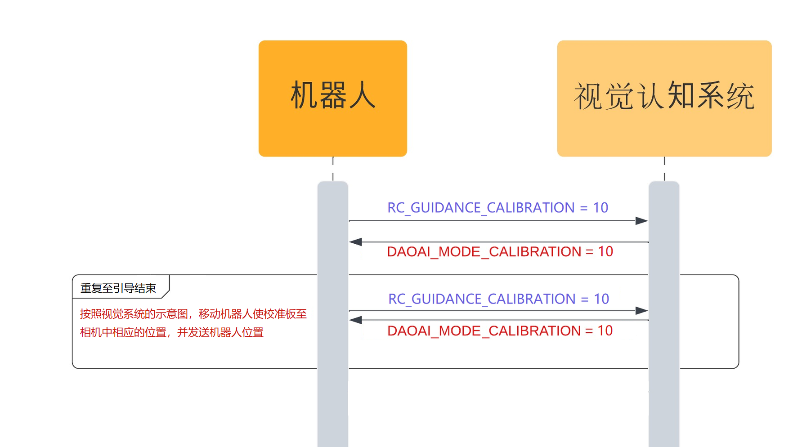
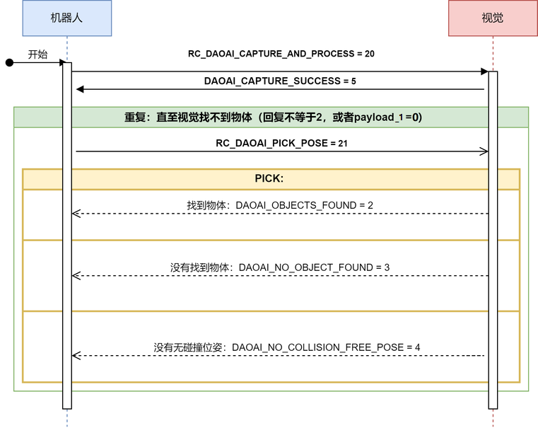
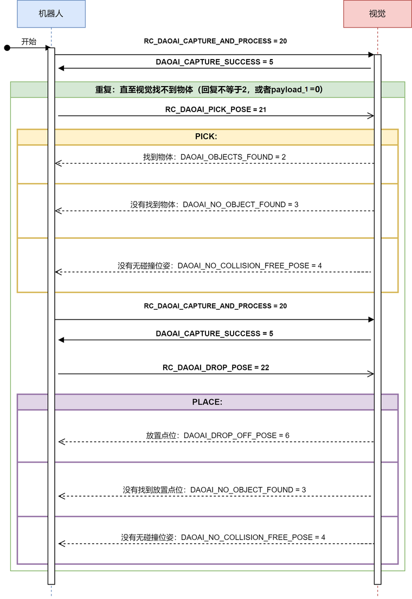

机器人通讯
=============

本章会详细介绍机器人和DaoAI机器人视觉认知系统之间的通讯协议。

.. note::
    1. DaoAI机器人程序所用的计量单位为  毫米-mm, 旋转计量单位为 度-°
    2. 该协议只适用于DaoAI网页版机器人视觉认知系统软件

.. contents:: 
    :local:

机器人和DaoAI机器人视觉认知系统之间以发送指令 |:left_right_arrow:| 接收程序回应 的模式交换信息，其中机器人充当客户端，DaoAI机器人视觉认知系统充当服务器。
机器人向视觉认知系统发送请求，例如进行探测流程，视觉认知系统在完成一系列操作后用相应的指令进行回复。
所有请求和等待都是同步的（单线程），在收到前一个等待的回应之前，应确保机器人在此期间不发送任何新请求。



|

连接详细信息
---------------

.. list-table:: 

   * - **类型/Type**
     - TCP/IP socket
   * - **端口/Port**
     - 6969 (TCP)
   * - **字节顺序/Byte order**
     - Network order (big endian)


一旦视觉认知系统启动，它就会侦听TCP端口 ``6969`` 并等待，直到机器人发起连接。这是在机器人端通过打开对视觉认知系统的IP地址和给定端口的TCP套接字来完成的。

可以在视觉认知系统的网络设置中找到并更改视觉认知系统系统的IP地址。

|

协议/Protocol
---------------

视觉认知系统 和机器人之间的指令和回应消息都是固定长度的。因为消息协议的长度是固定的，即使机器人短的编程功能有限，也会比较容易实现。

.. note::
    请求和回应消息具有固定长度，并且没有开始和/或结束字符。虽然TCP/IP协议可防止数据丢失，但机器人客户端实现负责通过计算发送/接收的字节数并与预期的消息大小进行比较来跟踪消息之间的边界。

请求和回应消息由多个字段组成，每个字段为一个 int32 (4 bytes)。 浮点数据（如距离和角度）将乘以一个恒定系数 MULT = 10000 , 再作为int32发送。 然后，接收端通过将接收的值除以该系数来解码此字段。 负数使用二进制补码进行编码。


|

请求消息
----------

从机器人发送到视觉认知系统的指令消息长度为48个字节，由以下字段组成：

.. list-table:: 请求消息结构

   * - **字段**
     - **类型**
     - **长度**
     - **描述**
   * - Position/位置字段
     - int32[3]
     - 12 bytes
     - 机器人法兰位置 (XYZ，以毫米为单位) 用右手机器人底座表示。每个字段都必须乘以MULT系数.
   * - Orientation/旋转字段 
     - int32[4]
     - 16 bytes
     - 机器人法兰方向用右手机器人底座框架表示。方向编码和单位取决于所选的方向约定。每个字段都必须乘以 MULT系数. 
   * - command/指令字段
     - int32[4]
     - 16 bytes
     - 请求指令 
   * - payload/载荷字段
     - int32[2]
     - 8 bytes
     - 可选的有效载荷字段。
   * - meta
     - int32[2]
     - 8 bytes
     - meta_1，即消息的倒数第二个字段，应发送机器人的类型，meta_2，即消息的最后一个字段，应发送机器人协议版本。详细信息请参阅本文Meta消息说明。


所有字段都是必填的，并且必须为每个请求设置合理的值。有效载荷字段只对某写流程和指令有效。无效的字段请赋予零。

指令字段command可以控制视觉认知系统执行不同的流程。下面将更详细地解释可能的指令及其对应的回应消息。

|

回应消息
---------------

除姿势更新请求外，所有请求指令都使用64字节长的回应消息进行应答，其结构如下：

.. list-table:: 回应消息结构

   * - **字段**
     - **类型**
     - **长度**
     - **描述**
   * - Position/位置字段
     - int32[3]
     - 12 bytes
     - 物体位置或拾取点偏移平移(XYZ，单位为毫米)，具体取决于回应状态。另请参阅更详细的指令说明。每个值都必须除以MULT。
   * - Orientation/旋转字段 
     - int32[4]
     - 16 bytes
     - 物体方向或拾取点偏移旋转，具体取决于回应状态。另请参阅更详细的指令说明。编码和单位取决于所选的定向约定，并且必须用MULT除以。
   * - payload/载荷字段
     - int32[6]
     - 24 bytes
     - 可选的有效载荷字段。编码和单位取决于所选的定向约定，并且必须用MULT除以。
   * - status/状态字段
     - int32
     - 4 bytes
     - 定义的状态值之一。
   * - meta
     - int32[2]
     - 8 bytes
     - meta_1，即消息的倒数第二个字段，应发送机器人的类型，meta_2，即消息的最后一个字段，应发送机器人协议版本。详细信息请参阅本文Meta消息说明。


并非每个指令回应都传达姿态信息或附加有效载荷。状态字段 可以用来控制position、orientation和payload字段的解读方式。在以下各节中，将更详细地说明各个指令及其对应的回应。

.. note::
    Orientation字段四位整数顺序说明：|br|
        目前视觉认知系统对支持机器人所用的 Orientation/定位字段 收发顺序为 |br|
        ABB: 四元数，字节分别是[x, y, z, w] 或 (q2,q3,q4,q1)；WeRobotics视觉认知系统 的四元数 顺序为 [x, y, z, w]， 部分系统使用四元数的顺序为 [w, x, y, z]， 所以在发送和接收四元数时需要注意顺序。 |br|
        UR: AxisAngle(轴线角) [rx, ry, rz, 0] |br|
        Staubli, Aubo, Dobot, Mitsubishi: Euler(欧拉角) XYZ旋转，字节分别是[rx, ry, rz, 0] |br|
        Hanwha, Kuka, Yaskawa: Euler(欧拉角)ZYX旋转，字节分别是[rx, ry, rz, 0] |br|
        Efort: Euler(欧拉角)ZYZ旋转顺序，字节分别是[rz, ry, rz, 0] |br|


可用指令(Command)
----------------------------------


RC_NO_COMMAND = -1 (机器人姿势更新)
~~~~~~~~~~~~~~~~~~~~~~~~~~~~~~~~~~~~

    将当前的机器人法兰姿势发送给视觉认知系统。视觉认知系统使用此信息来确定机器人是否仍处于连接状态，以及更新视觉认知系统网络界面中的3D视图。


RC_START_MANUAL_CALIBRATION = 1
~~~~~~~~~~~~~~~~~~~~~~~~~~~~~~~~~~

    发送校准模式开始指令到视觉，此指令属于机器人和视觉认知系统的握手。视觉认知系统可以处于CALIBRATION 模式

    当视觉发送的指令并非以下的指令时，视觉所在的流程与机器人不符，机器人需重新发送 RC_START_MANUAL_CALIBRATION = 1 ，并重新进行此握手。

    **回应**

    .. list-table:: 

      * - **字段**
        - **模式**
        - **描述**
      * - 状态
        - DAOAI_MODE_CALIBRATION= 10
        - 视觉认知系统处于手动、引导校准流程

RC_STOP_MANUAL_CALIBRATION = 2
~~~~~~~~~~~~~~~~~~~~~~~~~~~~~~~~~

    触发视觉认知系统停止校准板图像采集和累积流程。请注意，发送此指令时，视觉认知系统必须处于校准模式。

    **回应**

    .. list-table:: 

        * - **字段**
          - **模式**
          - **描述**
        * - 状态
          - DAOAI_DONE_CALIBRATION = 33
          - 视觉认知系统终止校准模式


RC_START_AUTO_CALIBRATION = 4
~~~~~~~~~~~~~~~~~~~~~~~~~~~~~~~~~

    发送校准模式开始指令到视觉，此指令属于机器人和视觉认知系统的握手。视觉认知系统可以处于自动校准模式。

    当视觉发送的指令并非以下的指令时，视觉所在的流程与机器人不符，机器人需重新发送  此指令进行握手。

    **回应**

    .. list-table:: 

        * - **字段**
          - **模式**
          - **描述**
        * - 状态
          - DAOAI_MODE_AUTO_CALIBRATION = 11
          - 视觉认知系统处于自动校准图像采集和累计流程。


RC_MANUAL_ACCUMULATE_POSE = 6
~~~~~~~~~~~~~~~~~~~~~~~~~~~~~~~~~~~~~

    请求视觉认知系统进入图像采集和累计流程，进行校准。若视觉发送的指令非以下指令，则机器人与视觉处于不同的模式/流程，机器人将发送 RC_START_MANUAL_CALIBRATION = 1（手动校准），并重新回到校准流程的握手状态。

    **回应**

    .. list-table:: 

        * - **字段**
          - **模式**
          - **描述**
        * - 状态
          - DAOAI_MODE_CALIBRATION = 10
          - 视觉认知系统处于手动校准模式

	
RC_AUTO_ACCUMULATE_POSE = 7
~~~~~~~~~~~~~~~~~~~~~~~~~~~~~~~~~~~~~

    请求视觉认知系统进入图像采集和累计流程，进行校准。若视觉发送的指令非以下指令，则机器人与视觉处于不同的模式/流程，机器人将发送 RC_START_AUTO_CALIBRATION = 4（自动校准），并重新回到校准流程的握手状态。

    **回应**

    .. list-table:: 

        * - **字段**
          - **模式**
          - **描述**
        * - 状态
          - DAOAI_MODE_AUTO_CALIBRATION = 11
          - 视觉认知系统处于自动校准图像采集和累计流程。
        * - 状态
          - DAOAI_DONE_AUTO_CALIBRATION = 33
          - 视觉认知系统以获得足够多的校准点位，回馈机器人停止校准

RC_GUIDANCE_CALIBRATION = 10
~~~~~~~~~~~~~~~~~~~~~~~~~~~~~~~~~~~~~~~~
    
    机器人发送此指令到视觉用以发送引导校准的位姿，视觉会接收位姿信息，不会给予回应。


RC_DAOAI_CAPTURE_AND_PROCESS = 20
~~~~~~~~~~~~~~~~~~~~~~~~~~~~~~~~~~~~~~~


    请求视觉认知系统进行探测流程，让视觉拍照并识别流程。此消息必须含有机器人目前的位姿信息。

    **回应**

    .. list-table:: 

        * - **字段**
          - **模式**
          - **描述**
        * - 状态
          - DAOAI_DETECTION_MODE = 5
          - 视觉认知系统回馈握手信息，认知目前处于拍照并识别流程。


RC_DAOAI_PICK_POSE = 21
~~~~~~~~~~~~~~~~~~~~~~~~~~~~

    请求视觉认知系统发送物体位姿；此指令只出现在 DAOAI_DETECTION = 5 之后。当视觉探测并发送了位姿给机器人后，机器人进行抓取，然后重复回复视觉 RC_DAOAI_PICK_POSE = 21 请求下一个物体的位姿。

    **回应**

    .. list-table:: 

        * - **字段**
          - **模式**
          - **描述**
        * - 状态
          - DAOAI_OBJECTS_FOUND = 2
          - 视觉认知系统探测到物体并把物体抓取位姿回复到机器人，机器人将根据位姿进行抓取。
        * - 状态
          - DAOAI_NO_OBJECT_FOUND = 3
          - 视觉认知系统探测不到物体回复到机器人，机器人将根据当前脚本进入下一阶段。
        * - 状态
          - DAOAI_NO_COLLISION_FREE_POSE= 4
          - 视觉认知系统回馈错误信息，避碰模块无法找到任何安全位姿，机器人将根据脚本进入不同的阶段。

RC_DAOAI_DROP_POSE = 22
~~~~~~~~~~~~~~~~~~~~~~~~~~~~

    请求视觉认知系统发送物体位姿；此指令只出现在 DAOAI_DETECTION = 5 之后。当视觉探测并发送了位姿给机器人后，机器人进行抓取，然后回复视觉 RC_DAOAI_GET_NEXT_OBJECT = 21 请求下一个物体的位姿。

    **回应**

    .. list-table:: 

        * - **字段**
          - **模式**
          - **描述**
        * - 状态
          - DAOAI_OBJECTS_FOUND = 2
          - 视觉认知系统探测到物体并把物体抓取位姿回复到机器人，机器人将根据位姿进行抓取。
        * - 状态
          - DAOAI_NO_OBJECT_FOUND = 3
          - 视觉认知系统探测不到物体回复到机器人，机器人将根据当前脚本进入下一阶段。
        * - 状态
          - DAOAI_NO_COLLISION_FREE_POSE= 4
          - 视觉认知系统回馈错误信息，避碰模块无法找到任何安全位姿，机器人将根据脚本进入不同的阶段。

RC_SWITCH_CONFIG = 69

    请求视觉认知系统切换相机配置；此指令发送到视觉端时，视觉会根据消息中的载荷字段1（payload_1）的整数，切换相机配置。此相机配置会在视觉端上设置好，根据整数切换用户预设的配置。如：payload_1 = 1， 切换 config_1；payload_1 = 3， 切换 config_3等。

    **回应**

    .. list-table:: 

        * - **字段**
          - **模式**
          - **描述**
        * - 状态
          - DAOAI_SWITCH_CONFIG_SUCCESS = 66
          - 切换相机配置成功
        * - 状态
          - DAOAI_SWITCH_CONFIG_FAIL = 67
          - 切换相机配置失败


|

载荷字段 Payload
---------------------

载荷字段在抓和放时，所表示的意思并不相同：payload_1会被用作基本的抓放信息交换，抓的时候payload_1 代表的是剩余物体数量：如在场景中探测到了5个物体，第一个位姿发送时payload_1 = 5；放的时候payload_1 代表的是物体的种类（在没有分类时此payload可被忽略或者用于其他用途）：如在场景中会出现5类物体，此次抓取到的是第四类物体 payload_1 = 4。

.. Warning::
    在抓取时：
        
        DaoAI机器人视觉认知系统 给机器人发送的payload_1：代表 **物体的剩余数量**。

        机器人给 DaoAI机器人视觉认知系统 发送的payload_1：代表 **执行task的id**。

    例：DaoAI机器人视觉认知系统 有2个task; task_1 的id 为0，task_2的id为1。想要执行task_1时，机器人的payload_1就应该为0。 想要执行task_2时，机器人的payload_1就应该为1。

其他的payload可根据用户具体案例自由使用。


|

全局常量
--------------

机器人发送指令常量
~~~~~~~~~~~~~~~~~~~~~~

.. code-block:: python

    RC_DAOAI_NO_COMMAND                               = -1

    # Manual Calibration/ Guidance Calibration
    RC_START_MANUAL_CALIBRATION                       = 1
    RC_STOP_MANUAL_CALIBRATION                        = 2 
    RC_MANUAL_ACCUMULATE_POSE                         = 6
    # Auto Calibration
    RC_START_AUTO_CALIBRATION                         = 4
    RC_AUTO_ACCUMULATE_POSE                           = 7
    RC_GUIDANCE_CALIBRATION                           = 10

    # Picking
    RC_DAOAI_CAPTURE_AND_PROCESS                      = 20
    RC_DAOAI_PICK_POSE                                = 21
    RC_DAOAI_DROP_POSE                                = 22

    #Teach
    RC_SEND_POSE                                      = 30

    #Camera Config
    RC_SWITCH_CONFIG                                  = 69


机器人视觉认知系统回应常量
~~~~~~~~~~~~~~~~~~~~~~~~~~~~~~

.. code-block:: python

    DAOAI_UNKNOWN_COMMAND                              = -1  

    #视觉认知系统抓取校准流程
    DAOAI_OBJECTS_FOUND                                = 2
    DAOAI_NO_OBJECT_FOUND                              = 3
    DAOAI_NO_COLLISION_FREE_POSE                       = 4
    DAOAI_CAPTURE_SUCCESS                              = 5
    DAOAI_DROP_OFF_POSE                                = 6

    #视觉认知系统处于手动校准流程
    DAOAI_MODE_CALIBRATION                             = 10 
    #视觉认知系统处于自动校准流程
    DAOAI_MODE_AUTO_CALIBRATION                        = 11

    #Teach pose status
    DAOAI_REAL_TEACH_POSE                              = 14
    DAOAI_DONE_TEACH_POSE                              = 15  

    #终止指令
    DAOAI_DONE_CALIBRATION                             = 33

    #相机配置更换
    DAOAI_SWITCH_CONFIG_SUCCESS                        = 66
    DAOAI_SWITCH_CONFIG_FAIL                           = 67


|

接口/Interface
---------------------

下文提出了一个应用程序接口，供程序员在集成新机器人时使用。从高层次来看，应用程序接口包括以下功能：

- Global Variables/全局变量

- Initialization/初始化设置

- Networking/收发和通讯

- Calibration/校准函数

- Pick & Place/抓放函数


以下为机器人端的脚本函数示例，均为伪代码：

Global Variables/全局变量
~~~~~~~~~~~~~~~~~~~~~~~~~~~

所有的接口函数都会使用以下所以的全局变量：

.. code-block:: python

    mult=10000
    #UR Robot type = 7
    DAOAI_ROBOT_TYPE = 7 
    DAOAI_META_VERSION = 1

    #Pose Object
    daoai_tcp_pose = p[0,0,0,0,0,0]
    daoai_payload_1 = 0
    daoai_payload_2 = 0
    daoai_payload_3 = 0
    daoai_payload_4 = 0
    daoai_payload_5 = 0
    daoai_payload_6 = 0
    daoai_socket_name = "daoai"
    daoai_socket

    daoai_status = 0
    daoai_r_command = 0

    daoai_task_id = 0
    daoai_num_remaining_objects = 0

Initialization
~~~~~~~~~~~~~~~~~~

daoai_init(IP, port)
```````````````````````

    **Parameters**:

        - IP: string（字符串） → 连接目标的IP地址

        - port: int （整数）→ 连接目标的端口，通常默认为：“6969”

    **Info**:

        机器人使用此函数建立Socket，设置IP和端口

    **Return type**:

        Boolean（布尔值）：成功打开Socket后返回True。

    **Pseudo-code**:

    .. code-block:: 

        def daoai_init(ip, port):
                if (not socket_open(daoai_ip, daoai_port, daoai_socket_name)):
                    #if open socket failed, return false
                    return False
                end
                
                return True
        end

Networking/收发和通讯
~~~~~~~~~~~~~~~~~~~~~~

send_robot_data()
```````````````````````

    **Parameters**:

        N/A

    **Info**:

        机器人发送数据至视觉

    **Return type**:

        Void

    **Pseudo-code**:

    .. code-block:: 

        def send_robot_data():
            sync()
            #synchronization for multi-threading
            
            pose = actual_pose
            #assign actual robot pose to variable "pose"
            
            acquire_lock
            #lock the block of data, prevent value changes during sending
            
            assign_data_to_msg_block
            #assign all necessary data to the sending block
            
            release_lock
            sync()
        end


recv_robot_data()
```````````````````````

    **Parameters**:

        N/A

    **Info**:

        机器人发送数据至视觉

    **Return type**:

        Void

    **Pseudo-code**:

    .. code-block:: 

        def send_robot_data():
            sync()
            #synchronization for multi-threading
            
            pose = actual_pose
            #assign actual robot pose to variable "pose"
            
            acquire_lock
            #lock the block of data, prevent value changes during sending
            
            assign_data_to_msg_block
            #assign all necessary data to the sending block
            
            release_lock
            sync()
        end


Calibration/校准函数
~~~~~~~~~~~~~~~~~~~~~~


Manual Calibration:
`````````````````````````


daoai_start_manual_calibration()
^^^^^^^^^^^^^^^^^^^^^^^^^^^^^^^^^^^^

    **Parameters**:

        N/A

    **Info**:

        机器人使用此函数引导视觉系统开始手动校准流程。

    **Return type**:

        Boolean（布尔值）：成功启动校准程序后返回True。

    **Pseudo-code**:

    .. code-block:: 

        def daoai_start_manual_calibration():
            #Set command as "Start Manual Calibration"
            daoai_r_command = RC_START_MANUAL_CALIBRATION
            
            send_robot_data()
            recv_daoai_data()
            
            if (daoai_status != DAOAI_MODE_CALIBRATION):
                #check rsponse from Vision, if incorrect, terminate the process
                return False
            end

            return True
        end

daoai_manual_accumulate_calibration()
^^^^^^^^^^^^^^^^^^^^^^^^^^^^^^^^^^^^^^^

    **Parameters**:

        N/A

    **Info**:

        机器人使用此函数累计校准位姿。

    **Return type**:

        Boolean（布尔值）：成功累计校准数据后返回True。当校准流程结束时、累计失败时返回False。

    **Pseudo-code**:

    .. code-block:: 

        def daoai_manual_accumulate_calibration():
            #Set command as "Accumulate Calibration poses"
            daoai_r_command = RC_MANUAL_ACCUMULATE_POSE
            
            send_robot_data()
            recv_daoai_data()
            
            if (daoai_status != DAOAI_MODE_CALIBRATION):
                #check response from Vision, if incorrect, terminate the process
                return False
            end
            
            if (daoai_status == DAOAI_DONE_CALIBRATION):
                #check rsponse from Vision, Vision sends "end" command, terminate the process
                return False
            end
            
            return True
        end

daoai_stop_manual_calibration()
^^^^^^^^^^^^^^^^^^^^^^^^^^^^^^^^^^^^^^^

    **Parameters**:

        N/A

    **Info**:

        机器人使用此函数示意视觉系统停止校准。

    **Return type**:

        Boolean（布尔值）：成功发送停止信息给视觉系统后返回True。

    **Pseudo-code**:

    .. code-block:: 

        def daoai_stop_manual_calibration():
            daoai_r_command = RC_STOP_MANUAL_CALIBRATION
            
            send_robot_data()
            popup("DaoAI Done Calibration.", title = "WARNING", warning = True, blocking = False)
            return True
        end

Guidance Calibration:
`````````````````````````

daoai_guidance_accumulate_calibration()
^^^^^^^^^^^^^^^^^^^^^^^^^^^^^^^^^^^^^^^^^

    **Parameters**:

        N/A

    **Info**:

        机器人使用此函数与视觉系统进行引导校准流程。每次收集位姿需要运行一次。

    **Return type**:

        Boolean（布尔值）：返回True。不需要视觉回应任何消息。

    **Pseudo-code**:

    .. code-block:: 

        def daoai_guidance_accumulate_calibration():
            daoai_r_command = RC_GUIDANCE_CALIBRATION
            
            send_robot_data()
            
            return True
        end


Auto Calibration:
`````````````````````````

daoai_start_auto_calibration()
^^^^^^^^^^^^^^^^^^^^^^^^^^^^^^^^^^^^^^^^^

    **Parameters**:

        N/A

    **Info**:

        机器人使用此函数请求视觉系统进行拍照和计算。

    **Return type**:

        Boolean（布尔值）：成功启动自动校准程序后返回True。

    **Pseudo-code**:

    .. code-block:: 

        def daoai_start_auto_calibration():
            daoai_r_command = RC_START_AUTO_CALIBRATION
            
            send_robot_data()
            recv_daoai_data() 
            
            if (daoai_status != DAOAI_MODE_AUTO_CALIBRATION):
                #Not in Auto calibration process, terminate
                return False
            end
            
            return True
        end


daoai_auto_accumulate()
^^^^^^^^^^^^^^^^^^^^^^^^^^^^^^^^^^^^^^^^^

    **Parameters**:

        N/A

    **Info**:

        机器人使用此函数与视觉系统进行引导校准流程。每次收集位姿需要运行一次。

    **Return type**:

        Boolean（布尔值）：返回True。不需要视觉回应任何消息。

    **Pseudo-code**:

    .. code-block:: 

        def daoai_auto_accumulate():
            daoai_r_command = RC_AUTO_ACCUMULATE_POSE

            send_robot_data()
            recv_daoai_data()
            
            if (daoai_status == DAOAI_DONE_CALIBRATION): 
                #auto calibration done
                return False
            
            end
            return True
        end

Camera Capture
~~~~~~~~~~~~~~~~~~~~~

daoai_capture_and_process()
``````````````````````````````````

    **Parameters**:

        N/A

    **Info**:

        机器人使用此函数请求视觉拍照并检测。在拍照期间会blocking。

    **Return type**:

        Boolean（布尔值）：请求拍照和物体检测后，视觉认知系统成功开始后返回true。

    **Pseudo-code**:

    .. code-block:: 

        def daoai_capture_and_process():
            daoai_r_command = RC_DAOAI_CAPTURE_AND_PROCESS
            daoai_payload_1 = daoai_task_id #specify the vision task id 
            send_robot_data()
            recv_daoai_data() #wait the response that the vision started 
            if (daoai_status == DAOAI_CAPTURE_SUCCESS):
                return True
            end
            popup("DaoAI Image Capture Failed.", title="WARNING", warning=True, blocking=True)
            return False
        end


Pick
~~~~~~~~~~~~~

daoai_get_picking_pose()
``````````````````````````````````

    **Parameters**:

        N/A

    **Info**:

        机器人使用此函数请求视觉发送抓取位姿。会blocking直到视觉认知系统完成物体检测。该函数通常是运行daoai_capture_and_process() 之后使用。每次运行会返回一个抓取位姿。

    **Return type**:

        Boolean（布尔值）：成功检测到至少一个物体 并获取抓取位姿后返回True。

    **Pseudo-code**:

    .. code-block:: 

        def daoai_get_picking_pose():
            daoai_r_command = RC_DAOAI_PICK_POSE
            daoai_payload_1 = daoai_task_id #specify the task id for which vision will perform
            send_robot_data()
            recv_daoai_data()
            daoai_num_remaining_objects = daoai_payload_1

            if (daoai_status == DAOAI_NO_OBJECT_FOUND): 
                #No objects found, Failed to find pick position, terminate
                return False
            end
            
            if (daoai_status == DAOAI_NO_COLLISION_FREE_POSE): 
                #No collision free path of pick pose, terminate
                return False
            end
            
            if(daoai_payload_1 <= 0):
                #Not enough occurence of objects in scene
                return False
            end

            #setup pick pose
            pick_pose = daoai_tcp_pose
            
            return True
        end


Place
~~~~~~~~~~~~~

daoai_get_placing_pose()
``````````````````````````````````

    **Parameters**:

        N/A

    **Info**:

        机器人使用此函数请求视觉发送放置位姿。会blocking直到视觉认知系统完成物体检测。该函数通常是运行daoai_capture_and_process() 之后使用。每次运行会返回一个放置位姿。

    **Return type**:

        Boolean（布尔值）：成功检测到至少一个物体 并获取放置位姿后返回True。

    **Pseudo-code**:

    .. code-block:: 

        def daoai_get_placing_pose():
            daoai_r_command = RC_DAOAI_DROP_POSE
            daoai_payload_1 = daoai_task_id #specify the task id for which vision will perform
            send_robot_data()
            recv_daoai_data()
            daoai_num_remaining_objects = daoai_payload_1

            if (daoai_status == DAOAI_NO_OBJECT_FOUND):
                #No anchor found, Failed to find place position, terminate
                return False
            end
            
            if(daoai_payload_1 <= 0):
                #Not enough occurence of objects in scene
                return False
            end

            #setup pick pose
            pick_pose = daoai_tcp_pose
            
            return True
        end

Helper
~~~~~~~~~~~~~

daoai_remaining_objects()
``````````````````````````````````

    **Parameters**:

        N/A

    **Info**:

        机器人使用此函数查看剩余的可抓取物体数量，需要先运行daoai_capture_and_process() 和 daoai_get_picking_pose()。

    **Return type**:

        Int（整数值）：返回剩余的抓取点位的数量。

    **Pseudo-code**:

    .. code-block:: 

        def daoai_remaining_objects():
            return daoai_num_remaining_objects
        end


daoai_switch_task(id)
``````````````````````````````````

    **Parameters**:

        Int（整数值）：需要切换到的task id

    **Info**:

        机器人使用此函数切换task id，之后的capture_and_process()和daoai_get_picking_pose() 都会对应vision的task id。程序开始时，默认的task_id 为0。

    **Return type**:

        Void：无返回值

    **Pseudo-code**:

    .. code-block:: 

        def daoai_switch_job(id):
            daoai_task_id = id
        end


消息元数据/Message metadata
~~~~~~~~~~~~~~~~~~~~~~~~~~~~~~~

为保证机器人和视觉认知系统之间对数据的正确解读，以下元数据始终与请求和回应消息一起发送：

.. list-table:: Metadata message

   * - **字段**
     - **值/描述**
   * - meta_1
     - |meta_info|
   * - meta_2
     - meta_2，即最后一个字段，代表机器人的版本和视觉认知系统之间的协议版本号. **目前的版本号** = 2

     
.. |meta_info| raw:: html
    
    <ul>
    <li>ABB = 0 </li>
    <li> Fanuc = 1 </li>
    <li> Hanwha = 2 </li>
    <li> Kuka = 3 </li>
    <li> Omron_TM = 4 </li>
    <li> Siemens_PLC = 5 </li>
    <li> Staubli = 6 </li>
    <li> UR = 7 </li>
    <li> Yaskawa = 8 </li>
    <li> Efort = 9 </li>
    <li> Aubo = 10 </li>
    <li> Dobot = 11 </li>
    <li> Mitsubishi = 12 </li>
    <li> Other = 99 </li>
    </ul>


|

通信流程示例
----------------

手动校准通信示例
~~~~~~~~~~~~~~~~~~~~~~~~

1. 设置好机器人脚本中所有的校准位姿。

2. 机器人使用 RC_START_MANUAL_CALIBRATION 发送开始校准指令到视觉认知系统。

3. 视觉回复 DAOAI_MODE_CALIBRATION 确认正处于手动校准模式。

4. 机器人使用 RC_MANUAL_ACCUMULATE_POSE 指令让视觉认知系统进入累计流程。视觉进行储存并回复 DAOAI_MODE_CALIBRATION 让机器人继续进行下一个位姿移动。

5. 在累计流程结束时机器人发送 RC_STOP_MANUAL_CALIBRATION 表示已结束校准流程。


.. code-block:: 

    #Robot Program
        Popup("Start Manual Calibration")
        If daoai_start_manual_calibration()
            MoveJ
                # Waypoints should be setup before running the script
                Waypoint_1
                
                #Wait 2 seconds in order to minimize the vabration of the 
                # calibration board after each movements
                Wait: 2.0
        #Accumulate the pose
        daoai_manual_accumulate_calibration()
        
        #Repeats
        ...... 
        
        MoveJ
            Waypoint_9
            Wait: 2.0
        daoai_manual_accumulate_calibration()
        Wait: 2.0
        daoai_stop_manual_calibration()
        daoai_socket_close()





引导校准通信示例
~~~~~~~~~~~~~~~~~~

1. 设置好第一个校准位姿。

2. 机器人使用 RC_GUIDANCE_CALIBRATION 发送开始引导校准指令到视觉认知系统。

3. 视觉会进行拍摄并计算出下一个位姿，而且会对当前位姿作出提议，用户需根据视觉的提示移动机器人到更理想的位姿：

4. 视觉判定当前校准位姿的成相是优良的，视觉会回复 DAOAI_GUIDANCE_CALIBRATION_GOOD 给机器人，并显示下一个推荐的位姿，用户需移动到推荐位姿；

5. 视觉判定当前校准位姿的成相是较差的，视觉会回复 DAOAI_GUIDANCE_CALIBRATION_BAD 给机器人，并显示该如何改进当前位姿，重新移动并采集和计算；

6. 重复步骤2-3直到视觉收集到足够的校准位姿。

7. 在累计流程结束时视觉向机器人发送 DAOAI_DONE_GUIDANCE_CALIBRATION 使机器人结束校准流程。

.. code-block:: 

   Robot Program
     MoveJ
       Waypoint_1
     daoai_guidance_accumulate_calibration()
     daoai_socket_close()





自动校准通信示例
~~~~~~~~~~~~~~~~~~~~~~

1. 设置好第一个校准位姿。

2. 机器人使用 RC_START_AUTO_CALIBRATION 发送开始自动校准指令到视觉认知系统，并发送当前机器人位姿。

3. 在确认视觉认知系统处于正确的流程后，回复机器人 DAOAI_MODE_AUTO_CALIBRATION 进入采集图像和累计流程。

4. 机器人使用 RC_ACCUMULATE_POSE 指令让视觉认知系统进入累计流程。视觉进行储存计算出下一个校准位姿，并回复 DAOAI_MODE_AUTO_CALIBRATION 移动机器人到下一个位姿。

5. 在累计流程结束时视觉向机器人发送 DAOAI_DONE_AUTO_CALIBRATION 使机器人结束校准流程。

.. code-block:: 

    Robot Program
        Popup("Start Auto Calibration"")
        MoveJ
            center_pose
        If daoai_start_auto_calibration()
            Loop daoai_auto_accumulate_calibration()
                calibra_pose≔daoai_tcp_pose
                MoveL
                    calibra_pose
                    Wait: 1.0
                Wait: 2.0
        daoai_socket_close()


.. image:: images/auto_cali_protocol.png
    :scale: 50%


抓取通信示例
~~~~~~~~~~~~~~~~~~~~~~

1. 设置好探测位姿，此位姿是抓取结束后机器人移动到的位姿，该位姿不能阻挡摄像头。

2. 机器人使用 RC_DAOAI_CAPTURE_AND_PROCESS 发送开始抓取指令到视觉认知系统。

3. 视觉认知系统回复DAOAI_CAPTURE_SUCCESS，表示视觉处于拍摄探测阶段；

4. 机器人发送 RC_DAOAI_PICK_POSE 请求视觉发送抓取位姿；

5. 视觉认知系统回复三种以下的可能性：DAOAI_OBJECTS_FOUND ；DAOAI_NO_OBJECT_FOUND ； DAOAI_NO_COLLISION_FREE_POSE 。 

    a. 相机拍摄成功并且视觉成功探测到一个或多个物体时，视觉发送 DAOAI_OBJECTS_FOUND = 2 和抓取位姿。payload_1数值为剩余的需抓取物体数量，此payload会根据每次抓取结束后更新；

    b. 相机拍摄成功，视觉探测不成功或者场景中没有物体时，视觉发送 DAOAI_NO_OBJECT_FOUND = 3；

    c. 没有安全抓取位姿时，视觉发送 DAOAI_NO_COLLISION_FREE_POSE = 4；

6. 场景内的物体抓取完成时，视觉会在最后一个需要抓取的物体信息中，payload_1 = 1，以此告知机器人剩余一个物体抓取，结束后将需要重新拍照。

.. code-block:: 

    Robot Program
        Loop
            If daoai_capture_and_process()
                Loop daoai_get_picking_pose()
                    MoveL
                        detection_pose
                    MoveL
                        pick_pose
                        Wait: 5.0
                    MoveL
                        detection_pose
        daoai_socket_close()




抓取并请求放置通信示例
~~~~~~~~~~~~~~~~~~~~~~

1. 抓取部分和纯抓取一样，区别在于放置：抓取并请求放置流程中，放置的点位是机器人请求视觉计算并发送的。

2. 抓取结束后，机器人再次请求 RC_DAOAI_CAPTURE_AND_PROCESS 拍照并识别放置点位。

3. 视觉认知系统回复DAOAI_CAPTURE_SUCCESS，表示视觉处于拍摄探测阶段；

4. 机器人发送 DAOAI_DROP_OFF_POSE 请求视觉发送放置位姿；

5. 视觉认知系统回复三种以下的可能性：DAOAI_DROP_OFF_POSE ；DAOAI_NO_OBJECT_FOUND ； DAOAI_NO_COLLISION_FREE_POSE 。 

    a. 相机拍摄成功并且视觉成功探测放置点位时，视觉发送 DAOAI_DROP_OFF_POSE = 6 和抓取位姿。payload_1数值为剩余的需抓取物体数量，此payload会根据每次抓取结束后更新；

    b. 相机拍摄成功，视觉探测不成功或者场景中放置点位时，视觉发送 DAOAI_NO_OBJECT_FOUND = 3，此处虽然使用同样的状态，但 DAOAI_NO_OBJECT_FOUND 状态意思为：无放置点位；

    c. 没有安全抓取位姿时，视觉发送 DAOAI_NO_COLLISION_FREE_POSE = 4；

6. 场景内的物体抓取完成时，视觉会在最后一个需要抓取的物体信息中，payload_1 = 1，以此告知机器人剩余一个物体抓取，结束后将需要重新拍照。

.. code-block:: 

    Robot Program
        Loop
            If daoai_capture_and_process()
                Loop daoai_get_picking_pose()
                    MoveJ
                        detection_pose
                    MoveJ
                        pick_pose
                        Wait: 5.0
                    MoveJ
                        detection_pose
                    If daoai_capture_and_process()
                        If daoai_get_placing_pose()
                            MoveJ
                                pick_pose
                                Wait: 5.0
                            MoveJ
                                detection_pose
            daoai_socket_close()




.. |br| raw:: html

      <br>