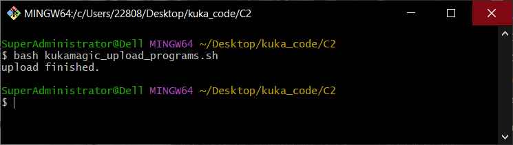

===================
KUKA 机器人连接
===================

1. 下载kuka机器人脚本， 将机器人脚本放置在一个空的USB drive里面。

2. 复制一个 kukamagic_upload_programs.sh 到usb的根目录，等待命令窗口提示“upload finished.”，shell脚本文件会上传kuka脚本到kuka控制器里面。

.. image:: images/kuka_upload_file.png
    :scale: 100%
|

|

.. admonition:: 备份程序
    :class: note

    如果想要备份kuka控制器中的文件，可以将 kukamagic_backup_programs.sh 复制到一个空的USB drive里面，等待命令窗口提示“backup finished.”，shell脚本文件会备份kuka脚本到USB drive里面。

    .. image:: images/kuka_backup_file.png
        :scale: 100%
    |
    .. image:: images/kuka_backup.png
        :scale: 100%

|

3. 设置PC端的IP地址，使PC端的IP地址和kuka机器人控制器IP地址处在同一个网段。

   kuka机器人控制器IP地址默认为“192.168.0.111”，PC端IP地址推荐设置成“192.168.0.112”。

    .. image:: images/kuka_connect_1.png
        :scale: 100%

|

4. 手动设定完成 DaoAI Vision Pilot 的 server端配置， 机器人端口号，并启动侦测。

   打开kuka机器人smartPad，选择路径"~/R1/Program/Communication_Program/"，该文件夹下即为kuka机器人通讯例程。以"daoai_teach_pose.src"例程为例，光标移动选中该程序。

   使用功能键选定该程序进入到程序监视界面。

    .. image:: images/kuka_connect_2.png
        :scale: 100%
    |
    .. image:: images/kuka_connect_3.png
        :scale: 100%

|

5. 将kuka机器人打到T1模式，手动按住使能键，使机器人上使能。

    .. image:: images/kuka_connect_4.jfif
        :scale: 100%

|

    .. admonition:: smartPad按钮
        :class: tip

        1、3和5为确认开关，电机启动使能；

        2、启动键(绿色)，程序启动；

        4、USB接口，上传或备份程序，以及连接鼠键外设等；

        6、型号铭牌，smartPad的信息。

        .. image:: images/smartPad_1.jpg
            :scale: 100%

|

6. 按下程序启动按钮，程序运行时，smartPad右上角数字输出“Connected”状态为true，表示与daoai vision pilot连接成功。

    .. image:: images/kuka_connect_5.png
        :scale: 55%

|

    .. admonition:: smartPad按钮
        :class: tip

        1、用于弹出库卡示教器的按钮，断开与控制器的连接；

        2、用于调出连接管理器的钥匙开关。只有当钥匙插入时，方可转动开关。利用连接管理器可以转换运行方式。

           运行模式分为T1、T2、auto和external。

        3、紧急停止装置。用于在危险情况下关停库卡机器人。紧急停止装置在被按下时将自动闭锁。

        4、3D鼠标：用于手动移动库卡机器人。

        5、移动键：用于手动移动库卡机器人。

        6、用于设定程序倍率的按键。

        7、用于设定手动倍率的按键。

        8、主菜单按键：用来在smartHMI上将菜单项显示出来。

        9、状态键：状态键主要用于设定应用程序包中的参数。其确切的功能取决于所安装的技术包。

        10、启动键：通过启动键可启动程序。

        11、逆向启动键：用逆向启动键可以逆向启动程序，程序将逐步运行。

        12、停止键：用停止键可以暂停运行中的程序。

        13、键盘按键显示键盘。通常不必特地将键盘显示出来，smartHMI可以识别需要通过键盘输入的情况并自动显示键盘。

        .. image:: images/smartPad_2.jpg
            :scale: 120%

