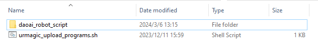

UR 机器人Modbus TCP连接
-----------------

1. 下载UR机器人脚本， 将机器人脚本放置在一个空的USB drive里面USB drive.

2. 复制一个 urmagic_upload_programs.sh 到usb的根目录，这个脚本文件会上传UR脚本到UR机器人里面。

|

.. note::
    如果想要备份UR中的文件，可以将 urmagic_backup_programs.sh 复制到一个空的USB里面

    .. image:: images_modbustcp/ur_backup.png
        :scale: 100%

3. 将准备好的USB插入UR操作板，插入后显示窗口会弹出红色的USB字样，等待绿色的USB字样弹出后，即可拔出USB。如果您没有看到绿色的USB字样，请等待10分钟后再拔出USB。

    .. image:: images_modbustcp/UR_usb.png
        :scale: 100%

|

4. 点击 Program Robot, 然后选择 Load Program. 

    .. image:: images_modbustcp/UR_connect_1.png
        :scale: 100%

    .. image:: images_modbustcp/UR_connect_2.png
        :scale: 100%

|

5. 选择任意脚本。这里以抓取脚本为例。如果您还没有Initialize Robot那么请在这一步做。

    .. image:: images_modbustcp/UR_connect_3.png
        :scale: 100%

|

6. 点击 Load Intallation, 然后选择UR脚本中 UR_Common_function 目录下的 VisionCognex.installation 文件

    .. image:: images_modbustcp/UR_connect_4.png
        :scale: 100%

|

    .. image:: images_modbustcp/UR_connect_5.png
        :scale: 100%

|

7. 选择合适的Active Payload，然后启动机器人。推荐第一次使用时法兰上不要装任何东西，并选择Active Payload为0。

    .. image:: images_modbustcp/UR_connect_6.png
        :scale: 100%

|

8. 如图所示，DaoAI Vision Pilot端需要设置IP地址，地址为机器人端的IP地址，如192.168.80.130，端口号默认使用502，暂时不能更改。

   机器人脚本程序会自动配置Modbus TCP。如果需要查看通讯是否连接成功，如下图所示：机器人端设置本机IP地址，如192.168.80.130，添加寄存器，设置slave number和slave address。左侧绿灯常亮表示连接成功。

    .. image:: images_modbustcp/UR_connect_7.png
        :scale: 100%

|

.. note::
    如果这里运行脚本时提示functions not found. 那么请重新将functions.script 和 communications.script 从UR_Common_function文件夹里加载一次。

    .. image:: images_modbustcp/UR_connect_8.png
        :scale: 100%
    |
    .. image:: images_modbustcp/UR_connect_9.png
        :scale: 100%
    |
    .. image:: images_modbustcp/UR_connect_10.png
        :scale: 100%

