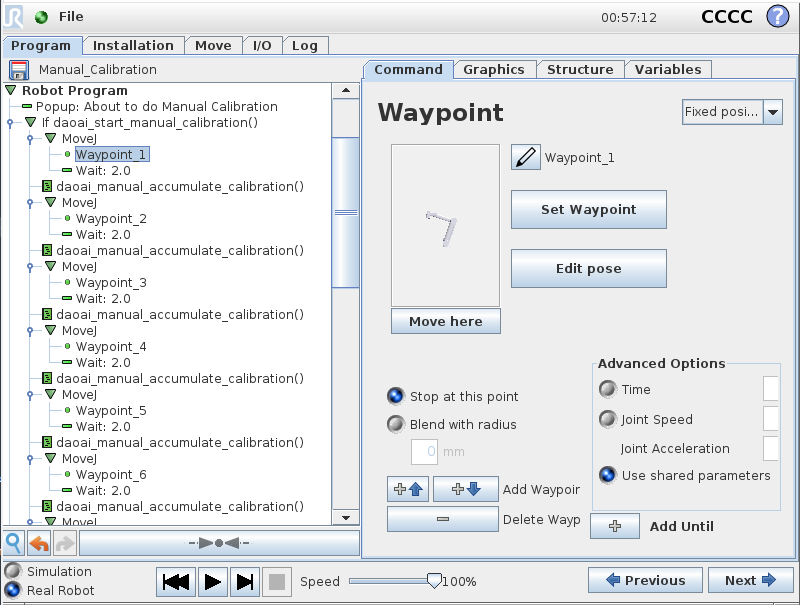
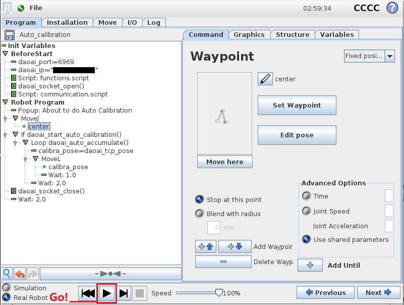
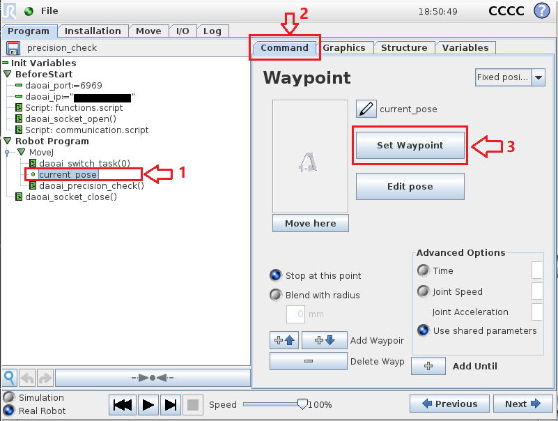

Universal Robot 机器人通讯接口
===============================

.. contents:: 
    :local:

.. note::
    1. DaoAI机器人程序所用的计量单位为  米-m, 旋转计量单位为 弧度-rad
    2. 该协议只适用于DaoAI网页版DaoAI Vision Pilot软件

|

以下为如何使用 **Universal Robot** 机器人端的脚本函数示例：

Global Variables/全局变量
------------------------------------------

.. code-block:: python

    mult=10000
    DAOAI_ROBOT_TYPE = 7 # UR robot type = 7
    DAOAI_META_VERSION = 1

    #Pose Object
    daoai_tcp_pose = p[0,0,0,0,0,0]
    daoai_payload_1 = 0
    daoai_payload_2 = 0
    daoai_payload_3 = 0
    daoai_payload_4 = 0
    daoai_payload_5 = 0
    daoai_payload_6 = 0
    daoai_plane = Base # UR 3D dimension pose is based on its "Base" coordinate

    #meta info
    daoai_socket_name = "daoai"
    daoai_socket
    daoai_status = 0
    daoai_r_command = 0
    daoai_task_id = 0
    daoai_num_remaining_objects = 0

Universal Robot 机器人(简称 **“UR”** )的脚本是使用基于 ``Python`` 编程语言撰写的。上方的全局变量可以直接复制黏贴到UR脚本中使用。若需要详细的讲解，这里是一些UR机器人全局变量的注释：

DAOAI_ROBOT_TYPE/机器人类别代码
~~~~~~~~~~~~~~~~~~~~~~~~~~~~~~~~~

UR机器人的 ``机器人类型代码`` 为 ``7``，在脚本中定义类型代码为 ``7`` ， DaoAI Vision Pilot 系统才能识别当前是UR机器人。

DAOAI_META_VERSION/脚本版本号
~~~~~~~~~~~~~~~~~~~~~~~~~~~~~~~~~

DaoAI Vision Pilot 系统当前使用的UR机器人脚本版本号为 ``1`` ，若版本更新，请注意文档和脚本的更新。

daoai_tcp_pose/UR机器人坐标变量
~~~~~~~~~~~~~~~~~~~~~~~~~~~~~~~~~

UR机器人脚本中的坐标，此变量使用字母 ``p`` 和一个长度为 ``6`` 的数列来表示： ``p[1,2,3,4,5,6]`` 

daoai_plane/平面变量
~~~~~~~~~~~~~~~~~~~~~~~~~~~~~~~~~

UR机器人脚本中的平面变量，在3D抓取的时候，该变量为 ``Base(基座)`` ，UR机器人的3D坐标都是以基座为原点，除非另外定义了新的平面变量。在使用2D抓取时，需要定义2D平面，作为坐标的原点。

Calibration/校准函数
------------------------------------------

Manual Calibration/手动校准
~~~~~~~~~~~~~~~~~~~~~~~~~~~~~~~~~

打开下载后的UR手动校准脚本，通常存放于 ``脚本目录下\manual calibration\Manual_Calibration.urp`` 。设置好 :ref:`UR 机器人连接` 后，你会看到脚本的程序部分，如上图所示。

手动校准的脚本中，用户只需要修改所有的手动校准点位：

1. 点击程序中的 ``Waypoint`` 变量，属于 ``Move`` 节点中的变量。
2. 点击 ``Waypoint`` 中， ``Command`` 页面。
3. 点击 ``Set Waypoint`` 按钮，调整机器人的校准位姿。

.. image:: images/ur_manual_caliibration_script_change_waypoint_ok.png
    :scale: 100%

4. 修改完成后，点击 ``OK`` 保存点位。
5. 重复上方步骤，直到调整好校准所需的所有位姿(通常建议13个校准位姿)。

6. 保存脚本，设置好DaoAI Vision Pilot 端的 :ref:`手动标定` 流程。
7. 点击 ``运行按钮(下方三角按钮)`` 。

Guidance Calibration/引导校准
~~~~~~~~~~~~~~~~~~~~~~~~~~~~~~~~~

打开下载后的UR引导校准脚本，通常存放于 ``脚本目录下\guidance calibration\Guidance_calibration.urp`` 。设置好 :ref:`UR 机器人连接` 后，你会看到脚本的程序部分，如上图所示。启动 DaoAI Vision Pilot 的 :ref:`引导标定` 流程，拍照后听取系统的提示信息。

1. 点击程序中的 ``Waypoint`` 变量，属于 ``Move`` 节点中的变量。
2. 点击 ``Waypoint`` 中， ``Command`` 页面。
3. 点击 ``Set Waypoint`` 按钮，根据系统提示信息调整机器人的校准位姿。

.. image:: images/ur_manual_caliibration_script_change_waypoint_ok.png
    :scale: 100%

4. 修改完成后，点击 ``OK`` 保存点位。

5. 点击 ``运行按钮(下方三角按钮)`` ，发送点位至 DaoAI Vision Pilot 。
6. 重复上方步骤，直到 DaoAI Vision Pilot 收集到足够的校准位姿。

Auto Calibration/自动校准
~~~~~~~~~~~~~~~~~~~~~~~~~~~~~~~~~

打开下载后的UR自动校准脚本，通常存放于 ``脚本目录下\auto calibration\Auto_calibration.urp`` 。设置好 :ref:`UR 机器人连接` 后，你会看到脚本的程序部分，如上图所示。然后设置好 DaoAI Vision Pilot 的 :ref:`自动标定` 流程。 

.. note::
    2D自动校准和3D的使用流程基本相同，在机器人端唯一区别在于需要使用不同的脚本。具体关于 DaoAI Vision Pilot 是如何操作完成2D标准的，请查看 :ref:`2D标定` 。

1. 点击程序中的中心点位： ``center`` 变量，属于 ``Move`` 节点中的变量，此变量是自动校准流程中的中心点位。
2. 点击 ``Waypoint`` 中， ``Command`` 页面。
3. 点击 ``Set Waypoint`` 按钮，根据系统提示信息调整机器人的校准位姿。

.. image:: images/ur_manual_caliibration_script_change_waypoint_ok.png
    :scale: 100%

4. 修改完成后，点击 ``OK`` 保存点位。

5. 点击 ``运行按钮(下方三角按钮)`` ，开始自动校准流程。

.. warning::
    在做自动标定的时候，请将机器人的速度调至可以反应过来的速度，并随时准备紧急停止，以防止过大的机器人移动距离造成碰撞。

Pick & Place/抓放函数
------------------------------------------

Teach Pose/示教
~~~~~~~~~~~~~~~~~~~~~~~~~~~~~~~~~

.. image:: images/ur_teach_pose_script_capture.png
    :scale: 100%

打开下载后的UR示教脚本，通常存放于 ``脚本目录下\pick_n_place\send_pose.urp`` 。设置好 :ref:`UR 机器人连接` 后，你会看到脚本的程序部分，如上图所示。然后设置好 DaoAI Vision Pilot 的 :ref:`真实示教` 流程。 

.. note::
    2D示教和3D的使用流程基本相同，在机器人端唯一区别在于需要使用不同的脚本。具体关于 DaoAI Vision Pilot 是如何操作完成2D标准的，请查看 :ref:`2D标定` 。

1. 点击程序中的 ``current_pose`` 变量，属于 ``Move`` 节点中的变量。
2. 点击 ``Waypoint`` 中， ``Command`` 页面。
3. 点击 ``Set Waypoint`` 按钮，根据系统提示信息调整机器人的校准位姿。

.. image:: images/ur_manual_caliibration_script_change_waypoint_ok.png
    :scale: 100%

4. 修改完成后，点击 ``OK`` 保存点位。

5. 点击 ``运行按钮(下方三角按钮)`` ，发送点位至 DaoAI Vision Pilot 。

Precision Check/精度验证
~~~~~~~~~~~~~~~~~~~~~~~~~~~~~~~~~

打开下载后的UR引导校准脚本，通常存放于 ``脚本目录下\pick_n_place\precision_check.urp`` 。设置好 :ref:`UR 机器人连接` 后，你会看到脚本的程序部分，如上图所示。然后可以查看视频教学 :ref:`8. Precision Quick Check 快速精度验证` 。 

1. 点击程序中的 ``current_pose`` 变量，属于 ``Move`` 节点中的变量。
2. 点击 ``Waypoint`` 中， ``Command`` 页面。
3. 点击 ``Set Waypoint`` 按钮，根据系统提示信息调整机器人的校准位姿。

.. image:: images/ur_manual_caliibration_script_change_waypoint_ok.png
    :scale: 100%

4. 修改完成后，点击 ``OK`` 保存点位。

5. 点击 ``运行按钮(下方三角按钮)`` ，发送点位至 DaoAI Vision Pilot 。

Picking/抓取
~~~~~~~~~~~~~~~~~~~~~~~~~~~~~~~~~

打开下载后的UR引导校准脚本，通常存放于 ``脚本目录下\pick_n_place\Picking.urp`` 。设置好 :ref:`UR 机器人连接` 后，你会看到脚本的程序部分，如上图所示。然后设置好 DaoAI Vision Pilot 的 :ref:`抓取应用` 。 

1. 点击程序中的 ``detection_pose`` 变量，属于 ``Move`` 节点中的变量。
2. 点击 ``Waypoint`` 中， ``Command`` 页面。
3. 点击 ``Set Waypoint`` 按钮，根据系统提示信息调整机器人的校准位姿。

.. image:: images/ur_manual_caliibration_script_change_waypoint_ok.png
    :scale: 100%

4. 修改完成后，点击 ``OK`` 保存点位。

5. 点击 ``运行按钮(下方三角按钮)`` ，发送点位至 DaoAI Vision Pilot 。

下方内容为启用空箱检测功能时的教程。

6. 在默认的情况下， :ref:`空箱检测功能` 功能在脚本上是隐藏了，可以重新使用该函数用以空箱检测。

7. 点击程序中的 ``if not daoai_check_box_empty()`` 语句。
8. 点击下方 ``->·<-`` ，展开右方选项的显示。

9. 点击 ``Suppress`` ，把隐藏的语句重新使用。

10. 在运行脚本的时候该语句就会执行，会进行空箱检测。

Pick and Place/抓取和放置
~~~~~~~~~~~~~~~~~~~~~~~~~~~~~~~~~

打开下载后的UR引导校准脚本，通常存放于 ``脚本目录下\pick_n_place\Picking_and_place.script`` 。设置好 :ref:`UR 机器人连接` 后，你会看到脚本的程序部分，如上图所示。然后设置好 DaoAI Vision Pilot 的 :ref:`抓取应用` 。 
抓取和放置脚本是有3个阶段的，分别是：抓取、纠正和放置。

第一阶段：抓取
**************

在此脚本中，有一个变量 ``stage`` ，记录目前的阶段。在程序开始的时候， ``stage = 0``，此时程序处于刚启动的阶段，需要进行拍照和处理。

1. 首先，需要设置好 ``detection_pose`` 探测位姿，在每个阶段、过程之间机器人会在这个位姿离开相机视野并进行拍照。
2. 点击 ``Waypoint`` 中， ``Command`` 页面。
3. 点击 ``Set Waypoint`` 按钮，根据系统提示信息调整机器人的校准位姿，并保存位姿。

4. ``stage`` 变量改变， ``stage = 1``。

第二阶段：纠正
**************

5. 需要查看物体被抓取后，与TCP的相对关系，用于放置时的坐标转换。

6. 首先，需要设置好 ``adjust_det_pose`` 物体在机器人抓取后的探测位姿，此位姿需要把物体出现在负责检测、纠正姿态的相机视野底下。
7. 点击 ``Waypoint`` 中， ``Command`` 页面。
8. 点击 ``Set Waypoint`` 按钮，根据系统提示信息调整机器人的校准位姿，并保存位姿。

9. ``stage`` 变量改变， ``stage = 2``。

第三阶段：放置
**************

10. 需要根据前面记录的物体抓取位姿后，与真实相机拍摄到的放置点位结合，准确把物体放置到目标点位。

11. 首先，需要设置好 ``place_det_pose`` 物体在机器人抓取后，相机识别放置点位的探测位姿，此位姿不能阻挡相机拍摄放置点位的视野。
12. 点击 ``Waypoint`` 中， ``Command`` 页面。
13. 点击 ``Set Waypoint`` 按钮，根据系统提示信息调整机器人的校准位姿，并保存位姿。
14. 识别处理结束后，从 DaoAI Vision Pilot 请求到放置点位，记录位姿，准备转化位姿和执行放置。
15. ``stage`` 变量改变， ``stage = 3``。

16. 对前面保存的各个位姿总合并转化，计算出放置点位的坐标。

17. 移动到物体正上方，往下放置，并且 ``stage`` 变量归零，重置阶段 ``stage = 0`` 。