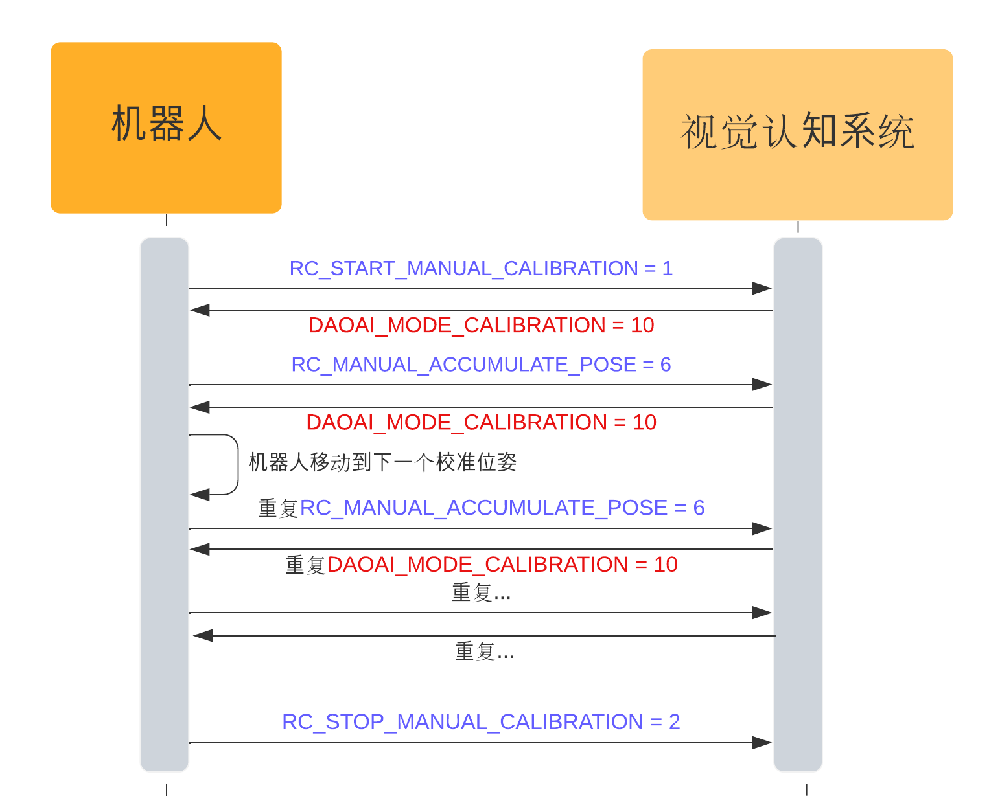

UR 机器人Modbus TCP通讯接口
===================

本章会详细介绍机器人和DaoAI Vision Pilot之间的通讯协议。

.. note::
    1. DaoAI机器人程序所用的计量单位为  米-m, 旋转计量单位为 弧度-rad
    2. 该协议只适用于DaoAI网页版DaoAI Vision Pilot软件

|

*************
目录列表
*************

.. contents:: 
    :local:

机器人和DaoAI Vision Pilot之间以发送指令 |:left_right_arrow:| 接收程序回应的模式交换信息，其中机器人充当slave，DaoAI Vision Pilot充当master。
机器人向DaoAI Vision Pilot发送请求，例如进行探测流程，DaoAI Vision Pilot在完成一系列操作后用相应的指令进行回复。
所有请求和等待都是同步的（单线程），在收到前一个等待的回应之前，应确保机器人在此期间不发送任何新请求。


|

连接详细信息
---------------

.. list-table:: 

   * - **类型/Type**
     - Modbus TCP
   * - **端口/Port**
     - 502
   * - **字节顺序/Byte order**
     - Network order (big endian)


一旦机器人启动程序，它就会侦听TCP端口 ``502`` 并等待，直到DaoAI Vision Pilot系统发起连接。这是基于TCP/IP(传输层/网络层)实现的master和slave的连接。

可以在DaoAI Vision Pilot的网络设置中找到并更改DaoAI Vision Pilot系统的IP地址。

|

协议/Protocol
---------------

DaoAI Vision Pilot 和机器人之间的指令和回应消息都是固定长度的。因为消息协议的长度是固定的，即使机器人短的编程功能有限，也会比较容易实现。

.. note::
    请求和回应消息具有固定长度，并且没有开始和/或结束字符。虽然TCP/IP协议可防止数据丢失，但机器人和DaoAI Vision Pilot实现通过计算发送/接收的字节数并与预期的消息大小进行比较来跟踪区别消息之间的边界。

请求和回应消息由多个字段组成，每个字段为一个 int32 (4 bytes)。 浮点数据（如距离和角度）将乘以一个恒定系数 MULT = 10000 , 再作为int32发送。 然后，接收端通过将接收的值除以该系数来解码此字段。


|

请求消息
~~~~~~~~~~

从机器人发送到DaoAI Vision Pilot的指令消息长度为48个字节，由以下字段组成：

.. list-table:: 请求消息结构

   * - **字段**
     - **类型**
     - **长度**
     - **描述**
   * - Position/位置字段
     - int32[3]
     - 12 bytes
     - 机器人法兰位置 (XYZ，以毫米为单位) 用右手机器人底座表示。每个字段都必须乘以MULT系数.
   * - Orientation/旋转字段 
     - int32[4]
     - 16 bytes
     - 机器人法兰方向用右手机器人底座框架表示。方向编码和单位取决于所选的方向约定。每个字段都必须乘以 MULT系数. 
   * - command/指令字段
     - int32[4]
     - 16 bytes
     - 请求指令 
   * - payload/载荷字段
     - int32[2]
     - 8 bytes
     - 可选的有效载荷字段。
   * - meta
     - int32[2]
     - 8 bytes
     - meta_1，即消息的倒数第二个字段，应发送机器人的类型，meta_2，即消息的最后一个字段，应发送机器人协议版本。详细信息请参阅本文Meta消息说明。

.. list-table:: 请求消息标志位

   * - **字段**
     - **类型**
     - **长度**
     - **描述**
   * - sign
     - int32[1]
     - 4 bytes
     - sign，在请求消息发送完成之后，此标志位必须置成值1，以通知master端请求消息更新完成。master端读取完成回应消息之后，此标志位必须置成值0，以reset此标志位的状态。


所有字段都是必填的，并且必须为每个请求设置合理的值。有效载荷字段只对特定的流程和指令有效。无效的字段请赋予零。

指令字段command可以控制DaoAI Vision Pilot执行不同的流程。下面将更详细地解释可能的指令及其对应的回应消息。

|

回应消息
~~~~~~~~~~~~~

除姿势更新请求外，所有请求指令都使用64字节长的回应消息进行应答，其结构如下：

.. list-table:: 回应消息结构

   * - **字段**
     - **类型**
     - **长度**
     - **描述**
   * - Position/位置字段
     - int32[3]
     - 12 bytes
     - 物体位置或拾取点偏移平移(XYZ，单位为毫米)，具体取决于回应状态。另请参阅更详细的指令说明。每个值都必须除以MULT。
   * - Orientation/旋转字段 
     - int32[4]
     - 16 bytes
     - 物体方向或拾取点偏移旋转，具体取决于回应状态。另请参阅更详细的指令说明。编码和单位取决于所选的定向约定，并且必须用MULT除以。
   * - payload/载荷字段
     - int32[6]
     - 24 bytes
     - 可选的有效载荷字段。编码和单位取决于所选的定向约定，并且必须用MULT除以。
   * - status/状态字段
     - int32
     - 4 bytes
     - 定义的状态值之一。
   * - meta
     - int32[2]
     - 8 bytes
     - meta_1，即消息的倒数第二个字段，应发送机器人的类型，meta_2，即消息的最后一个字段，应发送机器人协议版本。详细信息请参阅本文Meta消息说明。

.. list-table:: 回应消息标志位

   * - **字段**
     - **类型**
     - **长度**
     - **描述**
   * - sign
     - int32[1]
     - 4 bytes
     - sign，在回应消息发送完成之后，此标志位必须置成值1，以通知slave端回应消息更新完成。slave端读取完成回应消息之后，此标志位必须置成值0，以reset此标志位的状态。


并非每个指令回应都传达姿态信息或附加有效载荷。状态字段可以用来控制position、orientation和payload字段的解读方式。在以下各节中，将更详细地说明各个指令及其对应的回应。

.. admonition:: 重要声明
    :class: important

        .. list-table:: 机器人旋转表示和计算方式

            * - **机器人类型**
              - **旋转数据收发顺序**
              - **旋转表示方法**
              - **旋转顺序**
              - **旋转计算方式**
              - **备注**
            * - UR
              - rx, ry, rz, 0
              - 轴角（旋转矢量）
              - None
              - None
              - None
            * - ABB
              - q2, q3, q4, q1(DaoAI Vision Pilot表示为：x, y, z, w)
              - 四元数
              - None
              - None
              - 四元数表示旋转的数据元素顺序默认为 [w, x, y, z]， DaoAI Vision Pilot表示为：[x, y, z, w],所以在发送和接收四元数时需要注意顺序。
            * - Kuka
              - rx, ry, rz, 0
              - 欧拉角
              - ZY'X''
              - 右乘（内旋）
              - None
            * - Yaskawa
              - rx, ry, rz, 0
              - 欧拉角
              - XYZ
              - 左乘（外旋）
              - DaoAI Vision Pilot欧拉角计算方式为右乘（内旋），与该机器人计算方式不同，需注意DaoAI Vision Pilot的机器人相关配置。
            * - Fanuc
              - rx, ry, rz, 0
              - 欧拉角
              - XYZ
              - 左乘（外旋）
              - DaoAI Vision Pilot欧拉角计算方式为右乘（内旋），与该机器人计算方式不同，需注意DaoAI Vision Pilot的机器人相关配置。
            * - Staubli
              - rx, ry, rz, 0
              - 欧拉角
              - XY'Z''
              - 右乘（内旋）
              - None
            * - Adept
              - rx, ry, rz, 0
              - 欧拉角
              - ZY'Z''
              - 右乘（内旋）
              - None
            * - Kawasaki
              - rx, ry, rz, 0
              - 欧拉角
              - ZY'Z''
              - 右乘（内旋）
              - None
            * - Mitsubishi
              - rx, ry, rz, 0
              - 欧拉角
              - ZY'X''
              - 右乘（内旋）*
              - None
            * - Comau
              - rx, ry, rz, 0
              - 欧拉角
              - ZY'Z''
              - 右乘（内旋）
              - None
            * - Syntec
              - rx, ry, rz, 0
              - 欧拉角
              - XYZ
              - 左乘（外旋）
              - DaoAI Vision Pilot欧拉角计算方式为右乘（内旋），与该机器人计算方式不同，需注意DaoAI Vision Pilot的机器人相关配置。
            * - Aubo
              - rx, ry, rz, 0
              - 欧拉角
              - ZY'X''
              - 右乘（内旋）
              - None
            * - Dobot
              - rx, ry, rz, 0
              - 欧拉角
              - ZY'X''
              - 右乘（内旋）*
              - None
            * - Hanwha
              - rx, ry, rz, 0
              - 欧拉角
              - ZY'X''
              - 右乘（内旋）*
              - None
            * - Efort
              - rz, ry, rz, 0
              - 欧拉角
              - ZY'Z''
              - 右乘（内旋）
              - None
            * - Turin
              - rz, ry, rz, 0
              - 欧拉角
              - XY'Z''
              - 右乘（内旋）
              - None

.. admonition:: 拓展
    :class: note

    .. centered:: 浅析旋转表示和计算方法

    :strong:`轴角：` |br|
        轴角表示法是描述三维旋转的一种方法。它使用一个轴向量和一个旋转角度来唯一地确定一次旋转。 |br|
        轴角和旋转向量本质上是一个东西，轴角用四个元素表达旋转，其中的三个元素用来描述旋转轴，另外一个元素描述旋转的角度,如下所示：
            .. math::
                r = [x,y,z,\theta]\\
        其中单位向量 :math:`\mathop{n}\limits^{\rightarrow} = [x,y,z]` 对应的是旋转轴， :math:`\theta` 对应的是旋转角度。 |br|
        旋转向量与轴角相同，只是旋转向量用三个元素来描述旋转，它把 :math:`\theta` 角乘到了旋转轴上，如下：
            .. math::
                r_{v} = [x∗\theta,y∗\theta,z∗\theta]\\
        :emphasis:`优点：` 简单明了,易于理解；可以很容易地复合多次旋转；避免了万向节死锁(gimbal lock)的问题。 |br|
        :emphasis:`缺点：` 不同的轴角之间不能进行简单的插值，插值不平滑，可能会有跳跃；当旋转角度接近180度时,轴向量会变得不确定和不稳定，在这种情况下,四元数表示法更加稳定可靠。 |br|

    :strong:`欧拉角：` |br|
        欧拉角是由Leonhard Euler 提出的概念，用来描述刚体/移动坐标系在一个固定坐标系中的姿态。简单的说是使用XYZ三个轴的旋转分量，来描述一个6自由度的旋转。 |br|
        欧拉角一般具有两大类表示方式，每类按照旋转次序的不同分为6小类：
            .. math::
                Proper Euler angles (z-x-z, x-y-x, y-z-y, z-y-z, x-z-x, y-x-y)\\
                Tait–Bryan angles (x-y-z, y-z-x, z-x-y, x-z-y, z-y-x, y-x-z)
        每个大类都使用了3个变量描述三次旋转过程中的旋转角度，差别在于Proper Euler angles只涉及两个转轴。而Tait–Bryan angles涉及三个转轴。 |br|
        Tait–Bryan angles 也被称为Cardan angles, nautical angles, (heading, elevation, and bank),(yaw, pitch, and roll)。我们接触的比较多的是yaw(偏航), pitch(俯仰), roll(横滚)。三个变量一般对应(车体,飞行器)z,y,x三个坐标轴。 |br|
        :emphasis:`优点：` 易于直观的理解。 |br|
        :emphasis:`缺点：` 不易在任意方向的旋转轴插值，插值不平滑，可能会有跳跃；存在万向节死锁(gimbal lock)的问题。 |br|
        :strong:`内旋和外旋` |br|
        按照旋转的坐标系分为两种旋转方式： |br|
        :strong:`内旋-intrinsic rotation（动态）:相对变换后的（当前的，自身的）坐标系做变换，以z-y′-z′′表示。′上标表达的是该旋转是以上一次旋转为参考。参考坐标系为物体坐标系。`
            .. math::
                左乘(premultiplication)=内旋(intrinsic rotations) = 旋转轴(rotated axis)\\
        :strong:`外旋-extrinsic rotation（静态）:相对初始的（固定的）坐标系做变换，以z-x-z表示。参考坐标系为世界坐标系。`
            .. math::
                右乘(postmultiplication)=外旋(extrinsic rotations) = 固定轴(static/fixed axis)\\
        不考虑内旋与外旋时，Proper Euler angles 和 Tait–Bryan angles 各有六种绕轴旋转方式;如果考虑内旋与外旋，则各有12种绕轴旋转方式。 |br|
        :strong:`如果外旋和内旋的的第一次旋转和第三次旋转互换位置，则二者是等价的，可以从矩阵计算方法证明。左乘与右乘最后的结果差一个转置。` |br|

    :strong:`四元数：` |br|
        四元数（Quaternions）是由爱尔兰数学家哈密顿(William Rowan Hamilton,1805-1865）在1843年发明的数学概念。四元数的乘法不符合交换律（commutative law）。 |br|
        四元素与轴角的表示很接近，因为四元数描述的也是一个三维向量表示旋转轴与一个标量表示绕着该旋转轴旋转的角度(或弧度)。但四元数与轴角不等价。
            .. math::
                r = [nx,ny,nz,\theta]\\
                q = [w,x,y,z]\\
        :strong:`转换关系如下：`
            .. math::
                q = [w,x,y,z] = [cos(\theta / 2),nx * sin(\theta / 2),ny * sin(\theta / 2),nz * sin(\theta / 2)]\\
        :emphasis:`优点：` 四元数的插值过度平滑，最常用的是线性插值。解决欧拉角万向节死锁(gimbal lock)的问题和轴角插值不平滑存在跳跃问题。

|

可用指令(Command)
----------------------------------


RC_NO_COMMAND = -1 (机器人姿势更新)
~~~~~~~~~~~~~~~~~~~~~~~~~~~~~~~~~~~~

    将当前的机器人法兰姿势发送给DaoAI Vision Pilot。DaoAI Vision Pilot使用此信息来确定机器人是否仍处于连接状态，以及更新DaoAI Vision Pilot网络界面中的3D视图。


RC_START_MANUAL_CALIBRATION = 1
~~~~~~~~~~~~~~~~~~~~~~~~~~~~~~~~~~

    发送校准模式开始指令到视觉，此指令属于机器人和DaoAI Vision Pilot的握手。DaoAI Vision Pilot可以处于CALIBRATION 模式

    当视觉发送的指令并非以下的指令时，视觉所在的流程与机器人不符，机器人需重新发送 RC_START_MANUAL_CALIBRATION = 1 ，并重新进行此握手。

    **回应**

    .. list-table:: 

      * - **字段**
        - **模式**
        - **描述**
      * - 状态
        - DAOAI_MODE_CALIBRATION= 10
        - DaoAI Vision Pilot处于手动、引导校准流程

RC_STOP_MANUAL_CALIBRATION = 2
~~~~~~~~~~~~~~~~~~~~~~~~~~~~~~~~~

    触发DaoAI Vision Pilot停止校准板图像采集和累积流程。请注意，发送此指令时，DaoAI Vision Pilot必须处于校准模式。

    **回应**

    .. list-table:: 

        * - **字段**
          - **模式**
          - **描述**
        * - 状态
          - DAOAI_DONE_CALIBRATION = 33
          - DaoAI Vision Pilot终止校准模式


RC_START_AUTO_CALIBRATION = 4
~~~~~~~~~~~~~~~~~~~~~~~~~~~~~~~~~

    发送校准模式开始指令到视觉，此指令属于机器人和DaoAI Vision Pilot的握手。DaoAI Vision Pilot可以处于自动校准模式。

    当视觉发送的指令并非以下的指令时，视觉所在的流程与机器人不符，机器人需重新发送  此指令进行握手。

    **回应**

    .. list-table:: 

        * - **字段**
          - **模式**
          - **描述**
        * - 状态
          - DAOAI_MODE_AUTO_CALIBRATION = 11
          - DaoAI Vision Pilot处于自动校准图像采集和累计流程。


RC_MANUAL_ACCUMULATE_POSE = 6
~~~~~~~~~~~~~~~~~~~~~~~~~~~~~~~~~~~~~

    请求DaoAI Vision Pilot进入图像采集和累计流程，进行校准。若视觉发送的指令非以下指令，则机器人与视觉处于不同的模式/流程，机器人将发送 RC_START_MANUAL_CALIBRATION = 1（手动校准），并重新回到校准流程的握手状态。

    **回应**

    .. list-table:: 

        * - **字段**
          - **模式**
          - **描述**
        * - 状态
          - DAOAI_MODE_CALIBRATION = 10
          - DaoAI Vision Pilot处于手动校准模式

	
RC_AUTO_ACCUMULATE_POSE = 7
~~~~~~~~~~~~~~~~~~~~~~~~~~~~~~~~~~~~~

    请求DaoAI Vision Pilot进入图像采集和累计流程，进行校准。若视觉发送的指令非以下指令，则机器人与视觉处于不同的模式/流程，机器人将发送 RC_START_AUTO_CALIBRATION = 4（自动校准），并重新回到校准流程的握手状态。

    **回应**

    .. list-table:: 

        * - **字段**
          - **模式**
          - **描述**
        * - 状态
          - DAOAI_MODE_AUTO_CALIBRATION = 11
          - DaoAI Vision Pilot处于自动校准图像采集和累计流程。
        * - 状态
          - DAOAI_DONE_AUTO_CALIBRATION = 33
          - DaoAI Vision Pilot以获得足够多的校准点位，回馈机器人停止校准

RC_GUIDANCE_CALIBRATION = 10
~~~~~~~~~~~~~~~~~~~~~~~~~~~~~~~~~~~~~~~~
    
    机器人发送此指令到视觉用以发送引导校准的位姿，视觉会接收位姿信息，不会给予回应。


RC_START_2D_AUTO_CALIBRATION = 11
~~~~~~~~~~~~~~~~~~~~~~~~~~~~~~~~~~~~~~~


    发送2D校准模式开始指令到视觉，此指令属于机器人和DaoAI Vision Pilot的握手。DaoAI Vision Pilot可以处于自动校准模式。

    当视觉发送的指令并非以下的指令时，视觉所在的流程与机器人不符，机器人需重新发送  此指令进行握手。

    **回应**

    .. list-table:: 

        * - **字段**
          - **模式**
          - **描述**
        * - 状态
          - DAOAI_MODE_2D_AUTO_CALIBRATION  = 14
          - DaoAI Vision Pilot处于2D自动校准模式，并发送下一个校准点位至机器人，使机器人移动到该点位
        * - 状态
          - DAOAI_DONE_2D_AUTO_CALIBRATION  = 34
          - DaoAI Vision Pilot以获得足够多的校准点位，回馈机器人停止校准


RC_AUTO_ACCUMULATE_2D_POSE = 12
~~~~~~~~~~~~~~~~~~~~~~~~~~~~~~~~~~~~~~~


    请求DaoAI Vision Pilot进入图像采集和累计流程，进行校准。若视觉发送的指令非以下指令，则机器人与视觉处于不同的模式/流程，机器人将发送 RC_START_2D_AUTO_CALIBRATION = 11（2D自动校准），并重新回到校准流程的握手状态。

    **回应**

    .. list-table:: 

        * - **字段**
          - **模式**
          - **描述**
        * - 状态
          - DAOAI_MODE_2D_AUTO_CALIBRATION  = 14
          - DaoAI Vision Pilot处于2D自动校准模式，并发送下一个校准点位至机器人，使机器人移动到该点位
        * - 状态
          - DAOAI_DONE_2D_AUTO_CALIBRATION  = 34
          - DaoAI Vision Pilot以获得足够多的校准点位，回馈机器人停止校准

RC_DAOAI_CAPTURE_AND_PROCESS_ASYNC = 19
~~~~~~~~~~~~~~~~~~~~~~~~~~~~~~~~~~~~~~~

    请求DaoAI Vision Pilot进行探测流程，让视觉拍照并识别流程，不会阻塞机器人。此消息必须含有机器人目前的位姿信息。

    **回应**

    .. list-table:: 

        * - **字段**
          - **模式**
          - **描述**
        * - 状态
          - DAOAI_DETECTION_MODE = 5
          - DaoAI Vision Pilot回馈握手信息，认知目前处于拍照并识别流程。


RC_DAOAI_CAPTURE_AND_PROCESS = 20
~~~~~~~~~~~~~~~~~~~~~~~~~~~~~~~~~~~~~~~


    请求DaoAI Vision Pilot进行探测流程，让视觉拍照并识别流程，会阻塞机器人至拍照结束。此消息必须含有机器人目前的位姿信息。

    **回应**

    .. list-table:: 

        * - **字段**
          - **模式**
          - **描述**
        * - 状态
          - DAOAI_DETECTION_MODE = 5
          - DaoAI Vision Pilot回馈握手信息，认知目前处于拍照并识别流程。


RC_DAOAI_PICK_POSE = 21
~~~~~~~~~~~~~~~~~~~~~~~~~~~~

    请求DaoAI Vision Pilot发送物体位姿；此指令只出现在 DAOAI_DETECTION = 5 之后。当视觉探测并发送了位姿给机器人后，机器人进行抓取，然后重复回复视觉 RC_DAOAI_PICK_POSE = 21 请求下一个物体的位姿。

    **回应**

    .. list-table:: 

        * - **字段**
          - **模式**
          - **描述**
        * - 状态
          - DAOAI_OBJECTS_FOUND = 2
          - DaoAI Vision Pilot探测到物体并把物体抓取位姿回复到机器人，机器人将根据位姿进行抓取。
        * - 状态
          - DAOAI_NO_OBJECT_FOUND = 3
          - DaoAI Vision Pilot探测不到物体回复到机器人，机器人将根据当前脚本进入下一阶段。
        * - 状态
          - DAOAI_NO_COLLISION_FREE_POSE= 4
          - DaoAI Vision Pilot回馈错误信息，避碰模块无法找到任何安全位姿，机器人将根据脚本进入不同的阶段。


RC_SEND_POSE = 30
~~~~~~~~~~~~~~~~~~~~~~~~~~~~

    机器人发送此指令到视觉用以发送示教位姿，视觉会接收位姿信息，不会给予回应。


RC_CHECK_EMPTY_BOX = 40
~~~~~~~~~~~~~~~~~~~~~~~~~~~~

    请求DaoAI Vision Pilot检查箱体（ROI）区域是否为空，通常在收到 DAOAI_NO_OBJECT_FOUND = 3 之后使用。使用时 要使用payload_1 指定要进行检测的task id， 或者使用daoai_switch_task(id)函数来指定。

    如果箱体不为空，但是无法检测到物体，那么就可以考虑使用机器人去晃动箱体再尝试检测。

    **回应**

    .. list-table:: 

        * - **字段**
          - **模式**
          - **描述**
        * - 状态
          - DAOAI_BOX_EMPTY = 41
          - 视觉检测ROI区域为空，判断条件为 ROI区域<2000个点 和 检测流程没有检测到物体.
        * - 状态
          - DAOAI_BOX_NOT_EMPTY= 42
          - 视觉检测ROI区域仍有存在物体，判断条件为 ROI区域>2000个点 或 检测流程有检测到至少一个物体.


RC_PRECISION_CHECK= 50
~~~~~~~~~~~~~~~~~~~~~~~~~~~~

    请求视觉运行precision check。使用时 要使用payload_1 指定已创建的precision check task id, 或者使用daoai_switch_task(id)函数来指定。

    **回应**

    .. list-table:: 

        * - **字段**
          - **模式**
          - **描述**
        * - 状态
          - DAOAI_PRECISION_CHECK_SUCCESS= 51
          - 检测成功，返回值的payload_1为计算出的误差。
        * - 状态
          - DAOAI_PRECISION_CHECK_FAIL= 52
          - 检测失败，通常是因为无法检测到精度验证图形码


RC_SWITCH_CONFIG = 69
~~~~~~~~~~~~~~~~~~~~~~~~~~~~

    请求DaoAI Vision Pilot切换相机配置；此指令发送到视觉端时，视觉会根据消息中的载荷字段1（payload_1）的整数，切换相机配置。此相机配置会在视觉端上设置好，根据整数切换用户预设的配置。如：payload_1 = 1， 切换 config_1；payload_1 = 3， 切换 config_3等。

    **回应**

    .. list-table:: 

        * - **字段**
          - **模式**
          - **描述**
        * - 状态
          - DAOAI_SWITCH_CONFIG_SUCCESS = 66
          - 切换相机配置成功
        * - 状态
          - DAOAI_SWITCH_CONFIG_FAIL = 67
          - 切换相机配置失败


|

载荷字段 Payload
---------------------

载荷字段在抓和放时，所表示的意思并不相同：payload_1会被用作基本的抓放信息交换，抓的时候payload_1 代表的是剩余物体数量：如在场景中探测到了5个物体，第一个位姿发送时payload_1 = 5；放的时候payload_1 代表的是物体的种类（在没有分类时此payload可被忽略或者用于其他用途）：如在场景中会出现5类物体，此次抓取到的是第四类物体 payload_1 = 4。

.. Warning::
    在抓取时：
        
        DaoAI Vision Pilot 给机器人发送的payload_1：代表 **物体的剩余数量**。

        机器人给 DaoAI Vision Pilot 发送的payload_1：代表 **执行task的id**。

    例：DaoAI Vision Pilot 有2个task; task_1 的id 为0，task_2的id为1。想要执行task_1时，机器人的payload_1就应该为0。 想要执行task_2时，机器人的payload_1就应该为1。

其他的payload可根据用户具体案例自由使用。


|

全局常量
--------------

机器人发送指令常量
~~~~~~~~~~~~~~~~~~~~~~

.. code-block:: python

    RC_DAOAI_NO_COMMAND                               = -1

    # Manual Calibration/ Guidance Calibration
    RC_START_MANUAL_CALIBRATION                       = 1
    RC_STOP_MANUAL_CALIBRATION                        = 2 
    RC_MANUAL_ACCUMULATE_POSE                         = 6
    # Auto Calibration
    RC_START_AUTO_CALIBRATION                         = 4
    RC_AUTO_ACCUMULATE_POSE                           = 7
    RC_GUIDANCE_CALIBRATION                           = 10
    RC_START_2D_AUTO_CALIBRATION                      = 11

    RC_AUTO_ACCUMULATE_2D_POSE                        = 12
    # Picking
    RC_DAOAI_CAPTURE_AND_PROCESS_ASYNC                = 19
    RC_DAOAI_CAPTURE_AND_PROCESS                      = 20
    RC_DAOAI_PICK_POSE                                = 21

    #Teach
    RC_SEND_POSE                                      = 30

    #Check empty box
    RC_CHECK_EMPTY_BOX                                = 40

    #Check robot driftting
    RC_PRECISION_CHECK                                = 50

    #Camera Config
    RC_SWITCH_CONFIG                                  = 69


DaoAI Vision Pilot回应常量
~~~~~~~~~~~~~~~~~~~~~~~~~~~~~~

.. code-block:: python

    DAOAI_UNKNOWN_COMMAND                              = -1  

    #DaoAI Vision Pilot抓取校准流程
    DAOAI_OBJECTS_FOUND                                = 2
    DAOAI_NO_OBJECT_FOUND                              = 3
    DAOAI_NO_COLLISION_FREE_POSE                       = 4
    DAOAI_CAPTURE_SUCCESS                              = 5
    DAOAI_DROP_OFF_POSE                                = 6
    DAOAI_CAPTURE_FAIL                                 = 9

    #DaoAI Vision Pilot处于手动校准流程
    DAOAI_MODE_CALIBRATION                             = 10 
    #DaoAI Vision Pilot处于自动校准流程
    DAOAI_MODE_AUTO_CALIBRATION                        = 11
    DAOAI_MODE_2D_AUTO_CALIBRATION                     = 14

    #终止指令
    DAOAI_DONE_CALIBRATION                             = 33
    DAOAI_DONE_2D_AUTO_CALIBRATION                     = 34

    #check empty box
    DAOAI_BOX_EMPTY                                    = 41
    DAOAI_BOX_NOT_EMPTY                                = 42

    #Robot drift check
    DAOAI_PRECISION_CHECK_SUCCESS                      = 51
    DAOAI_PRECISION_CHECK_FAIL                         = 52

    #相机配置更换
    DAOAI_SWITCH_CONFIG_SUCCESS                        = 66
    DAOAI_SWITCH_CONFIG_FAIL                           = 67


|

接口/Interface
---------------------

下文提出了一个应用程序接口，供程序员在集成新机器人时使用。从高层次来看，应用程序接口包括以下功能：

- Global Variables/全局变量

- Initialization/初始化设置

- Networking/收发和通讯

- Calibration/校准函数

- Pick & Place/抓放函数


以下为机器人端的脚本函数示例，均为伪代码：

Global Variables/全局变量
~~~~~~~~~~~~~~~~~~~~~~~~~~~

所有的接口函数都会使用以下所以的全局变量：

.. code-block:: python

    mult=10000
    #UR Robot type = 7
    DAOAI_ROBOT_TYPE = 7 
    DAOAI_META_VERSION = 1

    #Pose Object
    daoai_tcp_pose = p[0,0,0,0,0,0]
    daoai_payload_1 = 0
    daoai_payload_2 = 0
    daoai_payload_3 = 0
    daoai_payload_4 = 0
    daoai_payload_5 = 0
    daoai_payload_6 = 0

    #meta info
    daoai_socket_name = "daoai"
    daoai_socket
    daoai_status = 0
    daoai_r_command = 0
    daoai_task_id = 0
    daoai_num_remaining_objects = 0

Initialization
~~~~~~~~~~~~~~~~~~

daoai_init(IP, port)
```````````````````````

    **Parameters**:

        - IP_address: string（字符串） → 机器人本机的IP地址

        - slave_number: int （整数）→ slave 端的地址，通常默认为：“502”

        - signal_starting_address: int （整数）→ 寄存器的开始地址，通常默认为：“128”

        - signal_type: int （整数）→ 寄存器的类型，通常默认为：“3”，即为register output

        - signal_name: string（字符串） → 寄存器的名称，通常默认为："output_register"

        - quantity: int （整数）→ 寄存器的数量，通常默认为：“20”

    **Info**:

        机器人使用此函数配置Modbus TCP 协议的 slave 端口和寄存器

    **Return type**:

        Boolean（布尔值）：配置 Modbus TCP 后返回True

    **Pseudo-code**:

    .. code-block:: 

        # Modbus Configuration Functions
        def Modbus_Configuration(IP_address=IP_address,slave_number=slave_number,signal_starting_address=signal_starting_address,signal_type=registerOutput,signal_name=output_signalName,quantity=output_signalQuantity):
            local i = 0
            while i<quantity:
                modbus_add_signal(IP_address, slave_number, signal_starting_address+i, signal_type, str_cat(signal_name, to_str(i)))
                i=i+1
            end
        return True
        end

Networking/收发和通讯
~~~~~~~~~~~~~~~~~~~~~~

send_robot_data()
```````````````````````

    **Parameters**:

        N/A

    **Info**:

        机器人发送数据至视觉

    **Return type**:

        Void

    **Pseudo-code**:

    .. code-block::

        def modbustcp_send_robot_data(robot_data):
            local i = 0

            # sync()
            # enter_critical
            while i<12:
                write_port_register(128+i, robot_data[i])
                i=i+1
            end
            write_port_register(144, 1)
            # exit_critical
            # sync()

            return (True)
        end

        def send_robot_data():
            local robot_data = [0,0,0,0,0,0,0,0,0,0,0,0]
            p_actual_pose = get_actual_tcp_pose()

            sync()
            enter_critical
            robot_data[0] = floor(mult*p_actual_pose[0])
            robot_data[1] = floor(mult*p_actual_pose[1])
            robot_data[2] = floor(mult*p_actual_pose[2])
            robot_data[3] = floor(mult*p_actual_pose[3])
            robot_data[4] = floor(mult*p_actual_pose[4])
            robot_data[5] = floor(mult*p_actual_pose[5])
            robot_data[6] = floor(mult*0.0)
            robot_data[7] = daoai_r_command
            robot_data[8] = daoai_payload_1
            robot_data[9] = daoai_payload_2
            robot_data[10] = DAOAI_ROBOT_TYPE
            robot_data[11] = DAOAI_META_VERSION
            modbustcp_send_robot_data(robot_data)
            daoai_r_command = RC_DAOAI_NO_COMMAND
            exit_critical
            sync()
        end


recv_daoai_data()
```````````````````````

    **Parameters**:

        N/A

    **Info**:

        机器人从视觉接收数据

    **Return type**:

        Void

    **Pseudo-code**:

    .. code-block:: 

        def modbustcp_recv_daoai_data():
            local i = 1
            local daoai_data = [16,0,0,0,0,0,0,0,0,0,0,0,0,0,0,0,0]

            sync()
            enter_critical
            while read_port_register(145) == 0:
            end
            while i<17:
                daoai_data[i] = read_port_register(128+i)
                i=i+1
            end
            write_port_register(145, 0)
            exit_critical
            sync()

            return (daoai_data)
        end

        def recv_daoai_data():
            wait_for_data = True
            while wait_for_data == True:
                daoai_data = modbustcp_recv_daoai_data()
                if daoai_data[0] == 16:
                    wait_for_data = False
                end
                sync()
            end
            if daoai_data[15] != DAOAI_ROBOT_TYPE:
                popup("Pick-it is not configured to communicate with a UR robot.")
            end
            if daoai_data[16] != DAOAI_META_VERSION:
                popup("The DaoAI interface version does not match the version of this program.")
            end
            enter_critical

            # daoai_data[14] contains the status of the response
            daoai_tcp_pose = p[daoai_data[1]/mult, daoai_data[2]/mult, daoai_data[3]/mult, daoai_data[4]/mult, daoai_data[5]/mult, daoai_data[6]/mult]
            daoai_payload_1=daoai_data[8]/mult
            daoai_payload_2=daoai_data[9]/mult
            daoai_payload_3=daoai_data[10]/mult
            daoai_payload_4=daoai_data[11]/mult
            daoai_payload_5=daoai_data[12]/mult
            daoai_payload_6 = daoai_data[13]/mult
            daoai_status = daoai_data[14]
            exit_critical
            sync()
        end

send_robot_data_2d(plane, optional_z = False, z_value = 0)
`````````````````````````````````````````````````````````````

    **Parameters**:

        - plane: 机器人发送时会将当前3D位置 转换到该平面然后发送。

        - optional_z: 默认为False, 发送的坐标z值为当前z值（视觉在读取2D坐标时会无视z值）。如果为True, 则会使用 z_value 作为发送坐标的z值。

        - z_value : 默认为0, 如果optional_z为True, 则会使用 z_value 作为发送坐标的z值。

    **Info**:

        机器人发送2D数据至视觉

    **Return type**:

        Void

    **Pseudo-code**:

    .. code-block::

        def modbustcp_send_robot_data(robot_data):
            local i = 0

            # sync()
            # enter_critical
            while i<12:
                write_port_register(128+i, robot_data[i])
                i=i+1
            end
            write_port_register(144, 1)
            # exit_critical
            # sync()

            return (True)
        end

        def send_robot_data_2d(plane, optional_z = False, z_value = 0):
            local robot_data = [0,0,0,0,0,0,0,0,0,0,0,0]

            sync()
            base_in_plane = pose_inv(plane)
            tool_in_plane = pose_trans(base_in_plane,get_actual_tcp_pose())
            p_actual_pose = tool_in_plane
            enter_critical
            if optional_z:
                robot_data[2] = floor(mult*z_value)
            else:
                robot_data[2] = floor(mult*p_actual_pose[2])
            end
            robot_data[0] = floor(mult*p_actual_pose[0])
            robot_data[1] = floor(mult*p_actual_pose[1])
            robot_data[3] = floor(mult*p_actual_pose[3])
            robot_data[4] = floor(mult*p_actual_pose[4])
            robot_data[5] = floor(mult*p_actual_pose[5])
            robot_data[6] = floor(mult*0.0)
            robot_data[7] = daoai_r_command
            robot_data[8] = daoai_payload_1
            robot_data[9] = daoai_payload_2
            robot_data[10] = DAOAI_ROBOT_TYPE
            robot_data[11] = DAOAI_META_VERSION
            modbustcp_send_robot_data(robot_data)
            daoai_r_command = RC_DAOAI_NO_COMMAND
            exit_critical
            sync()
        end


recv_daoai_data_2d(plane)
``````````````````````````````````

    **Parameters**:

        - plane: 机器人接受时会将收到的2D位置 从该平面转换到3D坐标然后接收。

    **Info**:

        机器人从视觉接收2D数据

    **Return type**:

        Void

    **Pseudo-code**:

    .. code-block::

        def modbustcp_recv_daoai_data():
            local i = 1
            local daoai_data = [16,0,0,0,0,0,0,0,0,0,0,0,0,0,0,0,0]

            sync()
            enter_critical
            while read_port_register(145) == 0:
            end
            while i<17:
                daoai_data[i] = read_port_register(128+i)
                i=i+1
            end
            write_port_register(145, 0)
            exit_critical
            sync()

            return (daoai_data)
        end

        def recv_daoai_data_2d(plane):
            wait_for_data = True
            while wait_for_data == True:
                daoai_data = modbustcp_recv_daoai_data()
                if daoai_data[0] == 16:
                    wait_for_data = False
                end
            sync()
            end
            if daoai_data[15] != DAOAI_ROBOT_TYPE:
                popup("Pick-it is not configured to communicate with a UR robot.")
            end
            if daoai_data[16] != DAOAI_META_VERSION:
                popup("The DaoAI interface version does not match the version of this program.")
            end

            tool_in_plane=p[daoai_data[1]/mult,daoai_data[2]/mult,daoai_data[3]/mult,daoai_data[4]/mult,daoai_data[5]/mult,daoai_data[6]/mult]
            bp = pose_trans(plane, tool_in_plane)
            cur_pose = get_actual_tcp_pose()
            #bp=tool_in_plane
            daoai_data[1]=bp[0]
            daoai_data[2]=bp[1]
            daoai_data[3]=bp[2]
            daoai_data[4]=bp[3]
            daoai_data[5]=bp[4]
            daoai_data[6]=bp[5]
            enter_critical
            # daoai_data[14] contains the status of the response
            daoai_tcp_pose = bp
            daoai_payload_1=daoai_data[8]/mult
            daoai_payload_2=daoai_data[9]/mult
            daoai_payload_3=daoai_data[10]/mult
            daoai_payload_4=daoai_data[11]/mult
            daoai_payload_5=daoai_data[12]/mult
            daoai_payload_6 = daoai_data[13]/mult
            daoai_status = daoai_data[14]
            daoai_tcp_pose[2] = cur_pose[2]
            exit_critical
            sync()
        end


Calibration/校准函数
~~~~~~~~~~~~~~~~~~~~~~


Manual Calibration:
`````````````````````````

daoai_start_manual_calibration()
^^^^^^^^^^^^^^^^^^^^^^^^^^^^^^^^^^^^

    **Parameters**:

        N/A

    **Info**:

        机器人使用此函数引导视觉系统开始手动校准流程。

    **Return type**:

        Boolean（布尔值）：成功启动校准程序后返回True。

    **Pseudo-code**:

    .. code-block:: 

        def daoai_start_manual_calibration():
            #Set command as "Start Manual Calibration"
            daoai_r_command = RC_START_MANUAL_CALIBRATION
            
            send_robot_data()
            recv_daoai_data()
            
            if (daoai_status != DAOAI_MODE_CALIBRATION):
                #check rsponse from Vision, if incorrect, terminate the process
                return False
            end

            return True
        end

daoai_manual_accumulate_calibration()
^^^^^^^^^^^^^^^^^^^^^^^^^^^^^^^^^^^^^^^

    **Parameters**:

        N/A

    **Info**:

        机器人使用此函数累计校准位姿。

    **Return type**:

        Boolean（布尔值）：成功累计校准数据后返回True。当校准流程结束时、累计失败时返回False。

    **Pseudo-code**:

    .. code-block:: 

        def daoai_manual_accumulate_calibration():
            #Set command as "Accumulate Calibration poses"
            daoai_r_command = RC_MANUAL_ACCUMULATE_POSE
            
            send_robot_data()
            recv_daoai_data()
            
            if (daoai_status != DAOAI_MODE_CALIBRATION):
                #check response from Vision, if incorrect, terminate the process
                return False
            end
            
            if (daoai_status == DAOAI_DONE_CALIBRATION):
                #check rsponse from Vision, Vision sends "end" command, terminate the process
                return False
            end
            
            return True
        end

daoai_stop_manual_calibration()
^^^^^^^^^^^^^^^^^^^^^^^^^^^^^^^^^^^^^^^

    **Parameters**:

        N/A

    **Info**:

        机器人使用此函数示意视觉系统停止校准。

    **Return type**:

        Boolean（布尔值）：成功发送停止信息给视觉系统后返回True。

    **Pseudo-code**:

    .. code-block:: 

        def daoai_stop_manual_calibration():
            daoai_r_command = RC_STOP_MANUAL_CALIBRATION
            
            send_robot_data()
            popup("DaoAI Done Calibration.", title = "WARNING", warning = True, blocking = False)
            return True
        end

Guidance Calibration:
`````````````````````````

daoai_guidance_accumulate_calibration()
^^^^^^^^^^^^^^^^^^^^^^^^^^^^^^^^^^^^^^^^^

    **Parameters**:

        N/A

    **Info**:

        机器人使用此函数与视觉系统进行引导校准流程。每次收集位姿需要运行一次。

    **Return type**:

        Boolean（布尔值）：返回True。不需要视觉回应任何消息。

    **Pseudo-code**:

    .. code-block:: 

        def daoai_guidance_accumulate_calibration():
            daoai_r_command = RC_GUIDANCE_CALIBRATION
            
            send_robot_data()
            
            return True
        end


Auto Calibration:
`````````````````````````

daoai_start_auto_calibration()
^^^^^^^^^^^^^^^^^^^^^^^^^^^^^^^^^^^^^^^^^

    **Parameters**:

        N/A

    **Info**:

        机器人使用此函数请求视觉系统进行拍照和计算。

    **Return type**:

        Boolean（布尔值）：成功启动自动校准程序后返回True。

    **Pseudo-code**:

    .. code-block:: 

        def daoai_start_auto_calibration():
            daoai_r_command = RC_START_AUTO_CALIBRATION
            
            send_robot_data()
            recv_daoai_data() 
            
            if (daoai_status != DAOAI_MODE_AUTO_CALIBRATION):
                #Not in Auto calibration process, terminate
                return False
            end
            
            return True
        end


daoai_auto_accumulate()
^^^^^^^^^^^^^^^^^^^^^^^^^^^^^^^^^^^^^^^^^

    **Parameters**:

        N/A

    **Info**:

        机器人使用此函数与视觉系统进行引导校准流程。每次收集位姿需要运行一次。

    **Return type**:

        Boolean（布尔值）：返回True。不需要视觉回应任何消息。

    **Pseudo-code**:

    .. code-block:: 

        def daoai_auto_accumulate():
            daoai_r_command = RC_AUTO_ACCUMULATE_POSE

            send_robot_data()
            recv_daoai_data()
            
            if (daoai_status == DAOAI_DONE_CALIBRATION): 
                #auto calibration done
                return False
            
            end
            return True
        end

2D Auto Calibration:
~~~~~~~~~~~~~~~~~~~~~


daoai_start_auto_calibration_2d()
^^^^^^^^^^^^^^^^^^^^^^^^^^^^^^^^^^^^^^^^^

    **Parameters**:

        N/A

    **Info**:

        机器人使用此函数请求视觉系统开始2D自动校准。

    **Return type**:

       Boolean（布尔值）：成功启动自动校准程序后返回True。

    **Pseudo-code**:

    .. code-block:: 

        def daoai_start_auto_calibration_2d():
            daoai_r_command = RC_START_2D_AUTO_CALIBRATION
            send_robot_data_2d(daoai_plane)
            recv_daoai_data_2d(daoai_plane) #wait the response that the vision started
            if (daoai_status != DAOAI_MODE_2D_AUTO_CALIBRATION):
                popup("DaoAI Cannot Start Auto 2d Calibration.", title="WARNING", warning=True, blocking=True)
                return False
            end
            return True
        end

daoai_auto_accumulate_2d()
^^^^^^^^^^^^^^^^^^^^^^^^^^^^^^^^^^^^^^^^^

    **Parameters**:

        N/A

    **Info**:

        机器人使用此函数请求视觉系统进行2D自动校准的位姿累积。每次收集位姿需要运行一次。

    **Return type**:

       Boolean（布尔值）：返回True。不需要视觉回应任何消息。

    **Pseudo-code**:

    .. code-block:: 

        def daoai_auto_accumulate_2d():
            daoai_r_command = RC_AUTO_ACCUMULATE_2D_POSE
            send_robot_data_2d(daoai_plane)
            recv_daoai_data_2d(daoai_plane)
            if (daoai_status == DAOAI_DONE_2D_AUTO_CALIBRATION):  #finish auto calibration
                popup("DaoAI Done Calibration.", title= "WARNING", warning= True,blocking=True)
                return False
            end
            return True
        end


Teach Pose
~~~~~~~~~~~~~~~~~~~~~


daoai_teach_pose()
^^^^^^^^^^^^^^^^^^^^^^^^^^^^^^^^^^^^^^^^^

    **Parameters**:

        N/A

    **Info**:

        机器人使用此函数发送当前位姿进行物体抓取示教。

    **Return type**:

       Void

    **Pseudo-code**:

    .. code-block:: 

        def daoai_teach_pose():
            daoai_r_command = RC_SEND_POSE
            send_robot_data()
        end

daoai_teach_pose_2d()
^^^^^^^^^^^^^^^^^^^^^^^^^^^^^^^^^^^^^^^^^

    **Parameters**:

        N/A

    **Info**:

        机器人使用此函数发送当前位姿进行2D流程的物体抓取示教。

    **Return type**:

       Void

    **Pseudo-code**:

    .. code-block:: 

        def daoai_teach_pose_2d():
            daoai_r_command = RC_DAOAI_CAPTURE_AND_PROCESS
            send_robot_data_2d(daoai_plane)
        end

3D Camera Capture
~~~~~~~~~~~~~~~~~~~~~


daoai_capture_and_process_async()
````````````````````````````````````

    **Parameters**:

        N/A

    **Info**:

        机器人使用此函数请求视觉拍照并检测, 该函数不会阻塞机器人脚本，视觉会立即回复并执行拍照和检测。

    **Return type**:

        Boolean（布尔值）：请求拍照和物体检测后，DaoAI Vision Pilot成功开始后返回true。

    .. code-block:: 

        def daoai_capture_and_process_async():
            daoai_r_command = RC_DAOAI_CAPTURE_AND_PROCESS_ASYNC
            daoai_payload_1 = task_id #specify the vision task id 
            send_robot_data()
            recv_daoai_data() #wait the response that the vision started 
            if (daoai_status == DAOAI_CAPTURE_SUCCESS):
                return True
            end
            popup("DaoAI Image Capture Failed.", title="WARNING", warning=True, blocking=True)
            return False
        end

daoai_capture_and_process()
``````````````````````````````````

    **Parameters**:

        N/A

    **Info**:

        机器人使用此函数请求视觉拍照并检测。在拍照期间脚本运行会被阻塞，拍照后继续。

    **Return type**:

        Boolean（布尔值）：请求拍照和物体检测后，DaoAI Vision Pilot成功开始后返回true。

    **Pseudo-code**:

    .. code-block:: 

        def daoai_capture_and_process():
            daoai_r_command = RC_DAOAI_CAPTURE_AND_PROCESS
            daoai_payload_1 = daoai_task_id #specify the vision task id 
            send_robot_data()
            recv_daoai_data() #wait the response that the vision started 
            if (daoai_status == DAOAI_CAPTURE_SUCCESS):
                return True
            end
            popup("DaoAI Image Capture Failed.", title="WARNING", warning=True, blocking=True)
            return False
        end


2D Camera Capture
~~~~~~~~~~~~~~~~~~~~~


daoai_capture_and_process_2d_async()
````````````````````````````````````````

    **Parameters**:

        N/A

    **Info**:

        机器人使用此函数请求视觉进行2D流程的拍照并检测, 该函数不会阻塞机器人脚本，视觉会立即回复并执行拍照和检测。

    **Return type**:

        Boolean（布尔值）：请求拍照和物体检测后，DaoAI Vision Pilot成功开始后返回true。

    .. code-block:: 

        def daoai_capture_and_process_2d_async():
            daoai_r_command = RC_DAOAI_CAPTURE_AND_PROCESS_ASYNC
            daoai_payload_1 = daoai_task_id #specify the task id for which task to perform
            send_robot_data_2d(daoai_plane)
            recv_daoai_data_2d(daoai_plane) #wait the response that the vision started 
            if (daoai_status == DAOAI_CAPTURE_SUCCESS):
                return True
            end
            popup("DaoAI Image Capture Failed.", title="WARNING", warning=True, blocking=True)
            return False
        end

daoai_capture_and_process_2d()
``````````````````````````````````

    **Parameters**:

        N/A

    **Info**:

        机器人使用此函数请求视觉进行2D流程的拍照并检测。在拍照期间脚本运行会被阻塞，拍照后继续。

    **Return type**:

        Boolean（布尔值）：请求拍照和物体检测后，DaoAI Vision Pilot成功开始后返回true。

    **Pseudo-code**:

    .. code-block:: 

        def daoai_capture_and_process_2d():
            daoai_r_command = RC_DAOAI_CAPTURE_AND_PROCESS
            daoai_payload_1 = daoai_task_id
            send_robot_data_2d(daoai_plane)
            recv_daoai_data_2d(daoai_plane) #wait the response that the vision started 
            if (daoai_status == DAOAI_CAPTURE_SUCCESS):
                return True
            end
            popup("DaoAI Image Capture Failed.", title="WARNING", warning=True, blocking=True)
            return False
        end


3D Pick
~~~~~~~~~~~~~


daoai_get_picking_pose()
``````````````````````````````````

    **Parameters**:

        N/A

    **Info**:

        机器人使用此函数请求视觉发送抓取位姿。机器人会等待直到DaoAI Vision Pilot完成物体检测。该函数通常是运行daoai_capture_and_process() 之后使用。每次运行会返回一个抓取位姿。

        调用该函数后收到的视觉回复，payload_1 为物体剩余数量（包括当前）；payload_2 为物体标签码，用于区分物体种类。

    **Return type**:

        Boolean（布尔值）：成功检测到至少一个物体 并获取抓取位姿后返回True。

    **Pseudo-code**:

    .. code-block:: 

        def daoai_get_picking_pose():
            daoai_r_command = RC_DAOAI_PICK_POSE
            daoai_payload_1 = daoai_task_id #specify the task id for which vision will perform
            send_robot_data()
            recv_daoai_data()
            daoai_num_remaining_objects = daoai_payload_1

            if (daoai_status == DAOAI_NO_OBJECT_FOUND): 
                #No objects found, Failed to find pick position, terminate
                popup("NO OBJECTS FOUND.", title="WARNING", warning=True, blocking=True)
                return False
            end
            
            if (daoai_status == DAOAI_NO_COLLISION_FREE_POSE): 
                #No collision free path of pick pose, terminate
                popup("NO Collision-free PICK pose.", title="WARNING", warning=True, blocking=True)
                return False
            end
            
            if(daoai_payload_1 <= 0):
                #Not enough occurence of objects in scene
                popup("NO OBJECTS FOUND.", title="WARNING", warning=True, blocking=True)
                return False
            end

            #setup pick pose
            pick_pose = daoai_tcp_pose
            
            return True
        end


2D Pick
~~~~~~~~~~~~~


daoai_get_picking_pose_2d()
``````````````````````````````````

    **Parameters**:

        N/A

    **Info**:

        机器人使用此函数请求视觉发送抓取位姿。脚本会阻塞直到DaoAI Vision Pilot完成物体检测。该函数通常是运行daoai_capture_and_process_2d() 之后使用。每次运行会返回一个抓取位姿。

        调用该函数后收到的视觉回复，payload_1 为物体剩余数量（包括当前）；payload_2 为 物体标签码，用于区分物体种类。

    **Return type**:

        Boolean（布尔值）：成功检测到至少一个物体 并获取抓取位姿后返回True。

    **Pseudo-code**:

    .. code-block:: 

        def daoai_get_picking_pose_2d():
            daoai_r_command = RC_DAOAI_PICK_POSE
            daoai_payload_1 = daoai_task_id
            send_robot_data_2d(daoai_plane)
            recv_daoai_data_2d(daoai_plane) #wait the response that the vision started 
            daoai_num_remaining_objects = daoai_payload_1
            daoai_object_type_id = daoai_payload_2
            if (daoai_status == DAOAI_NO_OBJECT_FOUND): #Failed to find pick position
                popup("No object found or detected.", title="WARNING", warning=True, blocking=True)
                return False
            end
            if (daoai_status == DAOAI_NO_COLLISION_FREE_POSE): #No collision free path of pick pose
                popup("NO Collision-free PICK pose.", title="WARNING", warning=True, blocking=True)
                return False
            end
            if(daoai_payload_1 <= 0):
                return False
            end

            pick_pose = daoai_tcp_pose 

            return True
        end

switch camera config
~~~~~~~~~~~~~~~~~~~~~~~~~~~~~~~


daoai_cam_config(id)
``````````````````````````````````

    **Parameters**:

        int: id 代表了在DaoAI Vision Pilot的任务检测的高级参数中，设置的相机配置id

    **Info**:

        机器人使用此函数请求视觉切换相机配置。使用该函数前，需要首先在DaoAI Vision Pilot对应的任务中启用自适应相机配置，选择并配置 根据机器人命令加载配置，配置了相应的相机配置后，才可以调用并进行切换。

    **Return type**:

        Boolean（布尔值）：成功检测到至少一个物体 并获取放置位姿后返回True。

    **Pseudo-code**:

        def daoai_cam_config(id):
            payload_1 = id
            daoai_r_command = RC_SWITCH_CONFIG
            send_robot_data()
            recv_daoai_data() #wait the response that the vision started 
            if (daoai_status == DAOAI_SWITCH_CONFIG_SUCCESS):
            return True
            end
            if (daoai_status == DAOAI_SWITCH_CONFIG_FAIL): #Failed to switch config 
            popup("DaoAI switch camera config failed, please check your configs.", title="WARNING", warning=True, blocking=True)
            end
            return False
        end

Helper
~~~~~~~~~~~~~


daoai_check_box_empty()
``````````````````````````````````

    **Parameters**:

        N/A

    **Info**:

        机器人使用此函数查看箱体是否为空，需要先运行daoai_switch_task()来选择检查的task。

        当 ROI区域内的点云 < 2000  和 检测流程没有检测到物体 则判断箱体为空。

    **Return type**:

        Bool（布尔值）：返回箱体是否为空。

    **Pseudo-code**:

    .. code-block:: 

        def daoai_check_box_empty():
            daoai_r_command = RC_CHEKC_EMPTY_BOX
            daoai_payload_1 = daoai_task_id #specify the task id for which vision will perform
            send_robot_data()
            recv_daoai_data()

            if (daoai_status == DAOAI_BOX_NOT_EMPTY): 
                #ROI not empty
                return False
            end
            
            if (daoai_status == DAOAI_BOX_EMPTY): 
                #ROI empty
                popup("Box Empty.", title="WARNING", warning=True, blocking=True)
                return True
            end
            
            return False
        end

daoai_remaining_objects()
``````````````````````````````````

    **Parameters**:

        N/A

    **Info**:

        机器人使用此函数查看剩余的可抓取物体数量，需要先运行daoai_capture_and_process() 和 daoai_get_picking_pose()。

    **Return type**:

        Int（整数值）：返回剩余的抓取点位的数量。

    **Pseudo-code**:

    .. code-block:: 

        def daoai_remaining_objects():
            return daoai_num_remaining_objects
        end


daoai_switch_task(id)
``````````````````````````````````

    **Parameters**:

        Int（整数值）：需要切换到的task id

    **Info**:

        机器人使用此函数切换task id，之后的capture_and_process()和daoai_get_picking_pose() 都会对应vision的task id。程序开始时，默认的task_id 为0。

    **Return type**:

        Void：无返回值

    **Pseudo-code**:

    .. code-block:: 

        def daoai_switch_job(id):
            daoai_task_id = id
        end


daoai_object_type()
``````````````````````````````````

    **Parameters**:

        N/A

    **Info**:

        机器人使用此函数查看当前物体的类型，也就是该物体在深度学习模型里的标签号，需要先运行daoai_capture_and_process() 和 daoai_get_picking_pose()。

    **Return type**:

        Int（整数值）：返回当前物体的类型。

    **Pseudo-code**:

    .. code-block:: 

        def daoai_object_type():
            return daoai_object_type_id
        end

daoai_precision_check()
``````````````````````````````````

    **Parameters**:

        N/A

    **Info**:

        需要首先在项目中设置一个precision quick check的任务。

        机器人使用此函数请求视觉执行快速精度验证，需要先运行daoai_switch_task()来指定运行的task id。

    **Return type**:

        Boolean（布尔值）：成功检测到快速精度验证图形码并计算出误差后返回True

    **Pseudo-code**:

    .. code-block:: 

        def daoai_precision_check():
            daoai_r_command = RC_PRECISION_CHECK
            daoai_payload_1 = daoai_task_id
            send_robot_data()
            recv_daoai_data()
            if (daoai_status == DAOAI_PRECISION_CHECK_FAIL):
                popup("DaoAI drift check failed, please make sure the sticker is visible and has not moved since initial define.")
                return False
            end

            if (daoai_status == DAOAI_PRECISION_CHECK_SUCCESS):
                #3d_error = daoai_payload_1
                msg = str_cat("3D error is : ", daoai_payload_1)
                msg = str_cat(msg, "mm")
                popup(msg, title ="Precision Check Success", warning = True, blocking = False)
                return True
            end

            return False
        end


消息元数据/Message metadata
~~~~~~~~~~~~~~~~~~~~~~~~~~~~~~~


为保证机器人和DaoAI Vision Pilot之间对数据的正确解读，以下元数据始终与请求和回应消息一起发送：

.. list-table:: Metadata message

   * - **字段**
     - **值/描述**
   * - meta_1
     - |meta_info|
   * - meta_2
     - meta_2，即最后一个字段，代表机器人的版本和DaoAI Vision Pilot之间的协议版本号. **目前的版本号** = 2

     
.. |meta_info| raw:: html
    
    <ul>
    <li>ABB = 0 </li>
    <li> Fanuc = 1 </li>
    <li> Hanwha = 2 </li>
    <li> Kuka = 3 </li>
    <li> Omron_TM = 4 </li>
    <li> Siemens_PLC = 5 </li>
    <li> Staubli = 6 </li>
    <li> UR = 7 </li>
    <li> Yaskawa = 8 </li>
    <li> Efort = 9 </li>
    <li> Aubo = 10 </li>
    <li> Dobot = 11 </li>
    <li> Mitsubishi = 12 </li>
    <li> Other = 99 </li>
    </ul>


|

通信流程示例
----------------


手动校准通信示例
~~~~~~~~~~~~~~~~~~~~~~~~


1. 设置好机器人脚本中所有的校准位姿。

2. 机器人使用 RC_START_MANUAL_CALIBRATION 发送开始校准指令到DaoAI Vision Pilot。

3. 视觉回复 DAOAI_MODE_CALIBRATION 确认正处于手动校准模式。

4. 机器人使用 RC_MANUAL_ACCUMULATE_POSE 指令让DaoAI Vision Pilot进入累计流程。视觉进行储存并回复 DAOAI_MODE_CALIBRATION 让机器人继续进行下一个位姿移动。

5. 在累计流程结束时机器人发送 RC_STOP_MANUAL_CALIBRATION 表示已结束校准流程。


.. code-block:: 

    #Robot Program
        Popup("Start Manual Calibration")
        If daoai_start_manual_calibration()
            MoveJ
                # Waypoints should be setup before running the script
                Waypoint_1
                
                #Wait 2 seconds in order to minimize the vabration of the 
                # calibration board after each movements
                Wait: 2.0
        #Accumulate the pose
        daoai_manual_accumulate_calibration()
        
        #Repeats
        ...... 
        
        MoveJ
            Waypoint_9
            Wait: 2.0
        daoai_manual_accumulate_calibration()
        Wait: 2.0
        daoai_stop_manual_calibration()
        daoai_socket_close()





引导校准通信示例
~~~~~~~~~~~~~~~~~~


1. 设置好第一个校准位姿。

2. 机器人使用 RC_GUIDANCE_CALIBRATION 发送开始引导校准指令到DaoAI Vision Pilot。

3. 视觉会进行拍摄并计算出下一个位姿，而且会对当前位姿作出提议，用户需根据视觉的提示移动机器人到更理想的位姿：

4. 视觉判定当前校准位姿的成相是优良的，视觉会回复 DAOAI_GUIDANCE_CALIBRATION_GOOD 给机器人，并显示下一个推荐的位姿，用户需移动到推荐位姿；

5. 视觉判定当前校准位姿的成相是较差的，视觉会回复 DAOAI_GUIDANCE_CALIBRATION_BAD 给机器人，并显示该如何改进当前位姿，重新移动并采集和计算；

6. 重复步骤2-3直到视觉收集到足够的校准位姿。

7. 在累计流程结束时视觉向机器人发送 DAOAI_DONE_GUIDANCE_CALIBRATION 使机器人结束校准流程。

.. code-block:: 

   Robot Program
     MoveJ
       Waypoint_1
     daoai_guidance_accumulate_calibration()
     daoai_socket_close()


自动校准通信示例
~~~~~~~~~~~~~~~~~~~~~~


1. 设置好第一个校准位姿。

2. 机器人使用 RC_START_AUTO_CALIBRATION 发送开始自动校准指令到DaoAI Vision Pilot，并发送当前机器人位姿。

3. 在确认DaoAI Vision Pilot处于正确的流程后，回复机器人 DAOAI_MODE_AUTO_CALIBRATION 进入采集图像和累计流程。

4. 机器人使用 RC_ACCUMULATE_POSE 指令让DaoAI Vision Pilot进入累计流程。视觉进行储存计算出下一个校准位姿，并回复 DAOAI_MODE_AUTO_CALIBRATION 移动机器人到下一个位姿。

5. 在累计流程结束时视觉向机器人发送 DAOAI_DONE_AUTO_CALIBRATION 使机器人结束校准流程。

.. code-block:: 

    Robot Program
        Popup("Start Auto Calibration"")
        MoveJ
            center_pose
        If daoai_start_auto_calibration()
            Loop daoai_auto_accumulate_calibration()
                calibra_pose≔daoai_tcp_pose
                MoveL
                    calibra_pose
                    Wait: 1.0
                Wait: 2.0
        daoai_socket_close()


抓取通信示例
~~~~~~~~~~~~~~~~~~~~~~

1. 设置好探测位姿，此位姿是抓取结束后机器人移动到的位姿，该位姿不能阻挡摄像头。

2. 机器人使用 RC_DAOAI_CAPTURE_AND_PROCESS 请求拍照并识别物体。

3. DaoAI Vision Pilot拍照成功后回复DAOAI_CAPTURE_SUCCESS，表示视觉处于拍摄探测阶段；

4. 机器人发送 RC_DAOAI_PICK_POSE 请求视觉发送抓取位姿；

5. DaoAI Vision Pilot回复三种以下的可能性：DAOAI_OBJECTS_FOUND ；DAOAI_NO_OBJECT_FOUND ； DAOAI_NO_COLLISION_FREE_POSE 。 

    a. 相机拍摄成功并且视觉成功探测到一个或多个物体时，视觉发送 DAOAI_OBJECTS_FOUND = 2 和抓取位姿。payload_1数值为剩余的需抓取物体数量，此payload会根据每次抓取结束后更新；

    b. 相机拍摄成功，视觉探测不成功或者场景中没有物体时，视觉发送 DAOAI_NO_OBJECT_FOUND = 3；

    c. 没有安全抓取位姿时，视觉发送 DAOAI_NO_COLLISION_FREE_POSE = 4；

6. DaoAI Vision Pilot回复的payload_1 代表物体剩余数量（包括当前发送的物体）； payload_2 代表物体在深度学习中的标签码，用于区分物体种类。

7. 场景内的物体抓取完成时，视觉会在最后一个需要抓取的物体信息中，payload_1 = 1，以此告知机器人剩余一个物体抓取，结束后将需要重新拍照。这时如果再调用daoai_get_picking_pose()则返回的payload_1 就会为0，代表没有可抓取的物体。

.. code-block:: 

    Robot Program
        Loop
            If daoai_capture_and_process()
                Loop daoai_get_picking_pose()
                    MoveL
                        detection_pose
                    MoveL
                        pick_pose
                        Wait: 5.0
                    MoveL
                        detection_pose
        daoai_socket_close()


抓取并请求放置通信示例
~~~~~~~~~~~~~~~~~~~~~~

1. 抓取部分和纯抓取一样，区别在于放置：抓取并请求放置流程中，放置的点位是机器人请求视觉计算并发送的。

2. 抓取结束后，机器人再次请求 RC_DAOAI_CAPTURE_AND_PROCESS 拍照并识别放置点位。

3. DaoAI Vision Pilot回复DAOAI_CAPTURE_SUCCESS，表示视觉处于拍摄探测阶段；

4. 机器人发送 DAOAI_DROP_OFF_POSE 请求视觉发送放置位姿；

5. DaoAI Vision Pilot回复三种以下的可能性：DAOAI_DROP_OFF_POSE ；DAOAI_NO_OBJECT_FOUND ； DAOAI_NO_COLLISION_FREE_POSE 。 

    a. 相机拍摄成功并且视觉成功探测放置点位时，视觉发送 DAOAI_DROP_OFF_POSE = 6 和抓取位姿。payload_1数值为剩余的需抓取物体数量，此payload会根据每次抓取结束后更新；

    b. 相机拍摄成功，视觉探测不成功或者场景中放置点位时，视觉发送 DAOAI_NO_OBJECT_FOUND = 3，此处虽然使用同样的状态，但 DAOAI_NO_OBJECT_FOUND 状态意思为：无放置点位；

    c. 没有安全抓取位姿时，视觉发送 DAOAI_NO_COLLISION_FREE_POSE = 4；


.. code-block:: 

    Robot Program
        Loop
            If daoai_capture_and_process()
                Loop daoai_get_picking_pose()
                    MoveJ
                        detection_pose
                    MoveJ
                        pick_pose
                        Wait: 5.0
                    MoveJ
                        detection_pose
                    If daoai_capture_and_process()
                        If daoai_get_placing_pose()
                            MoveJ
                                pick_pose
                                Wait: 5.0
                            MoveJ
                                detection_pose
            daoai_socket_close()


.. |br| raw:: html

      <br>

